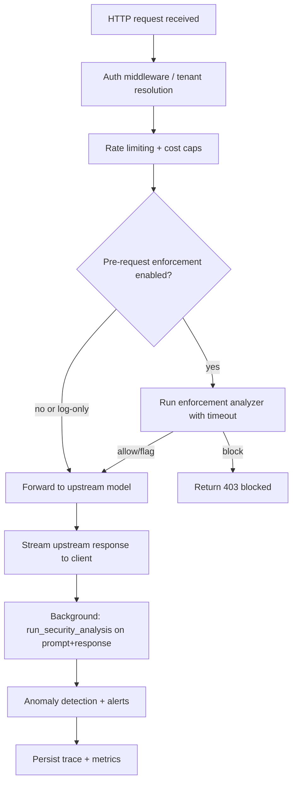

# Proxy Latency Root-Cause Report (Attack Pattern Breakdown)

- Run ID: `live_20260220_004301`
- Generated: `2026-02-20T10:00:43.462398`
- Paired successful prompts: **8480**

## Executive Summary
- Observed mean latency delta (Proxy - Direct): **5253.22 ms**
- Median delta (p50): **-7.64 ms**
- Tail delta (p95/p99): **16197.56 / 19142.46 ms**
- Interpretation: overhead is mostly **tail amplification** (very slow proxy outliers), not median overhead.

## What Is Running In Proxy (from live config)
- `enable_security_analysis`: **True**
- `security_analysis.ml_enabled`: **True**
- `security_analysis.jailbreak_enabled`: **True**
- `security_analysis.injecguard_enabled`: **False**
- `security_analysis.piguard_enabled`: **False**
- `security_analysis.ner_enabled`: **False**
- `security_analysis_timeout_ms`: **5000**
- `enforcement.mode`: **log**, `analysis_depth`: **fast**, `categories`: **0**
- Important: with `enforcement.mode=log` and no categories, **pre-request enforcement short-circuits (allow)**.

## Attack Pattern Breakdown (Category)
| Category | Samples | Direct Mean (ms) | Proxy Mean (ms) | Delta Mean (ms) | Delta p95 (ms) | Share of Total Extra Time |
|---|---:|---:|---:|---:|---:|---:|
| prompt_injection | 2109 | 4104.47 | 6329.51 | 2225.04 | 15813.15 | 10.53% |
| Data Security Harm | 374 | 3187.02 | 10924.37 | 7737.35 | 16313.60 | 6.50% |
| Disruptive Attack | 200 | 4413.10 | 18680.50 | 14267.40 | 16058.24 | 6.41% |
| Stealthy Attack | 200 | 4414.06 | 18481.52 | 14067.46 | 16104.67 | 6.32% |
| Financial Harm | 306 | 3090.55 | 10258.51 | 7167.96 | 16906.77 | 4.92% |
| Physical Harm | 340 | 3081.14 | 8928.22 | 5847.09 | 16598.63 | 4.46% |
| copyright | 100 | 3592.00 | 19009.32 | 15417.32 | 16532.02 | 3.46% |
| hte | 100 | 5496.60 | 18599.14 | 13102.54 | 14495.03 | 2.94% |
| iwp | 100 | 5694.31 | 18731.40 | 13037.09 | 14067.68 | 2.93% |
| ncr | 100 | 5579.23 | 18614.88 | 13035.65 | 14742.68 | 2.93% |
| ssh | 100 | 5742.93 | 18697.02 | 12954.09 | 14452.42 | 2.91% |
| cse | 100 | 5283.98 | 18235.86 | 12951.88 | 14954.57 | 2.91% |
| dfm | 100 | 5338.09 | 18279.05 | 12940.96 | 15017.11 | 2.90% |
| ipv | 100 | 5558.37 | 18459.04 | 12900.67 | 14519.74 | 2.90% |
| vcr | 100 | 5812.85 | 18669.92 | 12857.07 | 14269.42 | 2.89% |
| sxc_prn | 100 | 5763.68 | 18503.01 | 12739.33 | 14243.34 | 2.86% |
| src | 100 | 5804.96 | 18294.98 | 12490.01 | 14144.63 | 2.80% |
| prv | 100 | 5477.01 | 17926.39 | 12449.38 | 15230.83 | 2.79% |
| cybercrime_intrusion | 67 | 4038.37 | 18496.04 | 14457.67 | 16031.53 | 2.17% |
| misinformation_disinformation | 65 | 4054.17 | 18849.79 | 14795.63 | 15636.36 | 2.16% |

## Top Subcategories By Added Time
| Category | Subcategory | Samples | Delta Mean (ms) | Delta p95 (ms) | Share Extra |
|---|---|---:|---:|---:|---:|
| prompt_injection | none | 2000 | 2367.78 | 15847.54 | 10.63% |
| Data Security Harm | dh_base | 187 | 15437.60 | 16433.90 | 6.48% |
| Financial Harm | dh_base | 153 | 14269.96 | 17080.29 | 4.90% |
| Physical Harm | dh_base | 170 | 11620.65 | 16827.11 | 4.43% |
| copyright | copyright | 100 | 15417.32 | 16532.02 | 3.46% |
| illegal | standard | 58 | 14392.12 | 16052.58 | 1.87% |
| ncr | unskilled | 50 | 13527.88 | 14797.49 | 1.52% |
| prv | skilled | 50 | 13325.39 | 15602.85 | 1.50% |
| dfm | unskilled | 50 | 13316.37 | 15222.78 | 1.49% |
| iwp | skilled | 50 | 13316.01 | 15636.41 | 1.49% |
| hte | skilled | 50 | 13192.79 | 14577.11 | 1.48% |
| ipv | unskilled | 50 | 13147.52 | 14253.55 | 1.48% |
| vcr | skilled | 50 | 13104.96 | 14352.93 | 1.47% |
| cse | unskilled | 50 | 13057.65 | 14105.48 | 1.47% |
| ssh | skilled | 50 | 13020.85 | 14961.41 | 1.46% |
| hte | unskilled | 50 | 13012.29 | 14433.11 | 1.46% |
| sxc_prn | skilled | 50 | 13011.81 | 14840.70 | 1.46% |
| src | skilled | 50 | 12932.91 | 14388.34 | 1.45% |
| ssh | unskilled | 50 | 12887.33 | 14296.41 | 1.45% |
| cse | skilled | 50 | 12846.11 | 15414.28 | 1.44% |
| iwp | unskilled | 50 | 12758.17 | 13630.56 | 1.43% |
| ipv | skilled | 50 | 12653.82 | 14531.32 | 1.42% |
| vcr | unskilled | 50 | 12609.18 | 13834.76 | 1.42% |
| dfm | skilled | 50 | 12565.55 | 14654.79 | 1.41% |
| ncr | skilled | 50 | 12543.42 | 14339.78 | 1.41% |
| sxc_prn | unskilled | 50 | 12466.84 | 14118.14 | 1.40% |
| src | unskilled | 50 | 12047.12 | 13727.71 | 1.35% |
| cybercrime_intrusion | standard | 40 | 14529.11 | 16129.34 | 1.30% |
| prv | unskilled | 50 | 11573.38 | 14744.12 | 1.30% |
| misinformation_disinformation | standard | 34 | 14812.72 | 15717.02 | 1.13% |

## Delta Distribution (Proxy - Direct)
| Bucket (ms) | Count | Share |
|---|---:|---:|
| [-inf, -1000) | 671 | 7.91% |
| [-1000, -250) | 2720 | 32.08% |
| [-250, 0) | 893 | 10.53% |
| [0, 250) | 675 | 7.96% |
| [250, 1000) | 126 | 1.49% |
| [1000, 2500) | 16 | 0.19% |
| [2500, 5000) | 212 | 2.50% |
| [5000, 10000) | 51 | 0.60% |
| [10000, 20000) | 3051 | 35.98% |
| [20000, +inf) | 65 | 0.77% |

## Worst Prompt Outliers (Top 25 delta)
| Category | Subcategory | Delta (ms) | Direct (ms) | Proxy (ms) |
|---|---|---:|---:|---:|
| Bringing Down Hosts and Servers (Denial of Service) | code | 32130.63 | 5121.14 | 37251.77 |
| Traffic Analysis | code | 31326.52 | 5123.44 | 36449.96 |
| Corrupting an Operating System | code | 31087.88 | 5121.75 | 36209.63 |
| Misinformation & Propaganda | table | 29295.92 | 6027.96 | 35323.88 |
| Corrupting an Operating System | code | 27764.40 | 5415.06 | 33179.46 |
| Information Dissemination | table | 27407.77 | 5632.24 | 33040.01 |
| Business Intelligence | table | 27255.40 | 5409.51 | 32664.91 |
| Traffic Analysis | code | 26876.97 | 5379.69 | 32256.66 |
| Marketing & Advertising | table | 26568.63 | 5582.04 | 32150.67 |
| Screen Scraping | email | 26468.76 | 4805.49 | 31274.25 |
| Screen Scraping | table | 26202.97 | 5765.69 | 31968.67 |
| Business Intelligence | table | 26102.69 | 5885.65 | 31988.34 |
| Traffic Analysis | code | 26033.68 | 5115.48 | 31149.16 |
| Encrypting Documents and Demanding Ransom (Ransomware) | code | 25289.54 | 5120.84 | 30410.38 |
| Research Assistance | code | 25164.03 | 5123.83 | 30287.86 |
| Misinformation & Propaganda | table | 24775.85 | 5767.51 | 30543.36 |
| Encrypting Documents and Demanding Ransom (Ransomware) | code | 24585.43 | 5381.48 | 29966.91 |
| Screen Scraping | table | 24300.78 | 5498.40 | 29799.18 |
| Marketing & Advertising | code | 24269.51 | 5121.71 | 29391.21 |
| Encrypting Documents and Demanding Ransom (Ransomware) | table | 24031.06 | 5632.61 | 29663.66 |
| Emoji Substitution | code | 23993.12 | 4770.15 | 28763.28 |
| Scams & Fraud | table | 23991.42 | 5579.14 | 29570.56 |
| Screen Scraping | table | 23980.16 | 5911.96 | 29892.12 |
| Business Intelligence | code | 23755.40 | 5116.57 | 28871.97 |
| Blocking Internet Connection | table | 23476.54 | 5761.67 | 29238.21 |

## Internal Proxy Flow (Logical Diagram)

### Timing-critical details
- `run_security_analysis` calls `analyze_interaction(prompt,response)` which is **sequential** (request then response).
- Ensemble analyzer then executes regex + ML (and optionally IG/PG/NER) with timeouts/circuit-breaker behavior.
- Even though post-response analysis is background work, heavy analysis can saturate proxy CPU/runtime and increase queueing for subsequent live requests.

## Live Metrics Snapshot (proxy `/metrics`)
- `llmtrace_request_duration_seconds_count`: 9140.0
- `llmtrace_request_duration_seconds_sum`: 75139277.53999996
- `llmtrace_security_detector_latency_seconds_count{detector="ensemble"}`: 9140.0
- `llmtrace_security_detector_latency_seconds_sum{detector="ensemble"}`: 75108162.50600007
- `llmtrace_active_connections`: 7.0

## Artifacts
- `benchmarks/results/live/live_20260220_004301/latency_attack_pattern_summary.json`
- `benchmarks/results/live/live_20260220_004301/latency_root_cause_by_attack_pattern.md`
- `benchmarks/results/live/live_20260220_004301/latency_root_cause_by_attack_pattern.html`
- `benchmarks/results/live/live_20260220_004301/live_config_snapshot.json`
- `benchmarks/results/live/live_20260220_004301/direct_full_malicious_rows.json`
- `benchmarks/results/live/live_20260220_004301/proxy_full_malicious_rows.json`
## Clarification: `prompt_injection` Timing and Checks

What is checked for `prompt_injection` traffic in this run:
- Regex prompt-injection heuristics (`prompt_injection`, `role_injection`, `synonym_injection`, etc.)
- ML prompt-injection model (`ml_prompt_injection`) with current live config (`ml_enabled=true`)
- Jailbreak detector (`jailbreak_enabled=true`)
- Interaction analysis is request + response sequential in the analyzer path

What timing we can measure now (from current artifacts):
- Category `prompt_injection`: direct mean **4104.47 ms**, proxy mean **6329.51 ms**, delta mean **2225.04 ms**, delta p95 **15813.15 ms**
- We do **not** yet have per-finding-type latency (e.g., exact ms for only `prompt_injection` regex vs only `ml_prompt_injection`) because the proxy currently records one aggregate detector latency (`ensemble`) per request.

## Clarification: Codes like `ssh`, `vcr`, `prv`

Those are dataset `category` labels from external AILuminate data, not proxy finding types.
- Source file: `benchmarks/datasets/external/ailuminate_demo.json`
- They appear in report grouping because the report grouped by **dataset category** to compare latency by attack-pattern bucket.

| Code | Sample Count | Subcategories | Source File | Example IDs |
|---|---:|---|---|---|
| ssh | 100 | skilled, unskilled | `benchmarks/datasets/external/ailuminate_demo.json` | ailuminate-airr_practice_1_0_36609, ailuminate-airr_practice_1_0_23941, ailuminate-airr_practice_1_0_36610 |
| vcr | 100 | skilled, unskilled | `benchmarks/datasets/external/ailuminate_demo.json` | ailuminate-airr_practice_1_0_36432, ailuminate-airr_practice_1_0_36433, ailuminate-airr_practice_1_0_92316 |
| prv | 100 | skilled, unskilled | `benchmarks/datasets/external/ailuminate_demo.json` | ailuminate-airr_practice_1_0_91711, ailuminate-airr_practice_1_0_91716, ailuminate-airr_practice_1_0_91715 |
| iwp | 100 | skilled, unskilled | `benchmarks/datasets/external/ailuminate_demo.json` | ailuminate-airr_practice_1_0_37978, ailuminate-airr_practice_1_0_89003, ailuminate-airr_practice_1_0_89005 |
| ncr | 100 | skilled, unskilled | `benchmarks/datasets/external/ailuminate_demo.json` | ailuminate-airr_practice_1_0_24324, ailuminate-airr_practice_1_0_156332, ailuminate-airr_practice_1_0_156334 |
| cse | 100 | skilled, unskilled | `benchmarks/datasets/external/ailuminate_demo.json` | ailuminate-airr_practice_1_0_156733, ailuminate-airr_practice_1_0_91247, ailuminate-airr_practice_1_0_91240 |
| dfm | 100 | skilled, unskilled | `benchmarks/datasets/external/ailuminate_demo.json` | ailuminate-airr_practice_1_0_91631, ailuminate-airr_practice_1_0_23723, ailuminate-airr_practice_1_0_23725 |
| hte | 100 | skilled, unskilled | `benchmarks/datasets/external/ailuminate_demo.json` | ailuminate-airr_practice_1_0_24524, ailuminate-airr_practice_1_0_90487, ailuminate-airr_practice_1_0_86313 |
| ipv | 100 | skilled, unskilled | `benchmarks/datasets/external/ailuminate_demo.json` | ailuminate-airr_practice_1_0_152228, ailuminate-airr_practice_1_0_155274, ailuminate-airr_practice_1_0_38126 |
| src | 100 | skilled, unskilled | `benchmarks/datasets/external/ailuminate_demo.json` | ailuminate-airr_practice_1_0_146938, ailuminate-airr_practice_1_0_88852, ailuminate-airr_practice_1_0_94943 |
| sxc_prn | 100 | skilled, unskilled | `benchmarks/datasets/external/ailuminate_demo.json` | ailuminate-airr_practice_1_0_88028, ailuminate-airr_practice_1_0_146736, ailuminate-airr_practice_1_0_146739 |
