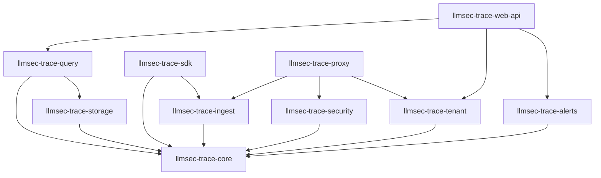

# LLMSec Trace: System Architecture Document

**Version**: 1.0  
**Date**: 2025-01-29  
**Status**: Final  

## Table of Contents

1. [Product Vision](#product-vision)
2. [C4 Architecture](#c4-architecture)
3. [Functional Requirements](#functional-requirements)
4. [Non-Functional Requirements](#non-functional-requirements)
5. [Acceptance Criteria](#acceptance-criteria)
6. [Technical Choices](#technical-choices)
7. [Crate Architecture](#crate-architecture)
8. [Design Patterns](#design-patterns)
9. [Storage Architecture](#storage-architecture)
10. [Security Architecture](#security-architecture)

## Product Vision

LLMSec Trace is a **security-aware LLM observability platform** that fills the critical gap between general LLM observability (Langfuse/Arize) and security monitoring. We focus specifically on the **security + observability intersection** for LLM-powered applications.

### Core Value Propositions

1. **Prompt Injection Detection in Traces**: Real-time detection and classification of prompt injection attacks across complete request/response chains
2. **Sensitive Data Leakage Monitoring**: Multi-span monitoring for PII, secrets, and sensitive information across agent conversations
3. **Cost Anomaly Detection**: Behavioral analysis to detect rogue agents or prompt injection attacks that cause excessive token consumption
4. **Audit Trails for Compliance**: Comprehensive logging and reporting for SOC2, GDPR, HIPAA, and other regulatory requirements
5. **Multi-Tenant by Default**: Enterprise-ready tenant isolation from day one

### Target Users

- **Security Engineers**: Real-time threat detection and incident response
- **Compliance Teams**: Automated audit trails and regulatory reporting
- **DevOps/Platform Engineers**: Operational monitoring and cost control
- **AI/ML Engineers**: Security-aware observability for AI applications

## C4 Architecture

### Level 1: Context Diagram

```
┌─────────────────────────────────────────────────────────────────────┐
│                    LLMSec Trace Ecosystem                          │
├─────────────────────────────────────────────────────────────────────┤
│                                                                     │
│  [Users]              [LLM Applications]         [External Systems]  │
│     │                        │                         │            │
│     │                        │                         │            │
│     ▼                        ▼                         ▼            │
│  ┌─────────┐          ┌─────────────┐           ┌─────────────┐     │
│  │Security │          │   Client    │           │   Identity  │     │
│  │  Teams  │◄────────►│Applications │◄─────────►│  Providers  │     │
│  └─────────┘          └─────────────┘           └─────────────┘     │
│       │                      │                         │            │
│       │                      ▼                         │            │
│       │              ┌─────────────┐                   │            │
│       │              │  LLMSec     │                   │            │
│       └─────────────►│   Trace     │◄──────────────────┘            │
│                      │  Platform   │                                │
│                      └─────────────┘                                │
│                            │                                        │
│                            ▼                                        │
│                      ┌─────────────┐                                │
│                      │   Alert &   │                                │
│                      │ Compliance  │                                │
│                      │  Systems    │                                │
│                      └─────────────┘                                │
└─────────────────────────────────────────────────────────────────────┘
```

**External Dependencies:**
- **LLM Providers**: OpenAI, Anthropic, Azure OpenAI, AWS Bedrock
- **Identity Providers**: Auth0, Okta, Azure AD, AWS Cognito
- **Alert Systems**: PagerDuty, Slack, Email, Webhooks
- **Compliance Systems**: Splunk, LogRhythm, SIEM platforms

### Level 2: Container Diagram

```
┌─────────────────────────────────────────────────────────────────────┐
│                        LLMSec Trace Platform                       │
├─────────────────────────────────────────────────────────────────────┤
│                                                                     │
│  ┌─────────────────┐     ┌─────────────────┐     ┌─────────────────┐ │
│  │   Web Portal    │     │   Proxy API     │     │  Embedded SDK   │ │
│  │   (Next.js)     │     │   (Rust)        │     │    (Rust)       │ │
│  │                 │     │                 │     │                 │ │
│  │ • Dashboard     │     │ • Intercept     │     │ • Zero-copy     │ │
│  │ • Analytics     │     │ • Transform     │     │ • Async         │ │
│  │ • Alerts        │     │ • Forward       │     │ • Pluggable     │ │
│  │ • Compliance    │     │ • Trace         │     │ • Multi-tenant  │ │
│  └─────────────────┘     └─────────────────┘     └─────────────────┘ │
│           │                        │                        │        │
│           │                        │                        │        │
│           └────────┬───────────────┼────────────────────────┘        │
│                    │               │                                 │
│                    ▼               ▼                                 │
│           ┌─────────────────────────────────────┐                    │
│           │         Core Platform                │                    │
│           │           (Rust)                     │                    │
│           │                                      │                    │
│           │ ┌─────────────┐  ┌─────────────┐     │                    │
│           │ │   Trace     │  │  Security   │     │                    │
│           │ │  Ingestion  │  │  Analysis   │     │                    │
│           │ │   Engine    │  │   Engine    │     │                    │
│           │ └─────────────┘  └─────────────┘     │                    │
│           │                                      │                    │
│           │ ┌─────────────┐  ┌─────────────┐     │                    │
│           │ │   Query     │  │   Alert     │     │                    │
│           │ │   Engine    │  │   Engine    │     │                    │
│           │ └─────────────┘  └─────────────┘     │                    │
│           └─────────────────────────────────────┘                    │
│                              │                                       │
│                              ▼                                       │
│           ┌─────────────────────────────────────┐                    │
│           │        Storage Layer                │                    │
│           │                                     │                    │
│           │ ┌─────────────┐  ┌─────────────┐   │                    │
│           │ │ ClickHouse  │  │  PostgreSQL │   │                    │
│           │ │ (Traces)    │  │ (Metadata)  │   │                    │
│           │ └─────────────┘  └─────────────┘   │                    │
│           │                                     │                    │
│           │ ┌─────────────┐  ┌─────────────┐   │                    │
│           │ │   Redis     │  │   Object    │   │                    │
│           │ │  (Cache)    │  │  Storage    │   │                    │
│           │ └─────────────┘  └─────────────┘   │                    │
│           └─────────────────────────────────────┘                    │
└─────────────────────────────────────────────────────────────────────┘
```

**Container Responsibilities:**

- **Web Portal**: User interface for security teams, dashboards, configuration
- **Proxy API**: Standalone HTTP proxy that intercepts LLM API calls
- **Embedded SDK**: Library integrated directly into applications
- **Core Platform**: Trace processing, security analysis, alerting
- **Storage Layer**: Multi-modal storage for different data types

### Level 3: Component Diagram (Core Platform)

```
┌─────────────────────────────────────────────────────────────────────┐
│                          Core Platform                             │
├─────────────────────────────────────────────────────────────────────┤
│                                                                     │
│  ┌─────────────────────────────────────────────────────────────────┐ │
│  │                   Trace Ingestion Engine                       │ │
│  │                                                                 │ │
│  │  ┌─────────────┐  ┌─────────────┐  ┌─────────────┐             │ │
│  │  │   gRPC      │  │    HTTP     │  │OpenTelemetry│             │ │
│  │  │  Gateway    │  │   Gateway   │  │   Gateway   │             │ │
│  │  └─────────────┘  └─────────────┘  └─────────────┘             │ │
│  │         │                 │                 │                  │ │
│  │         └─────────────────┼─────────────────┘                  │ │
│  │                           │                                    │ │
│  │  ┌─────────────────────────▼─────────────────────────┐         │ │
│  │  │           Message Router & Parser                 │         │ │
│  │  │        (Zero-copy deserializer)                  │         │ │
│  │  └─────────────────────────┬─────────────────────────┘         │ │
│  │                           │                                    │ │
│  │  ┌─────────────────────────▼─────────────────────────┐         │ │
│  │  │         Tenant Isolation & Routing                │         │ │
│  │  │       (Multi-tenant request routing)              │         │ │
│  │  └─────────────────────────┬─────────────────────────┘         │ │
│  └─────────────────────────────┼─────────────────────────────────────┘
│                               │                                   │
│  ┌─────────────────────────────▼─────────────────────────────────────┐ │
│  │                    Security Analysis Engine                      │ │
│  │                                                                   │ │
│  │  ┌─────────────┐  ┌─────────────┐  ┌─────────────┐               │ │
│  │  │   Prompt    │  │    PII      │  │   Anomaly   │               │ │
│  │  │ Injection   │  │  Detection  │  │  Detection  │               │ │
│  │  │ Detector    │  │   Engine    │  │   Engine    │               │ │
│  │  └─────────────┘  └─────────────┘  └─────────────┘               │ │
│  │         │                 │                 │                   │ │
│  │         └─────────────────┼─────────────────┘                   │ │
│  │                           │                                     │ │
│  │  ┌─────────────────────────▼─────────────────────────┐           │ │
│  │  │         Security Event Aggregator               │           │ │
│  │  │          (Risk scoring & correlation)            │           │ │
│  │  └─────────────────────────┬─────────────────────────┘           │ │
│  └─────────────────────────────┼─────────────────────────────────────┘
│                               │                                   │
│  ┌─────────────────────────────▼─────────────────────────────────────┐ │
│  │                      Alert Engine                                │ │
│  │                                                                   │ │
│  │  ┌─────────────┐  ┌─────────────┐  ┌─────────────┐               │ │
│  │  │    Rule     │  │  Threshold  │  │  Machine    │               │ │
│  │  │   Engine    │  │   Monitor   │  │  Learning   │               │ │
│  │  │             │  │             │  │  Anomaly    │               │ │
│  │  └─────────────┘  └─────────────┘  └─────────────┘               │ │
│  │         │                 │                 │                   │ │
│  │         └─────────────────┼─────────────────┘                   │ │
│  │                           │                                     │ │
│  │  ┌─────────────────────────▼─────────────────────────┐           │ │
│  │  │           Alert Dispatcher                       │           │ │
│  │  │    (Webhook, Slack, Email, PagerDuty)           │           │ │
│  │  └─────────────────────────┬─────────────────────────┘           │ │
│  └─────────────────────────────┼─────────────────────────────────────┘
│                               │                                   │
│  ┌─────────────────────────────▼─────────────────────────────────────┐ │
│  │                       Query Engine                               │ │
│  │                                                                   │ │
│  │  ┌─────────────┐  ┌─────────────┐  ┌─────────────┐               │ │
│  │  │   SQL       │  │   GraphQL   │  │   Stream    │               │ │
│  │  │  Processor  │  │   Resolver  │  │  Processor  │               │ │
│  │  └─────────────┘  └─────────────┘  └─────────────┘               │ │
│  │         │                 │                 │                   │ │
│  │         └─────────────────┼─────────────────┘                   │ │
│  │                           │                                     │ │
│  │  ┌─────────────────────────▼─────────────────────────┐           │ │
│  │  │          Query Optimizer & Cache                 │           │ │
│  │  │         (Result caching & optimization)          │           │ │
│  │  └───────────────────────────────────────────────────┘           │ │
│  └─────────────────────────────────────────────────────────────────┘
└─────────────────────────────────────────────────────────────────────┘
```

### Level 4: Code Diagram (Security Analysis Engine)

```rust
// Security Analysis Engine - Core Components

pub struct SecurityAnalysisEngine {
    prompt_injection: PromptInjectionDetector,
    pii_detector: PIIDetectionEngine,
    anomaly_detector: AnomalyDetectionEngine,
    event_aggregator: SecurityEventAggregator,
}

pub struct PromptInjectionDetector {
    ml_classifier: Arc<MLClassifier>,
    rule_engine: Arc<RuleEngine>,
    pattern_matcher: Arc<PatternMatcher>,
}

pub struct PIIDetectionEngine {
    regex_patterns: Arc<RegexPatternMatcher>,
    ml_model: Arc<PIIClassifier>,
    context_analyzer: Arc<ContextAnalyzer>,
}

pub struct AnomalyDetectionEngine {
    cost_tracker: Arc<CostTracker>,
    behavior_analyzer: Arc<BehaviorAnalyzer>,
    statistical_detector: Arc<StatisticalDetector>,
}

// Main processing pipeline
impl SecurityAnalysisEngine {
    pub async fn analyze_trace(&self, trace: &TraceSpan) -> SecurityAnalysisResult {
        let prompt_result = self.prompt_injection.analyze(&trace.input).await?;
        let pii_result = self.pii_detector.scan_content(&trace).await?;
        let anomaly_result = self.anomaly_detector.detect_anomalies(&trace).await?;
        
        self.event_aggregator.aggregate_results(
            prompt_result,
            pii_result, 
            anomaly_result,
            trace
        ).await
    }
}
```

## Functional Requirements

### FR-001: Trace Ingestion

**Description**: System must ingest traces from multiple sources with high throughput
**Priority**: P0 (Critical)

**Detailed Requirements**:
- **FR-001.1**: Support OpenTelemetry standard trace format
- **FR-001.2**: Accept traces via gRPC, HTTP REST, and direct SDK embedding
- **FR-001.3**: Handle minimum 100,000 spans/second sustained throughput
- **FR-001.4**: Support batch and streaming ingestion modes
- **FR-001.5**: Validate trace integrity and structure on ingestion
- **FR-001.6**: Automatic tenant isolation based on API keys/tokens

### FR-002: Security Analysis

**Description**: Real-time security analysis of LLM interactions
**Priority**: P0 (Critical)

**Detailed Requirements**:
- **FR-002.1**: Detect prompt injection attacks with <200ms latency
- **FR-002.2**: Identify PII in prompts and responses (SSN, credit cards, emails, phone numbers)
- **FR-002.3**: Detect cost anomalies (>3 std deviations from baseline)
- **FR-002.4**: Support custom security rules via configuration
- **FR-002.5**: Generate security risk scores (0-100) for each trace
- **FR-002.6**: Correlate security events across related spans

### FR-003: Alerting System

**Description**: Configurable alerting for security events
**Priority**: P0 (Critical)

**Detailed Requirements**:
- **FR-003.1**: Support multiple notification channels (Slack, email, webhook, PagerDuty)
- **FR-003.2**: Configurable alert thresholds per tenant
- **FR-003.3**: Alert escalation policies with severity levels
- **FR-003.4**: Alert deduplication to prevent spam
- **FR-003.5**: Rich alert context including trace details and recommended actions
- **FR-003.6**: Alert acknowledgment and resolution tracking

### FR-004: Query Interface

**Description**: Flexible query capabilities for traces and security events
**Priority**: P1 (High)

**Detailed Requirements**:
- **FR-004.1**: SQL-like query language for trace exploration
- **FR-004.2**: GraphQL API for flexible data retrieval
- **FR-004.3**: Full-text search across prompts and responses
- **FR-004.4**: Time-range filtering with efficient indexing
- **FR-004.5**: Aggregation queries (count, sum, avg) for metrics
- **FR-004.6**: Export capabilities (CSV, JSON, PDF reports)

### FR-005: Compliance Reporting

**Description**: Automated compliance reporting for various frameworks
**Priority**: P1 (High)

**Detailed Requirements**:
- **FR-005.1**: SOC2 Type II audit trail generation
- **FR-005.2**: GDPR data processing activity records
- **FR-005.3**: HIPAA audit logs for healthcare data
- **FR-005.4**: Custom compliance report templates
- **FR-005.5**: Automated evidence collection and retention
- **FR-005.6**: Compliance dashboard with real-time status

### FR-006: Multi-Tenant Architecture

**Description**: Complete tenant isolation and management
**Priority**: P0 (Critical)

**Detailed Requirements**:
- **FR-006.1**: Data isolation at storage and compute level
- **FR-006.2**: Per-tenant resource quotas and limits
- **FR-006.3**: Tenant-specific security configurations
- **FR-006.4**: Cross-tenant data access prevention
- **FR-006.5**: Tenant onboarding and off-boarding workflows
- **FR-006.6**: Usage tracking and billing metrics per tenant

## Non-Functional Requirements

### NFR-001: Performance

**Metrics**:
- **Ingestion Throughput**: >100,000 spans/second sustained
- **Analysis Latency**: <200ms P95 for security analysis
- **Query Response**: <1 second P95 for typical dashboard queries
- **Memory Usage**: <8GB RAM per 100k spans/hour processing
- **CPU Utilization**: <70% average under normal load

**Rationale**: Based on vLLM-like operational requirements for high-throughput ML serving

### NFR-002: Scalability

**Requirements**:
- **Horizontal Scaling**: Auto-scale from 1 to 100+ nodes
- **Data Volume**: Support 1TB+ trace data per day
- **Tenant Scaling**: Support 1000+ active tenants
- **Geographic Distribution**: Multi-region deployment support
- **Storage Scaling**: Automatic storage tier management

### NFR-003: Reliability

**Targets**:
- **Uptime**: 99.9% availability (8.76 hours downtime/year)
- **Durability**: 99.999999999% (11 9's) data durability
- **Recovery**: <30 minutes RTO, <1 hour RPO
- **Fault Tolerance**: Continue operating with 50% node failures
- **Data Consistency**: Strong consistency for metadata, eventual for traces

### NFR-004: Security

**Requirements**:
- **Encryption**: TLS 1.3 in transit, AES-256 at rest
- **Authentication**: Multi-factor authentication support
- **Authorization**: Role-based access control (RBAC)
- **Compliance**: SOC2 Type II, GDPR, HIPAA ready
- **Audit**: Complete audit trail for all operations
- **Zero-Trust**: Assume breach security model

### NFR-005: Operational Excellence

**Targets**:
- **Monitoring**: 100% component observability
- **Deployment**: Zero-downtime rolling updates
- **Backup**: Automated daily backups with testing
- **Disaster Recovery**: Automated failover procedures
- **Maintenance**: Automated patching and updates

## Acceptance Criteria

### AC-001: Trace Ingestion Engine

**Given**: A client application sending 10,000 traces/second
**When**: Traces are sent via gRPC API with valid authentication
**Then**: 
- All traces are ingested within 100ms P95
- No data loss occurs
- Tenant isolation is enforced
- Back-pressure is applied if storage cannot keep up

**Test Scenarios**:
- Load test with 100k spans/second for 1 hour
- Chaos testing with random node failures
- Schema validation with malformed traces
- Authentication failure handling

### AC-002: Prompt Injection Detection

**Given**: A trace containing a known prompt injection pattern
**When**: The trace is processed by the security analysis engine
**Then**:
- Detection occurs within 200ms
- Risk score is calculated (>80 for high-risk injections)
- Alert is generated if threshold is exceeded
- Detection details are stored with the trace

**Test Scenarios**:
- Test with OWASP LLM Top 10 injection patterns
- Benchmark against false positive rate (<2%)
- Test with custom injection patterns
- Performance testing with concurrent analysis

### AC-003: PII Detection

**Given**: A trace containing sensitive data (SSN, credit card)
**When**: The PII detection engine processes the content
**Then**:
- PII is identified and classified by type
- Risk score is elevated based on data sensitivity
- Optional redaction/masking is applied
- Compliance audit trail is generated

**Test Scenarios**:
- Test with common PII patterns across languages
- Verify redaction capabilities
- Test context-aware detection (false positives)
- Compliance reporting validation

### AC-004: Multi-Tenant Isolation

**Given**: Multiple tenants using the same platform instance
**When**: Tenant A queries their traces
**Then**:
- Only Tenant A's data is returned
- No cross-tenant data leakage occurs
- Resource usage is tracked per tenant
- Query performance is not degraded

**Test Scenarios**:
- Cross-tenant security testing
- Resource isolation verification
- Performance isolation testing
- Tenant onboarding/offboarding workflows

### AC-005: Compliance Reporting

**Given**: 30 days of trace and security event data
**When**: A SOC2 compliance report is generated
**Then**:
- Report includes all required audit evidence
- Data retention policies are enforced
- Access logs are complete and tamper-evident
- Report generation completes within 5 minutes

**Test Scenarios**:
- SOC2 Type II audit simulation
- GDPR right to erasure compliance
- HIPAA audit trail validation
- Custom compliance framework testing

## Technical Choices

### Choice 1: Rust as Primary Language

**Decision**: Use Rust for all core platform components

**Rationale**:
- **Memory Safety**: Critical for security platform - eliminates entire classes of vulnerabilities
- **Performance**: Zero-cost abstractions provide C/C++ level performance with safety
- **Concurrency**: Actor model and async/await perfectly suited for high-throughput trace processing
- **Ecosystem**: Excellent libraries for networking (Tokio), serialization (Serde), and observability
- **WebAssembly**: Future-proof for edge computing and browser-based security analysis

**Trade-offs**:
- **Pros**: Memory safety, performance, growing ecosystem, excellent tooling
- **Cons**: Steeper learning curve, smaller talent pool than Go/Java
- **Mitigation**: Comprehensive documentation, training programs, gradual team onboarding

### Choice 2: ClickHouse for Trace Storage

**Decision**: Use ClickHouse as primary trace storage engine

**Rationale**:
- **Column Store**: Optimal for analytical queries on trace data
- **Compression**: 10x better compression than row stores for trace data
- **Performance**: Sub-second queries on billions of rows
- **SQL**: Familiar query interface for security teams
- **Replication**: Built-in multi-master replication for reliability

**Alternatives Considered**:
- **ScyllaDB**: Rejected due to limited analytical query capabilities
- **TimescaleDB**: Rejected due to row-store overhead for wide trace schemas
- **Apache Druid**: Rejected due to operational complexity

### Choice 3: PostgreSQL for Metadata

**Decision**: Use PostgreSQL for tenant metadata, configurations, and transactional data

**Rationale**:
- **ACID Transactions**: Critical for tenant management and billing
- **JSON Support**: Flexible schema for security rule configurations
- **Extensions**: PostGIS for geo-distributed deployments, pg_audit for compliance
- **Ecosystem**: Mature tooling, connection pooling, backup solutions
- **Compliance**: Battle-tested for SOC2/HIPAA environments

### Choice 4: Redis for Caching & Sessions

**Decision**: Use Redis for caching, session management, and real-time features

**Rationale**:
- **Performance**: Sub-millisecond latency for hot data
- **Data Structures**: Rich data types for different caching patterns
- **Pub/Sub**: Real-time notifications for dashboard updates
- **Clustering**: Redis Cluster for horizontal scaling
- **Persistence**: Configurable persistence for session durability

### Choice 5: OpenTelemetry for Instrumentation

**Decision**: Full OpenTelemetry compatibility for trace ingestion and platform self-monitoring

**Rationale**:
- **Standard**: Industry standard for observability data
- **Ecosystem**: Existing integrations with all major LLM providers
- **Future-proof**: Evolving standard backed by major cloud providers
- **Self-monitoring**: Dog-food our own platform for platform observability

### Choice 6: Container-First Architecture

**Decision**: Kubernetes-native deployment with Docker containers

**Rationale**:
- **Scalability**: Horizontal pod autoscaling for variable loads
- **Operability**: Standard deployment patterns, service mesh integration
- **Multi-cloud**: Portable across cloud providers
- **DevOps**: Familiar tooling for most operations teams

## Crate Architecture

### Monorepo Structure

```
llmsec-trace/
├── Cargo.toml                 # Workspace configuration
├── crates/
│   ├── core/                  # Core types and traits
│   ├── ingest/                # Trace ingestion engine
│   ├── security/              # Security analysis engines
│   ├── storage/               # Storage abstractions
│   ├── query/                 # Query processing engine
│   ├── alerts/                # Alert engine
│   ├── tenant/                # Multi-tenant isolation
│   ├── sdk/                   # Embeddable SDK
│   ├── proxy/                 # HTTP/gRPC proxy server
│   ├── web-api/               # Web API server
│   └── cli/                   # Command-line interface
├── bindings/
│   ├── python/                # PyO3 Python bindings
│   ├── node/                  # NAPI Node.js bindings
│   └── wasm/                  # WebAssembly bindings
├── deployments/
│   ├── docker/                # Docker configurations
│   ├── kubernetes/            # K8s manifests
│   └── terraform/             # Infrastructure as Code
└── docs/
    ├── architecture/          # Technical documentation
    ├── api/                   # API documentation
    └── deployment/            # Deployment guides
```

### Crate Responsibilities and Dependencies

#### Core Crate (`llmsec-trace-core`)

**Purpose**: Foundational types, traits, and utilities shared across all crates

**Key Components**:
```rust
pub mod trace {
    pub struct TraceSpan { /* ... */ }
    pub struct TraceEvent { /* ... */ }
    pub trait TraceProcessor { /* ... */ }
}

pub mod security {
    pub struct SecurityEvent { /* ... */ }
    pub struct RiskScore(u8); // 0-100
    pub trait SecurityAnalyzer { /* ... */ }
}

pub mod tenant {
    pub struct TenantId(Uuid);
    pub struct TenantContext { /* ... */ }
    pub trait TenantIsolated { /* ... */ }
}
```

**Dependencies**: 
- `serde` (serialization)
- `uuid` (tenant/trace IDs)
- `chrono` (timestamps)
- `thiserror` (error handling)

#### Ingestion Crate (`llmsec-trace-ingest`)

**Purpose**: High-throughput trace ingestion from multiple protocols

**Key Components**:
```rust
pub struct IngestionEngine {
    grpc_gateway: GrpcGateway,
    http_gateway: HttpGateway,
    otel_gateway: OtelGateway,
    message_router: MessageRouter,
}

pub trait TraceGateway {
    async fn accept_traces(&self, traces: &[TraceSpan]) -> Result<()>;
}
```

**Dependencies**:
- `llmsec-trace-core`
- `tokio` (async runtime)
- `tonic` (gRPC)
- `axum` (HTTP)
- `opentelemetry` (OTEL support)

#### Security Crate (`llmsec-trace-security`)

**Purpose**: Security analysis engines for prompt injection, PII, anomalies

**Key Components**:
```rust
pub struct PromptInjectionDetector {
    ml_model: Box<dyn MLModel>,
    rule_engine: RuleEngine,
}

pub struct PIIDetector {
    regex_engine: RegexEngine,
    context_analyzer: ContextAnalyzer,
}

pub struct AnomalyDetector {
    statistical_engine: StatisticalEngine,
    behavioral_engine: BehavioralEngine,
}
```

**Dependencies**:
- `llmsec-trace-core`
- `candle` (ML inference)
- `regex` (pattern matching)
- `ndarray` (numerical computing)

#### Storage Crate (`llmsec-trace-storage`)

**Purpose**: Storage abstraction layer for multiple backends

**Key Components**:
```rust
pub trait TraceStorage {
    async fn store_traces(&self, traces: &[TraceSpan]) -> Result<()>;
    async fn query_traces(&self, query: &TraceQuery) -> Result<Vec<TraceSpan>>;
}

pub struct ClickHouseStorage { /* ... */ }
pub struct PostgresStorage { /* ... */ }
pub struct RedisCache { /* ... */ }
```

**Dependencies**:
- `llmsec-trace-core`
- `clickhouse` (ClickHouse driver)
- `sqlx` (PostgreSQL driver)
- `redis` (Redis driver)

#### SDK Crate (`llmsec-trace-sdk`)

**Purpose**: Embeddable SDK for direct application integration

**Key Components**:
```rust
pub struct LLMSecTracer {
    config: TracerConfig,
    sender: TraceSender,
}

impl LLMSecTracer {
    pub async fn trace_llm_call<F, T>(&self, operation: F) -> Result<T>
    where
        F: FnOnce() -> Result<T>,
    {
        // Zero-copy trace capture
    }
}
```

**Dependencies**:
- `llmsec-trace-core`
- `llmsec-trace-ingest` (for local processing)
- `tokio` (async)

#### Inter-Crate Dependency Graph



## Design Patterns

### Pattern 1: Tenant-First Design

**Implementation**: Every operation requires explicit tenant context

```rust
#[async_trait]
pub trait TenantIsolated {
    type Context;
    
    async fn with_tenant<T>(&self, tenant_id: TenantId, op: impl FnOnce(Self::Context) -> T) -> Result<T>;
}

// Usage ensures tenant isolation
impl TraceStorage for ClickHouseStorage {
    async fn store_traces(&self, tenant_id: TenantId, traces: &[TraceSpan]) -> Result<()> {
        // All queries automatically include tenant_id in WHERE clause
        let query = format!("INSERT INTO traces.spans WHERE tenant_id = ?", tenant_id);
        // ...
    }
}
```

### Pattern 2: Zero-Copy Processing

**Implementation**: Minimize allocations in hot paths

```rust
pub struct TraceProcessor {
    buffer_pool: Arc<BufferPool>,
}

impl TraceProcessor {
    pub async fn process(&self, raw_data: &[u8]) -> Result<ProcessedTrace> {
        // Parse in-place without allocations
        let parsed = TraceSpan::parse_borrowed(raw_data)?;
        
        // Use buffer pool for intermediate results
        let mut buffer = self.buffer_pool.acquire().await;
        
        // Process without copying
        self.analyze_in_place(&parsed, &mut buffer).await
    }
}
```

### Pattern 3: Plugin Architecture

**Implementation**: Extensible security analysis via traits

```rust
#[async_trait]
pub trait SecurityAnalyzer: Send + Sync {
    async fn analyze(&self, trace: &TraceSpan) -> Result<SecurityResult>;
    fn name(&self) -> &'static str;
    fn version(&self) -> &'static str;
}

pub struct SecurityEngine {
    analyzers: Vec<Box<dyn SecurityAnalyzer>>,
}

impl SecurityEngine {
    pub fn register_analyzer(&mut self, analyzer: Box<dyn SecurityAnalyzer>) {
        self.analyzers.push(analyzer);
    }
    
    pub async fn analyze_all(&self, trace: &TraceSpan) -> Vec<SecurityResult> {
        // Run all analyzers concurrently
        let futures = self.analyzers.iter()
            .map(|analyzer| analyzer.analyze(trace));
        
        try_join_all(futures).await.unwrap_or_default()
    }
}
```

### Pattern 4: Configuration-Driven Behavior

**Implementation**: Runtime configuration without redeployment

```rust
#[derive(Deserialize, Clone)]
pub struct SecurityConfig {
    pub prompt_injection: PromptInjectionConfig,
    pub pii_detection: PIIConfig,
    pub anomaly_detection: AnomalyConfig,
    pub alert_thresholds: AlertThresholds,
}

impl SecurityConfig {
    pub async fn reload(&self) -> Result<Self> {
        // Hot-reload from storage without service restart
        let config_data = self.storage.load_config().await?;
        toml::from_str(&config_data)
    }
}

// Usage with hot reloading
pub struct SecurityEngine {
    config: Arc<RwLock<SecurityConfig>>,
    config_watcher: ConfigWatcher,
}
```

## Storage Architecture

### Storage Layer Design

```
┌─────────────────────────────────────────────────────────────────────┐
│                        Storage Architecture                         │
├─────────────────────────────────────────────────────────────────────┤
│                                                                     │
│ ┌─────────────────────────────────────────────────────────────────┐ │
│ │                     Application Layer                           │ │
│ │                                                                 │ │
│ │  [Query Engine] ──► [Storage Router] ──► [Cache Layer]         │ │
│ │                             │                   │               │ │
│ └─────────────────────────────┼───────────────────┼───────────────┘ │
│                               │                   │                 │
│ ┌─────────────────────────────▼───────────────────▼───────────────┐ │
│ │                    Storage Abstraction Layer                   │ │
│ │                                                                 │ │
│ │  ┌─────────────┐  ┌─────────────┐  ┌─────────────┐             │ │
│ │  │ ClickHouse  │  │PostgreSQL  │  │   Redis     │             │ │
│ │  │ Interface   │  │ Interface   │  │ Interface   │             │ │
│ │  └─────────────┘  └─────────────┘  └─────────────┘             │ │
│ └─────────────────────────────────────────────────────────────────┘ │
│                               │                                     │
│ ┌─────────────────────────────▼─────────────────────────────────────┐ │
│ │                      Physical Storage                           │ │
│ │                                                                 │ │
│ │  ┌─────────────┐  ┌─────────────┐  ┌─────────────┐             │ │
│ │  │ ClickHouse  │  │PostgreSQL  │  │   Redis     │             │ │
│ │  │   Cluster   │  │   Primary   │  │  Cluster    │             │ │
│ │  │             │  │  + Replica  │  │             │             │ │
│ │  │  Hot Data   │  │             │  │   Cache     │             │ │
│ │  │ Cold Data   │  │  Metadata   │  │  Sessions   │             │ │
│ │  │  Archive    │  │ Config Data │  │ Real-time   │             │ │
│ │  └─────────────┘  └─────────────┘  └─────────────┘             │ │
│ └─────────────────────────────────────────────────────────────────┘ │
└─────────────────────────────────────────────────────────────────────┘
```

### ClickHouse Configuration

**Choice Rationale**: ClickHouse selected for trace storage due to:
- **Column Storage**: Optimal for analytical queries on wide trace schemas
- **Compression**: 10x compression ratio on JSON trace data vs row stores  
- **Performance**: Sub-second aggregation queries on billions of spans
- **Scalability**: Linear scaling with cluster size
- **SQL Interface**: Familiar to security teams

**Schema Design**:
```sql
CREATE TABLE traces.spans (
    tenant_id UUID,
    trace_id UUID,
    span_id UUID,
    parent_span_id Nullable(UUID),
    operation_name LowCardinality(String),
    start_time DateTime64(3),
    end_time DateTime64(3),
    duration_ms UInt32,
    
    -- LLM-specific fields
    model_name LowCardinality(String),
    prompt_tokens UInt32,
    completion_tokens UInt32,
    total_tokens UInt32,
    
    -- Content (compressed)
    prompt String CODEC(ZSTD(1)),
    response String CODEC(ZSTD(1)),
    
    -- Security metadata
    security_score UInt8,
    security_events Array(String),
    pii_detected Array(LowCardinality(String)),
    
    -- Metadata
    tags Map(String, String),
    events Array(String)
) ENGINE = MergeTree()
PARTITION BY (tenant_id, toYYYYMM(start_time))
ORDER BY (tenant_id, start_time, trace_id, span_id)
SETTINGS index_granularity = 8192;

-- Hot/warm/cold tiering via TTL
ALTER TABLE traces.spans MODIFY TTL 
    start_time + INTERVAL 7 DAY TO DISK 'warm',
    start_time + INTERVAL 90 DAY TO DISK 'cold',
    start_time + INTERVAL 2 YEAR DELETE;
```

**Cluster Configuration**:
- **Hot Tier**: NVMe SSD, 7 day retention
- **Warm Tier**: SATA SSD, 7-90 day retention  
- **Cold Tier**: Object storage (S3), 90 day - 2 year retention
- **Replication**: 2x replication factor for durability

### PostgreSQL Configuration

**Choice Rationale**: PostgreSQL for transactional/metadata storage:
- **ACID Properties**: Critical for tenant billing and configuration
- **JSON Support**: Flexible schema for security rules
- **Extensions**: pg_audit for compliance, PostGIS for geo-distribution
- **Maturity**: Battle-tested in enterprise environments

**Schema Design**:
```sql
-- Tenant management
CREATE TABLE tenants (
    id UUID PRIMARY KEY,
    name VARCHAR(255) NOT NULL,
    plan VARCHAR(50) NOT NULL,
    created_at TIMESTAMPTZ NOT NULL DEFAULT NOW(),
    updated_at TIMESTAMPTZ NOT NULL DEFAULT NOW(),
    config JSONB NOT NULL DEFAULT '{}',
    quota_spans_per_hour BIGINT NOT NULL DEFAULT 100000,
    quota_storage_gb INTEGER NOT NULL DEFAULT 1000
);

-- Security configurations per tenant
CREATE TABLE security_configs (
    tenant_id UUID REFERENCES tenants(id),
    config_version INTEGER NOT NULL,
    prompt_injection_threshold INTEGER NOT NULL DEFAULT 80,
    pii_detection_enabled BOOLEAN NOT NULL DEFAULT true,
    anomaly_detection_config JSONB NOT NULL DEFAULT '{}',
    alert_channels JSONB NOT NULL DEFAULT '[]',
    created_at TIMESTAMPTZ NOT NULL DEFAULT NOW(),
    PRIMARY KEY (tenant_id, config_version)
);

-- Compliance audit trail
CREATE TABLE audit_events (
    id UUID PRIMARY KEY DEFAULT gen_random_uuid(),
    tenant_id UUID REFERENCES tenants(id),
    event_type VARCHAR(100) NOT NULL,
    actor_id VARCHAR(255) NOT NULL,
    resource_type VARCHAR(100) NOT NULL,
    resource_id VARCHAR(255) NOT NULL,
    event_data JSONB NOT NULL DEFAULT '{}',
    created_at TIMESTAMPTZ NOT NULL DEFAULT NOW()
);

CREATE INDEX idx_audit_events_tenant_time ON audit_events(tenant_id, created_at DESC);
```

### Data Tiering Strategy

**Hot Tier (0-7 days)**:
- **Storage**: NVMe SSD ClickHouse cluster
- **Replication**: 3x replication for high availability
- **Performance**: <100ms P95 query latency
- **Compression**: LZ4 for speed over compression ratio

**Warm Tier (7-90 days)**:
- **Storage**: SATA SSD ClickHouse cluster  
- **Replication**: 2x replication for durability
- **Performance**: <500ms P95 query latency
- **Compression**: ZSTD(3) for better compression

**Cold Tier (90 days - 2 years)**:
- **Storage**: Object storage (S3/GCS/Azure Blob)
- **Format**: Parquet with ZSTD compression
- **Access Pattern**: Batch queries only
- **Performance**: <5 second query initiation

**Archive Tier (>2 years)**:
- **Storage**: Glacier/Archive storage
- **Access**: Manual restore for compliance requests
- **Retention**: Per-tenant compliance requirements

### Tenant Isolation Strategy

**Data Isolation**:
- **Primary Key**: All tables include `tenant_id` as first column
- **Partitioning**: Physical partitioning by tenant for large tenants
- **Row-Level Security**: PostgreSQL RLS for metadata access control
- **Query Rewriting**: Automatic tenant_id injection in all queries

**Compute Isolation**:
- **Kubernetes Namespaces**: Per-tenant namespaces for workload isolation
- **Resource Quotas**: CPU/memory limits per tenant
- **Network Policies**: Inter-tenant network isolation
- **Priority Classes**: Different QoS for different tenant tiers

**Implementation**:
```rust
pub struct TenantStorageRouter {
    hot_storage: ClickHouseCluster,
    warm_storage: ClickHouseCluster, 
    cold_storage: ObjectStorage,
    metadata_storage: PostgresPool,
}

impl TenantStorageRouter {
    pub async fn query_traces(&self, tenant_id: TenantId, query: &TraceQuery) -> Result<Vec<TraceSpan>> {
        // Validate tenant access
        self.validate_tenant_access(tenant_id).await?;
        
        // Route to appropriate tier based on time range
        let storage = match query.time_range.age() {
            age if age < Duration::days(7) => &self.hot_storage,
            age if age < Duration::days(90) => &self.warm_storage,
            _ => return self.query_cold_storage(tenant_id, query).await,
        };
        
        // Inject tenant_id into query
        let tenant_query = query.with_tenant_filter(tenant_id);
        storage.execute_query(tenant_query).await
    }
}
```

## Security Architecture

### Threat Model

**Assets to Protect**:
1. **Customer Trace Data**: LLM prompts, responses, and metadata
2. **Security Analysis Results**: Risk scores, detected threats, patterns
3. **Tenant Configurations**: Security rules, alert thresholds, compliance settings
4. **Platform Infrastructure**: Compute resources, storage systems, network access
5. **Cryptographic Keys**: Encryption keys, API tokens, certificates

**Threat Actors**:
1. **External Attackers**: Remote attackers seeking data access or service disruption
2. **Malicious Insiders**: Employees or contractors with legitimate access
3. **Compromised Accounts**: Legitimate user accounts under attacker control
4. **Supply Chain Attacks**: Compromised dependencies or infrastructure
5. **State Actors**: Advanced persistent threats with significant resources

**Attack Vectors**:
1. **API Exploitation**: Authentication bypass, injection attacks, privilege escalation
2. **Infrastructure Compromise**: Container escape, Kubernetes exploitation, cloud misconfig
3. **Data Exfiltration**: Unauthorized data access, side-channel attacks
4. **Denial of Service**: Resource exhaustion, algorithm complexity attacks
5. **Social Engineering**: Credential phishing, insider manipulation

### Platform Security Architecture

```
┌─────────────────────────────────────────────────────────────────────┐
│                      Security Architecture                         │
├─────────────────────────────────────────────────────────────────────┤
│                                                                     │
│ ┌─────────────────────────────────────────────────────────────────┐ │
│ │                    Perimeter Security                           │ │
│ │                                                                 │ │
│ │  [WAF] ──► [DDoS Protection] ──► [API Gateway] ──► [Rate Limit] │ │
│ │    │             │                    │               │        │ │
│ │    ▼             ▼                    ▼               ▼        │ │
│ │  [Threat Intel] [GeoIP Filter] [Auth/AuthZ] [Request Validation]│ │
│ └─────────────────────────────────────────────────────────────────┘ │
│                               │                                     │
│ ┌─────────────────────────────▼─────────────────────────────────────┐ │
│ │                   Application Security                          │ │
│ │                                                                 │ │
│ │  ┌─────────────┐  ┌─────────────┐  ┌─────────────┐             │ │
│ │  │    mTLS     │  │    RBAC     │  │  Input      │             │ │
│ │  │   Between   │  │   Engine    │  │ Validation  │             │ │
│ │  │  Services   │  │             │  │ & Sanitization │         │ │
│ │  └─────────────┘  └─────────────┘  └─────────────┘             │ │
│ │         │                 │                 │                  │ │
│ │         ▼                 ▼                 ▼                  │ │
│ │  ┌─────────────┐  ┌─────────────┐  ┌─────────────┐             │ │
│ │  │   Secrets   │  │   Audit     │  │ Secure      │             │ │
│ │  │ Management  │  │  Logging    │  │ Defaults    │             │ │
│ │  └─────────────┘  └─────────────┘  └─────────────┘             │ │
│ └─────────────────────────────────────────────────────────────────┘ │
│                               │                                     │
│ ┌─────────────────────────────▼─────────────────────────────────────┐ │
│ │                     Data Security                               │ │
│ │                                                                 │ │
│ │  ┌─────────────┐  ┌─────────────┐  ┌─────────────┐             │ │
│ │  │ Encryption  │  │   Tenant    │  │    PII      │             │ │
│ │  │ at Rest     │  │ Isolation   │  │ Tokenization│             │ │
│ │  │ AES-256     │  │             │  │             │             │ │
│ │  └─────────────┘  └─────────────┘  └─────────────┘             │ │
│ │         │                 │                 │                  │ │
│ │         ▼                 ▼                 ▼                  │ │
│ │  ┌─────────────┐  ┌─────────────┐  ┌─────────────┐             │ │
│ │  │ Encryption  │  │   Access    │  │   Data      │             │ │
│ │  │ in Transit  │  │  Controls   │  │ Masking     │             │ │
│ │  │  TLS 1.3    │  │             │  │             │             │ │
│ │  └─────────────┘  └─────────────┘  └─────────────┘             │ │
│ └─────────────────────────────────────────────────────────────────┘ │
│                               │                                     │
│ ┌─────────────────────────────▼─────────────────────────────────────┐ │
│ │                Infrastructure Security                          │ │
│ │                                                                 │ │
│ │  ┌─────────────┐  ┌─────────────┐  ┌─────────────┐             │ │
│ │  │   Network   │  │  Container  │  │ Kubernetes  │             │ │
│ │  │   Policies  │  │   Security  │  │   Security  │             │ │
│ │  │             │  │             │  │             │             │ │
│ │  └─────────────┘  └─────────────┘  └─────────────┘             │ │
│ │         │                 │                 │                  │ │
│ │         ▼                 ▼                 ▼                  │ │
│ │  ┌─────────────┐  ┌─────────────┐  ┌─────────────┐             │ │
│ │  │  Runtime    │  │    Image    │  │  Compliance │             │ │
│ │  │ Protection  │  │  Scanning   │  │  Monitoring │             │ │
│ │  │   (Falco)   │  │   (Trivy)   │  │             │             │ │
│ │  └─────────────┘  └─────────────┘  └─────────────┘             │ │
│ └─────────────────────────────────────────────────────────────────┘ │
└─────────────────────────────────────────────────────────────────────┘
```

### Prompt Injection Detection Methodology

**Approach**: Multi-layered detection combining ML models, rule engines, and statistical analysis

**Layer 1: Pattern-Based Detection**
```rust
pub struct PatternDetector {
    injection_patterns: Vec<CompiledRegex>,
    semantic_patterns: Vec<SemanticRule>,
}

impl PatternDetector {
    pub fn detect_injection(&self, prompt: &str) -> Option<InjectionPattern> {
        // Fast regex-based detection
        for pattern in &self.injection_patterns {
            if let Some(matches) = pattern.find(prompt) {
                return Some(InjectionPattern {
                    pattern_type: pattern.pattern_type,
                    confidence: pattern.confidence,
                    location: matches.range(),
                });
            }
        }
        None
    }
}
```

**Layer 2: ML-Based Classification**
```rust
pub struct MLInjectionDetector {
    model: Arc<TransformerModel>,
    tokenizer: Arc<Tokenizer>,
    threshold: f32,
}

impl MLInjectionDetector {
    pub async fn classify_prompt(&self, prompt: &str) -> Result<InjectionResult> {
        let tokens = self.tokenizer.encode(prompt)?;
        let embeddings = self.model.embed(&tokens).await?;
        
        // Binary classification: legitimate vs injection
        let injection_score = self.model.classify(&embeddings).await?;
        
        Ok(InjectionResult {
            is_injection: injection_score > self.threshold,
            confidence: injection_score,
            technique: self.classify_technique(&embeddings).await?,
        })
    }
}
```

**Layer 3: Statistical Analysis**
```rust
pub struct StatisticalDetector {
    baseline_metrics: BaselineMetrics,
    anomaly_threshold: f64,
}

impl StatisticalDetector {
    pub fn detect_anomalies(&self, prompt: &str) -> Vec<Anomaly> {
        let mut anomalies = Vec::new();
        
        // Length anomaly detection
        if self.is_length_anomaly(prompt.len()) {
            anomalies.push(Anomaly::UnusualLength);
        }
        
        // Entropy analysis
        let entropy = self.calculate_entropy(prompt);
        if entropy > self.baseline_metrics.entropy_p99 {
            anomalies.push(Anomaly::HighEntropy);
        }
        
        // Character distribution analysis
        if self.is_character_distribution_anomaly(prompt) {
            anomalies.push(Anomaly::UnusualCharacterDistribution);
        }
        
        anomalies
    }
}
```

### PII Detection Approach

**Strategy**: Context-aware detection using named entity recognition and pattern matching

**Implementation**:
```rust
pub struct PIIDetector {
    regex_engine: RegexEngine,
    ner_model: NamedEntityRecognizer,
    context_analyzer: ContextAnalyzer,
    false_positive_filter: FalsePositiveFilter,
}

#[derive(Debug, Clone)]
pub enum PIIType {
    SSN,
    CreditCard,
    Email,
    PhoneNumber,
    DriverLicense,
    Passport,
    Custom(String),
}

impl PIIDetector {
    pub async fn detect_pii(&self, content: &str, context: &TraceContext) -> Result<Vec<PIIMatch>> {
        let mut matches = Vec::new();
        
        // Regex-based detection for structured data
        matches.extend(self.regex_engine.find_patterns(content));
        
        // NER model for contextual detection
        let entities = self.ner_model.extract_entities(content).await?;
        matches.extend(self.entities_to_pii_matches(entities));
        
        // Context-aware filtering
        let filtered_matches = self.context_analyzer
            .filter_with_context(matches, context)
            .await?;
            
        // Remove false positives
        Ok(self.false_positive_filter.filter(filtered_matches))
    }
}
```

### Self-Protection Security

**Zero-Trust Implementation**:
```rust
pub struct ZeroTrustGateway {
    identity_verifier: Arc<IdentityVerifier>,
    policy_engine: Arc<PolicyEngine>,
    audit_logger: Arc<AuditLogger>,
}

impl ZeroTrustGateway {
    pub async fn authorize_request(&self, request: &Request) -> Result<AuthorizationResult> {
        // 1. Verify identity
        let identity = self.identity_verifier.verify(request.auth_token()).await?;
        
        // 2. Check authorization policy
        let policy_result = self.policy_engine
            .evaluate(identity, request.resource(), request.action())
            .await?;
            
        // 3. Log access attempt
        self.audit_logger.log_access_attempt(AccessAttempt {
            identity: identity.clone(),
            resource: request.resource().clone(),
            action: request.action().clone(),
            result: policy_result.clone(),
            timestamp: Utc::now(),
        }).await?;
        
        Ok(policy_result)
    }
}
```

**Container Security**:
```yaml
# Pod Security Standards (Restricted)
apiVersion: v1
kind: Pod
metadata:
  name: llmsec-trace-core
spec:
  securityContext:
    runAsNonRoot: true
    runAsUser: 10001
    runAsGroup: 10001
    fsGroup: 10001
    seccompProfile:
      type: RuntimeDefault
  containers:
  - name: core
    image: llmsec-trace:latest
    securityContext:
      allowPrivilegeEscalation: false
      capabilities:
        drop:
        - ALL
      readOnlyRootFilesystem: true
      runAsNonRoot: true
    resources:
      limits:
        memory: "2Gi"
        cpu: "1000m"
      requests:
        memory: "1Gi" 
        cpu: "500m"
```

**Runtime Protection**:
```yaml
# Falco rules for runtime protection
- rule: Unauthorized Process Execution
  desc: Detect unauthorized process execution in containers
  condition: >
    spawned_process and
    container.image contains "llmsec-trace" and
    not proc.name in (llmsec-trace, nginx, redis-server)
  output: >
    Unauthorized process executed in container
    (user=%user.name command=%proc.cmdline container=%container.name)
  priority: HIGH

- rule: Sensitive File Access
  desc: Detect access to sensitive files
  condition: >
    open_read and
    container.image contains "llmsec-trace" and
    fd.filename contains "/etc/passwd"
  output: >
    Sensitive file accessed
    (file=%fd.name user=%user.name container=%container.name)
  priority: CRITICAL
```

This comprehensive architecture document provides a solid foundation for implementing LLMSec Trace. The design emphasizes security-first principles, high performance, and operational excellence while maintaining the flexibility needed for a security observability platform.