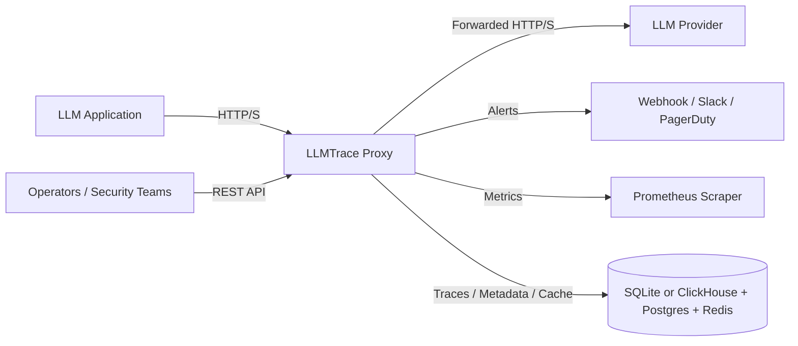

# LLMTrace System Architecture

**Version**: 2.0
**Date**: 2026-02-04
**Status**: Living

## Scope

This document describes the current, code-backed architecture of LLMTrace as implemented in this repository. It focuses on the transparent proxy, storage backends, security analysis pipeline, and supporting services that ship with the `llmtrace-proxy` binary. It does not describe a hosted UI or external SaaS components because they are not served by the proxy runtime.

## System Overview (C4)

### Context Diagram



### Container Diagram

```mermaid
flowchart TD
    subgraph Runtime[llmtrace-proxy (single process)]
        ProxyHTTP[HTTP Proxy + REST API]
        OTel[OTLP/HTTP Ingest (/v1/traces)]
        Grpc[gRPC Ingest (optional)]
        Security[Security Analysis]
        AlertsEngine[Alert Engine]
        StorageLayer[Storage Adapter]
        Metrics[Metrics + Health]
    end

    App[LLM Application] --> ProxyHTTP
    ProxyHTTP --> Provider[LLM Provider]
    ProxyHTTP --> Security
    ProxyHTTP --> StorageLayer
    OTel --> Security
    OTel --> StorageLayer
    Grpc --> Security
    Grpc --> StorageLayer
    Security --> AlertsEngine
    AlertsEngine --> Alerts[Webhook / Slack / PagerDuty]
    Metrics --> Prometheus[Prometheus]
    StorageLayer --> Storage[(SQLite / ClickHouse + Postgres + Redis)]
```

## Runtime Flow

### Transparent Proxy Request Flow

1. Client sends an OpenAI-compatible request to the proxy endpoint (for example `/v1/chat/completions`).
2. The proxy resolves tenant identity from `X-LLMTrace-Tenant-ID` or derives a deterministic UUID from the API key when auth is disabled.
3. The proxy forwards the request to the configured upstream provider and streams the response back to the client.
4. A background task captures prompt/response data, performs security analysis, computes cost estimates, and stores trace data.

### Streaming Analysis Flow

1. For SSE streams, the proxy incrementally parses tokens and runs regex-based checks on a token interval.
2. Streaming output safety checks (PII, leakage, and optional toxicity) run in parallel.
3. If `streaming_analysis.early_stop_on_critical` is enabled, the proxy injects a warning event and terminates the stream on critical output findings.
4. Full security analysis still runs after the stream ends.

## Core Components

### llmtrace-proxy

Primary responsibilities:

- Transparent HTTP proxy to upstream LLM endpoints with SSE passthrough.
- REST API for traces, spans, stats, security findings, tenants, and reports.
- OTLP/HTTP ingestion on `POST /v1/traces` when enabled.
- Optional gRPC ingestion on a separate listen address when enabled.
- Background tasks for trace capture, security analysis, cost estimation, anomaly detection, and alerting.

Key routes are defined in `crates/llmtrace-proxy/src/main.rs`.

### llmtrace-security

Security analysis library used by the proxy.

- Default analyzer is regex-based (`RegexSecurityAnalyzer`).
- When the `ml` feature is enabled (default for the proxy), the proxy can preload an `EnsembleSecurityAnalyzer` that combines regex and ML detectors with optional NER.
- Output safety analysis uses `OutputAnalyzer` with response-only checks in the proxy. Toxicity detection can be enabled; hallucination detection requires the original prompt and is not invoked by the current proxy flow. Regex-based PII and leakage scanning always runs when output safety is enabled.

### llmtrace-storage

Storage abstraction with selectable profiles:

- `memory`: In-memory repositories (testing and dev).
- `lite`: SQLite for traces and metadata, in-memory cache.
- `production`: ClickHouse for traces, PostgreSQL for metadata, Redis for cache (requires feature flags).

The proxy uses `StorageProfile::build` to assemble the storage composite at startup.

### Client SDKs

The repository includes client libraries to help instrument applications, but they are not part of the proxy runtime:

- `llmtrace-sdk` (Rust)
- `llmtrace-python`
- `llmtrace-wasm`

## Security Analysis Pipeline

### Inputs and Outputs

Inputs:

- Prompt text (flattened messages or raw prompt)
- Response text
- Context metadata (tenant, trace, span, provider, model)
- Parsed tool calls (agent actions)

Outputs:

- `SecurityFinding` records with severity, confidence, type, and location
- Optional alerts when severity and confidence thresholds are exceeded

### Execution Model

- Security analysis runs asynchronously in a background task after the upstream response begins.
- The proxy uses a circuit breaker to skip analysis when failures accumulate.
- Streaming analysis runs inline on SSE streams using regex patterns and optional toxicity checks.

## Auth and Tenancy

- When `auth.enabled` is true, all routes except `/health` require `Authorization: Bearer <key>`.
- API keys are stored as SHA-256 hashes in metadata storage; roles are `admin`, `operator`, or `viewer`.
- When auth is disabled, a permissive context is injected and tenant identity is resolved from `X-LLMTrace-Tenant-ID` or derived from the API key.

## Observability

- `/health` returns proxy health and storage connectivity status.
- `/metrics` exposes Prometheus metrics, including circuit breaker state and request counters.
- OTLP/HTTP ingestion allows external traces to be stored and analyzed by the same pipeline.

## Alerts

- Channels supported: webhook, Slack, PagerDuty.
- Email channel is recognized in config but not implemented and will be skipped.
- Cooldown-based deduplication is enforced per finding type.
- Escalation config exists in config schema but is not currently used by the alert engine.

## Configuration and Feature Flags

- Configuration is loaded from YAML, then overridden by environment variables and CLI flags.
- `llmtrace-proxy` enables the `ml` feature by default, which activates the ML security components and output safety analyzers.
- Storage backends for ClickHouse, Postgres, and Redis require their respective feature flags in `llmtrace-storage`.

## Current Limitations and Non-Goals

- The proxy does not serve a web UI or dashboard.
- GraphQL and SQL query engines are not part of the proxy.
- External identity providers are not integrated; auth is API-key based.
- Multi-region ingestion, autoscaling orchestration, and SIEM integrations are not implemented in the proxy runtime.
