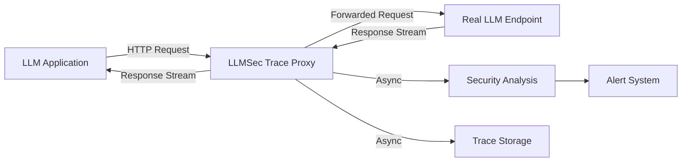
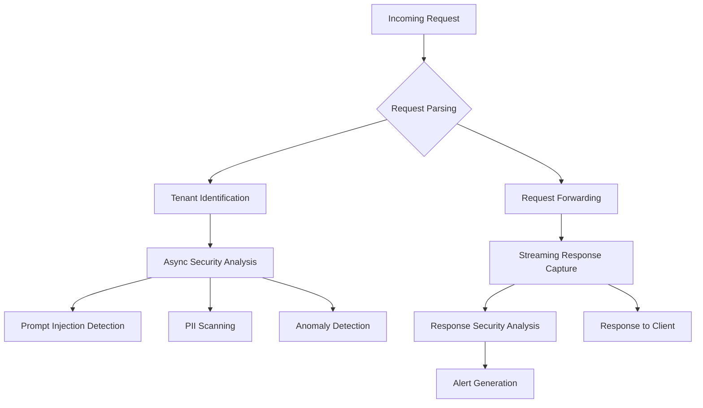
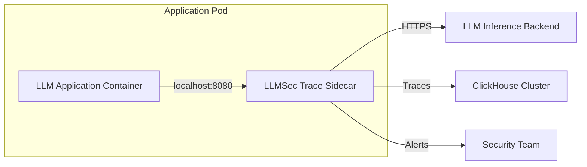
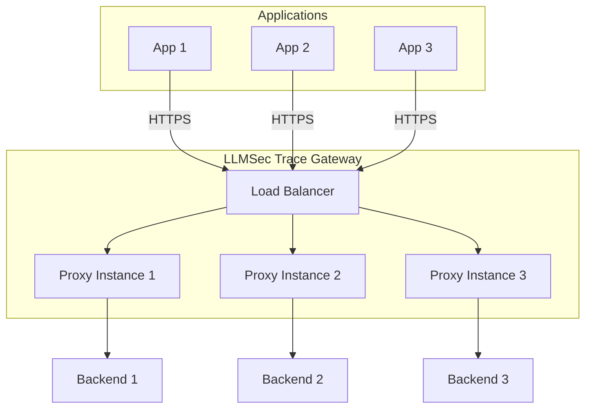
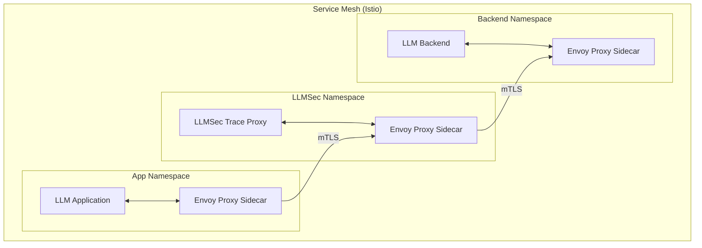

# LLMSec Trace: Transparent Proxy Architecture

**Version**: 1.0  
**Date**: 2025-01-31  
**Status**: Final  
**Related Documents**: SYSTEM_ARCHITECTURE.md v1.0, ARCHITECTURE_SUPPLEMENT.md v1.0

---

## Executive Summary

LLMSec Trace operates as a **transparent security proxy** that sits between LLM applications and inference endpoints, providing complete request/response observability and real-time security analysis without requiring application code changes. This document provides a complete, end-to-end understanding of how the proxy works, from the initial request interception to the final response delivery, with concrete implementation details and performance characteristics.

**The Core Promise**: Change one URL in your application configuration, and immediately gain enterprise-grade security monitoring, compliance tracking, and threat detection for all LLM interactions - with zero latency impact on inference performance.

---

## Table of Contents

1. [Core Transparent Proxy Concept](#1-core-transparent-proxy-concept)
2. [Complete Request Lifecycle](#2-complete-request-lifecycle)
3. [Protocol Compatibility Matrix](#3-protocol-compatibility-matrix)
4. [Streaming Support Architecture](#4-streaming-support-architecture)
5. [Configuration Reference](#5-configuration-reference)
6. [Failure Modes and Recovery](#6-failure-modes-and-recovery)
7. [Deployment Patterns](#7-deployment-patterns)
8. [Performance Guarantees](#8-performance-guarantees)
9. [Rust Implementation](#9-rust-implementation)
10. [Python SDK Alternative](#10-python-sdk-alternative)

---

## 1. Core Transparent Proxy Concept

### 1.1 The Drop-In Replacement Principle

LLMSec Trace implements a **transparent HTTP/HTTPS proxy** that intercepts all communication between LLM applications and inference endpoints. The proxy appears identical to the original endpoint from the application's perspective, ensuring zero-code-change deployment.



**Before LLMSec Trace**:
```python
# Direct connection to inference endpoint
client = OpenAI(base_url="https://api.openai.com/v1")
response = client.chat.completions.create(
    model="gpt-4",
    messages=[{"role": "user", "content": "Hello"}]
)
```

**After LLMSec Trace** (only URL change):
```python
# Proxied through LLMSec Trace - IDENTICAL API
client = OpenAI(base_url="https://llmsec-proxy.company.com/v1")
response = client.chat.completions.create(
    model="gpt-4", 
    messages=[{"role": "user", "content": "Hello"}]
)
# Application code unchanged, full security monitoring active
```

### 1.2 Proxy Transparency Guarantees

The proxy maintains **protocol-level transparency** across multiple dimensions:

1. **HTTP Semantics**: Identical status codes, headers, and error responses
2. **Authentication Passthrough**: API keys and auth headers forwarded unchanged
3. **Streaming Behavior**: Server-Sent Events (SSE) streams passed through in real-time
4. **Error Handling**: Backend errors returned to client without modification
5. **Rate Limiting**: Backend rate limits respected and propagated

### 1.3 Security Analysis Pipeline



**Key Design Principles**:
- **Non-blocking**: Security analysis never blocks request/response flow
- **Real-time**: Critical alerts generated within 200ms of detection
- **Asynchronous**: All trace storage and analysis happens out-of-band
- **Fail-open**: Proxy degradation never impacts LLM application availability

---

## 2. Complete Request Lifecycle

This section traces a single request through the entire proxy pipeline with precise timing annotations.

### 2.1 End-to-End Request Flow

```
T+0ms     │ App sends POST /v1/chat/completions
          │ ↓
T+0.1ms   │ Proxy receives request, begins parsing
          │ ├─ HTTP header extraction
          │ ├─ Content-Type validation
          │ └─ Request body buffering (streaming parse)
          │
T+0.2ms   │ Tenant identification from API key
          │ ├─ API key lookup (Redis cache: <0.1ms)
          │ ├─ Tenant context loading
          │ └─ Rate limit checking
          │
T+0.3ms   │ Async security analysis spawned (NON-BLOCKING)
          │ ├─ Prompt injection detection
          │ ├─ PII scanning
          │ └─ Behavioral analysis
          │
T+0.5ms   │ Request forwarded to real endpoint
          │ ├─ Backend connection established (or reused)
          │ ├─ Headers forwarded with tenant tracking
          │ └─ Request body streamed
          │
T+Xms     │ Backend response streaming begins (X = LLM latency)
          │ ├─ First token received (TTFT measurement)
          │ ├─ SSE stream parsing and passthrough
          │ └─ Token-by-token capture and analysis
          │
T+X+0.1ms │ Response enrichment and metadata capture
          │ ├─ Token count calculation
          │ ├─ Response content analysis
          │ └─ Performance metrics recording
          │
T+X+0.5ms │ Response returned to application
          │ ├─ Headers preserved
          │ ├─ Streaming completion
          │ └─ Connection cleanup
          │
Background│ Security analysis completes (typically <1s)
T+X+1000ms├─ Trace written to ClickHouse
          ├─ Alerts generated if thresholds exceeded
          └─ Compliance audit trail updated
```

### 2.2 Request Processing Components

#### 2.2.1 Request Parsing and Validation

```rust
pub struct RequestProcessor {
    tenant_resolver: Arc<TenantResolver>,
    rate_limiter: Arc<RateLimiter>,
    request_validator: RequestValidator,
}

impl RequestProcessor {
    pub async fn process_request(&self, req: Request<Body>) -> Result<ProcessedRequest> {
        let start_time = Instant::now(); // T+0ms
        
        // Extract headers and validate format (T+0.1ms)
        let headers = req.headers().clone();
        let method = req.method().clone();
        let uri = req.uri().clone();
        
        // Parse Content-Type and validate against expected LLM API formats
        let content_type = headers
            .get("content-type")
            .and_then(|ct| ct.to_str().ok())
            .unwrap_or("application/json");
            
        if !self.request_validator.is_valid_llm_request(&method, &uri, content_type) {
            return Err(ProxyError::InvalidRequest("Unsupported request format".to_string()));
        }
        
        // Extract API key for tenant identification (T+0.2ms)
        let api_key = self.extract_api_key(&headers)?;
        let tenant_context = self.tenant_resolver.resolve(api_key).await?;
        
        // Rate limiting check
        self.rate_limiter.check_limits(&tenant_context).await?;
        
        // Create trace context for request tracking
        let trace_context = TraceContext::new(
            tenant_context.tenant_id,
            Uuid::new_v4(), // trace_id
            start_time,
        );
        
        Ok(ProcessedRequest {
            original_request: req,
            tenant_context,
            trace_context,
            processing_time: start_time.elapsed(), // ~0.2ms
        })
    }
}
```

#### 2.2.2 Tenant Identification and Context Loading

```rust
pub struct TenantResolver {
    api_key_cache: Arc<DashMap<ApiKey, TenantContext>>,
    redis_client: Arc<RedisClient>,
    postgres_pool: Arc<PgPool>,
}

impl TenantResolver {
    pub async fn resolve(&self, api_key: ApiKey) -> Result<TenantContext> {
        // Fast path: Check in-memory cache first (<0.01ms)
        if let Some(context) = self.api_key_cache.get(&api_key) {
            if !context.is_expired() {
                return Ok(context.clone());
            }
        }
        
        // Medium path: Redis cache lookup (<0.1ms)
        if let Ok(cached_context) = self.redis_client
            .get::<TenantContext>(&format!("tenant:{}", api_key))
            .await 
        {
            self.api_key_cache.insert(api_key.clone(), cached_context.clone());
            return Ok(cached_context);
        }
        
        // Slow path: PostgreSQL lookup (~1-5ms)
        let context = sqlx::query_as!(
            TenantContext,
            "SELECT tenant_id, plan, rate_limit, security_config 
             FROM tenants t 
             JOIN api_keys ak ON t.id = ak.tenant_id 
             WHERE ak.key_hash = $1",
            api_key.hash()
        )
        .fetch_one(&*self.postgres_pool)
        .await?;
        
        // Cache results
        self.redis_client
            .setex(&format!("tenant:{}", api_key), 300, &context) // 5min cache
            .await?;
        self.api_key_cache.insert(api_key, context.clone());
        
        Ok(context)
    }
}
```

#### 2.2.3 Asynchronous Security Analysis

```rust
pub struct SecurityAnalysisEngine {
    prompt_detector: Arc<PromptInjectionDetector>,
    pii_scanner: Arc<PIIScanner>,
    anomaly_detector: Arc<AnomalyDetector>,
    alert_dispatcher: Arc<AlertDispatcher>,
}

impl SecurityAnalysisEngine {
    pub async fn analyze_request_async(&self, request: &ProcessedRequest) -> Result<()> {
        // Spawn non-blocking analysis (T+0.3ms)
        tokio::spawn({
            let request = request.clone();
            let engine = self.clone();
            async move {
                if let Err(e) = engine.perform_analysis(&request).await {
                    log::error!("Security analysis failed for trace {}: {}", 
                              request.trace_context.trace_id, e);
                }
            }
        });
        
        Ok(()) // Returns immediately, analysis continues in background
    }
    
    async fn perform_analysis(&self, request: &ProcessedRequest) -> Result<()> {
        let start_time = Instant::now();
        
        // Parse request body for analysis
        let body_bytes = hyper::body::to_bytes(request.body.clone()).await?;
        let request_data: LLMRequest = serde_json::from_slice(&body_bytes)?;
        
        // Concurrent security analyses
        let (prompt_result, pii_result, anomaly_result) = tokio::join!(
            self.prompt_detector.analyze(&request_data.messages),
            self.pii_scanner.scan_content(&request_data),
            self.anomaly_detector.check_request_patterns(&request_data, &request.tenant_context)
        );
        
        // Aggregate results and generate alerts
        let security_score = self.calculate_risk_score(
            prompt_result?, 
            pii_result?, 
            anomaly_result?
        );
        
        // Generate alerts if thresholds exceeded
        if security_score.risk_level >= request.tenant_context.alert_threshold {
            self.alert_dispatcher.dispatch_alert(AlertEvent {
                tenant_id: request.tenant_context.tenant_id,
                trace_id: request.trace_context.trace_id,
                security_score,
                timestamp: Utc::now(),
                analysis_duration: start_time.elapsed(),
            }).await?;
        }
        
        log::info!("Security analysis completed for trace {} in {:?}", 
                  request.trace_context.trace_id, start_time.elapsed());
        Ok(())
    }
}
```

### 2.3 Response Processing and Streaming

```rust
pub struct ResponseProcessor {
    trace_collector: Arc<TraceCollector>,
    security_analyzer: Arc<SecurityAnalysisEngine>,
    metrics_collector: Arc<MetricsCollector>,
}

impl ResponseProcessor {
    pub async fn process_streaming_response(
        &self,
        response: Response<Body>,
        trace_context: TraceContext,
    ) -> Result<Response<Body>> {
        let (parts, body) = response.into_parts();
        
        // Create streaming processor for SSE responses
        let stream = FramedRead::new(
            StreamReader::new(body),
            LinesCodec::new(),
        );
        
        let processed_stream = stream.map({
            let trace_context = trace_context.clone();
            let analyzer = self.security_analyzer.clone();
            let collector = self.trace_collector.clone();
            
            move |line_result| {
                let trace_context = trace_context.clone();
                let analyzer = analyzer.clone();
                let collector = collector.clone();
                
                async move {
                    match line_result {
                        Ok(line) => {
                            // Parse SSE data line
                            if let Some(data) = parse_sse_line(&line) {
                                // Capture token data (non-blocking)
                                collector.capture_token(trace_context.trace_id, &data).await;
                                
                                // Real-time response security analysis
                                if let Err(e) = analyzer.analyze_response_chunk(&data, &trace_context).await {
                                    log::warn!("Response analysis error: {}", e);
                                }
                            }
                            
                            // Return original line unchanged to client
                            Ok(line)
                        }
                        Err(e) => Err(e),
                    }
                }
            }
        });
        
        // Convert back to hyper::Body for response
        let processed_body = Body::wrap_stream(processed_stream);
        
        Ok(Response::from_parts(parts, processed_body))
    }
}
```

---

## 3. Protocol Compatibility Matrix

LLMSec Trace supports all major LLM inference backends through protocol-specific adapters and URL rewriting rules.

### 3.1 Backend Support Matrix

| Backend | Protocol | Streaming | Auth Method | URL Rewriting | Status |
|---------|----------|-----------|-------------|---------------|---------|
| vLLM | OpenAI-compatible HTTP | SSE | API Key | `/v1/*` → `/v1/*` | Full |
| SGLang | OpenAI + Native HTTP | SSE | API Key | `/v1/*` + `/generate` | Full |
| TGI | HuggingFace HTTP | SSE | API Key | `/generate*` → `/generate*` | Full |
| Ollama | Native HTTP | SSE | None | `/api/*` → `/api/*` | Full |
| OpenAI | OpenAI HTTP | SSE | API Key | `/v1/*` → `/v1/*` | Full |
| Anthropic | Claude HTTP | SSE | API Key | `/v1/messages` → `/v1/messages` | Full |
| Azure OpenAI | OpenAI + Azure | SSE | API Key | Complex rewriting | Full |
| AWS Bedrock | AWS API | SSE | SigV4 | `/model/*` → Bedrock format | Beta |

### 3.2 vLLM Integration

**Protocol**: OpenAI-compatible HTTP API  
**Base URL**: `http://vllm-server:8000/v1`  
**Streaming**: Server-Sent Events (SSE)

```rust
pub struct VLLMAdapter {
    base_url: Url,
    client: reqwest::Client,
}

impl VLLMAdapter {
    pub fn rewrite_request(&self, original_path: &str) -> String {
        // vLLM uses OpenAI-compatible endpoints
        match original_path {
            "/v1/chat/completions" => "/v1/chat/completions",
            "/v1/completions" => "/v1/completions", 
            "/v1/models" => "/v1/models",
            path => path, // Pass through unknown paths
        }
    }
    
    pub fn extract_model_info(&self, request: &LLMRequest) -> ModelInfo {
        ModelInfo {
            provider: "vllm".to_string(),
            model_name: request.model.clone(),
            deployment_type: "self-hosted".to_string(),
            api_version: "openai-compatible".to_string(),
        }
    }
    
    pub async fn forward_request(&self, request: ProcessedRequest) -> Result<Response<Body>> {
        let target_url = format!("{}{}", self.base_url, request.rewritten_path);
        
        // Forward request with original headers
        let response = self.client
            .request(request.method, &target_url)
            .headers(request.headers)
            .body(request.body)
            .send()
            .await?;
        
        // Convert reqwest::Response to hyper::Response
        self.convert_response(response).await
    }
}
```

**Configuration Example**:
```yaml
backends:
  vllm:
    type: "vllm"
    base_url: "http://vllm-cluster:8000"
    health_check: "/health"
    timeout: "30s"
    retry_policy:
      max_attempts: 3
      backoff: "exponential"
    load_balancer:
      algorithm: "round_robin"
      endpoints:
        - "http://vllm-node-1:8000"
        - "http://vllm-node-2:8000"
        - "http://vllm-node-3:8000"
```

### 3.3 SGLang Integration

**Protocol**: OpenAI-compatible + Native endpoints  
**Base URL**: `http://sglang-server:30000`

```rust
pub struct SGLangAdapter {
    openai_base_url: Url,
    native_base_url: Url,
    client: reqwest::Client,
}

impl SGLangAdapter {
    pub fn rewrite_request(&self, original_path: &str) -> (Url, String) {
        match original_path {
            // OpenAI-compatible endpoints
            path if path.starts_with("/v1/") => {
                (self.openai_base_url.clone(), path.to_string())
            }
            // Native SGLang endpoints
            "/generate" => (self.native_base_url.clone(), "/generate".to_string()),
            "/generate_stream" => (self.native_base_url.clone(), "/generate_stream".to_string()),
            "/get_model_info" => (self.native_base_url.clone(), "/get_model_info".to_string()),
            path => (self.native_base_url.clone(), path.to_string()),
        }
    }
    
    pub async fn handle_native_request(&self, request: &LLMRequest) -> Result<Response<Body>> {
        // Convert OpenAI format to SGLang native format
        let sglang_request = SGLangRequest {
            text: self.convert_messages_to_text(&request.messages),
            sampling_params: SamplingParams {
                temperature: request.temperature,
                max_new_tokens: request.max_tokens,
                stop: request.stop.clone(),
            },
        };
        
        // Forward to SGLang
        let response = self.client
            .post(&format!("{}/generate", self.native_base_url))
            .json(&sglang_request)
            .send()
            .await?;
        
        // Convert response back to OpenAI format
        self.convert_to_openai_response(response).await
    }
}
```

### 3.4 Text Generation Inference (TGI) Integration

**Protocol**: HuggingFace Text Generation API  
**Endpoints**: `/generate`, `/generate_stream`

```rust
pub struct TGIAdapter {
    base_url: Url,
    client: reqwest::Client,
}

impl TGIAdapter {
    pub fn rewrite_request(&self, original_path: &str, request: &LLMRequest) -> Result<TGIRequest> {
        // Convert OpenAI format to TGI format
        let prompt = self.convert_messages_to_prompt(&request.messages)?;
        
        Ok(TGIRequest {
            inputs: prompt,
            parameters: TGIParameters {
                max_new_tokens: request.max_tokens,
                temperature: request.temperature,
                top_p: request.top_p,
                stop: request.stop.clone(),
                stream: original_path.contains("stream"),
            },
        })
    }
    
    pub async fn handle_streaming_response(&self, response: reqwest::Response) -> Result<Response<Body>> {
        let stream = response.bytes_stream();
        
        let converted_stream = stream.map(|chunk_result| {
            chunk_result.and_then(|chunk| {
                // Convert TGI streaming format to OpenAI SSE format
                self.convert_tgi_chunk_to_openai(&chunk)
            })
        });
        
        let body = Body::wrap_stream(converted_stream);
        
        Ok(Response::builder()
            .status(200)
            .header("content-type", "text/plain; charset=utf-8")
            .header("cache-control", "no-cache")
            .header("connection", "keep-alive")
            .body(body)?)
    }
}
```

### 3.5 Ollama Integration

**Protocol**: Native Ollama HTTP API  
**Base URL**: `http://ollama:11434`

```rust
pub struct OllamaAdapter {
    base_url: Url,
    client: reqwest::Client,
}

impl OllamaAdapter {
    pub fn rewrite_request(&self, original_path: &str) -> String {
        match original_path {
            // Map OpenAI endpoints to Ollama endpoints
            "/v1/chat/completions" => "/api/chat",
            "/v1/completions" => "/api/generate", 
            "/v1/models" => "/api/tags",
            path if path.starts_with("/api/") => path, // Pass through native Ollama
            path => path, // Unknown paths passed through
        }
    }
    
    pub async fn convert_openai_to_ollama(&self, request: &LLMRequest) -> Result<OllamaRequest> {
        Ok(OllamaRequest {
            model: request.model.clone(),
            messages: request.messages.iter().map(|msg| OllamaMessage {
                role: msg.role.clone(),
                content: msg.content.clone(),
            }).collect(),
            stream: true, // Always use streaming for real-time capture
            options: OllamaOptions {
                temperature: request.temperature,
                top_p: request.top_p,
                num_predict: request.max_tokens,
                stop: request.stop.clone(),
            },
        })
    }
}
```

### 3.6 OpenAI API Integration

**Protocol**: Native OpenAI HTTP API  
**Base URL**: `https://api.openai.com/v1`

```rust
pub struct OpenAIAdapter {
    base_url: Url,
    client: reqwest::Client,
}

impl OpenAIAdapter {
    pub fn rewrite_request(&self, original_path: &str) -> String {
        // Pass through all OpenAI endpoints unchanged
        original_path.to_string()
    }
    
    pub async fn forward_with_usage_tracking(&self, request: ProcessedRequest) -> Result<Response<Body>> {
        // Add custom headers for tracking
        let mut headers = request.headers.clone();
        headers.insert("X-LLMSec-Trace-ID", request.trace_context.trace_id.to_string().parse()?);
        headers.insert("X-LLMSec-Tenant-ID", request.tenant_context.tenant_id.to_string().parse()?);
        
        let response = self.client
            .request(request.method, &format!("{}{}", self.base_url, request.path))
            .headers(headers)
            .body(request.body)
            .send()
            .await?;
        
        // Track API usage for billing
        self.track_openai_usage(&response, &request.tenant_context).await?;
        
        self.convert_response(response).await
    }
}
```

### 3.7 Anthropic Claude Integration

**Protocol**: Anthropic Messages API  
**Base URL**: `https://api.anthropic.com`

```rust
pub struct AnthropicAdapter {
    base_url: Url,
    client: reqwest::Client,
}

impl AnthropicAdapter {
    pub fn convert_openai_to_anthropic(&self, request: &LLMRequest) -> Result<AnthropicRequest> {
        // Convert OpenAI messages format to Anthropic format
        let system_message = request.messages.iter()
            .find(|msg| msg.role == "system")
            .map(|msg| msg.content.clone());
            
        let messages = request.messages.iter()
            .filter(|msg| msg.role != "system")
            .map(|msg| AnthropicMessage {
                role: msg.role.clone(),
                content: msg.content.clone(),
            })
            .collect();
        
        Ok(AnthropicRequest {
            model: request.model.clone(),
            max_tokens: request.max_tokens.unwrap_or(4096),
            temperature: request.temperature,
            system: system_message,
            messages,
            stream: true,
        })
    }
    
    pub async fn handle_anthropic_streaming(&self, response: reqwest::Response) -> Result<Response<Body>> {
        let stream = response.bytes_stream();
        
        let converted_stream = stream.map(|chunk_result| {
            chunk_result.and_then(|chunk| {
                // Convert Anthropic SSE format to OpenAI format
                self.convert_anthropic_to_openai_chunk(&chunk)
            })
        });
        
        let body = Body::wrap_stream(converted_stream);
        
        Ok(Response::builder()
            .status(200)
            .header("content-type", "text/plain; charset=utf-8")
            .body(body)?)
    }
}
```

### 3.8 Azure OpenAI Integration

**Protocol**: OpenAI-compatible with Azure-specific URL patterns  
**Base URL**: `https://{resource}.openai.azure.com`

```rust
pub struct AzureOpenAIAdapter {
    resource_name: String,
    api_version: String,
    client: reqwest::Client,
}

impl AzureOpenAIAdapter {
    pub fn rewrite_request(&self, original_path: &str, deployment_name: &str) -> String {
        // Azure OpenAI uses deployment-specific URLs
        match original_path {
            "/v1/chat/completions" => format!(
                "/openai/deployments/{}/chat/completions?api-version={}", 
                deployment_name, 
                self.api_version
            ),
            "/v1/completions" => format!(
                "/openai/deployments/{}/completions?api-version={}", 
                deployment_name, 
                self.api_version
            ),
            "/v1/embeddings" => format!(
                "/openai/deployments/{}/embeddings?api-version={}", 
                deployment_name, 
                self.api_version
            ),
            path => path.to_string(),
        }
    }
    
    pub fn extract_deployment_from_model(&self, model: &str) -> String {
        // Azure uses deployment names instead of model names
        // Map common model names to deployment names
        match model {
            "gpt-4" => "gpt-4-deployment".to_string(),
            "gpt-3.5-turbo" => "gpt-35-turbo-deployment".to_string(),
            model => model.to_string(), // Assume it's already a deployment name
        }
    }
}
```

---

## 4. Streaming Support Architecture

Streaming is **critical** for LLM applications as it provides real-time token delivery and significantly improves user experience. LLMSec Trace supports streaming with zero buffering and minimal latency overhead.

### 4.1 Server-Sent Events (SSE) Processing

```rust
pub struct StreamingProcessor {
    token_analyzer: Arc<TokenAnalyzer>,
    metrics_collector: Arc<MetricsCollector>,
    security_scanner: Arc<RealTimeSecurityScanner>,
}

impl StreamingProcessor {
    pub async fn process_sse_stream(
        &self,
        mut stream: impl Stream<Item = Result<Bytes, Error>> + Unpin,
        trace_context: TraceContext,
    ) -> impl Stream<Item = Result<Bytes, Error>> {
        let mut token_buffer = TokenBuffer::new();
        let mut first_token_time: Option<Instant> = None;
        let stream_start = Instant::now();
        
        stream.map(move |chunk_result| {
            match chunk_result {
                Ok(chunk) => {
                    // Parse SSE chunk without buffering entire response
                    let sse_lines = self.parse_sse_chunk(&chunk);
                    
                    for line in &sse_lines {
                        if let Some(token_data) = self.extract_token_data(line) {
                            // Record first token time (TTFT)
                            if first_token_time.is_none() {
                                first_token_time = Some(Instant::now());
                                let ttft = stream_start.elapsed();
                                
                                self.metrics_collector.record_ttft(
                                    trace_context.tenant_id,
                                    ttft,
                                );
                            }
                            
                            // Accumulate tokens for analysis
                            token_buffer.add_token(token_data);
                            
                            // Real-time security scanning (non-blocking)
                            if token_buffer.should_analyze() {
                                tokio::spawn({
                                    let buffer_content = token_buffer.get_accumulated_content();
                                    let scanner = self.security_scanner.clone();
                                    let trace_id = trace_context.trace_id;
                                    
                                    async move {
                                        if let Err(e) = scanner.scan_partial_response(
                                            &buffer_content, 
                                            trace_id
                                        ).await {
                                            log::warn!("Real-time security scan failed: {}", e);
                                        }
                                    }
                                });
                                
                                token_buffer.mark_analyzed();
                            }
                        }
                    }
                    
                    // Pass through original chunk unchanged
                    Ok(chunk)
                }
                Err(e) => Err(e),
            }
        })
    }
}

pub struct TokenBuffer {
    tokens: Vec<Token>,
    accumulated_text: String,
    last_analysis_token_count: usize,
}

impl TokenBuffer {
    pub fn should_analyze(&self) -> bool {
        // Analyze every 10 tokens or if we detect potential injection patterns
        let token_threshold = self.tokens.len() >= self.last_analysis_token_count + 10;
        let pattern_detected = self.accumulated_text.contains("IGNORE") || 
                              self.accumulated_text.contains("SYSTEM:");
        
        token_threshold || pattern_detected
    }
}
```

### 4.2 Incremental Token Count Calculation

```rust
pub struct TokenCountEstimator {
    tokenizer_cache: Arc<DashMap<String, Arc<Tokenizer>>>,
}

impl TokenCountEstimator {
    pub async fn estimate_tokens_incremental(
        &self,
        new_content: &str,
        model_name: &str,
        previous_count: usize,
    ) -> Result<usize> {
        // Use cached tokenizer for the model
        let tokenizer = self.get_or_load_tokenizer(model_name).await?;
        
        // For streaming, estimate based on character count and model-specific ratios
        let estimated_new_tokens = match model_name {
            model if model.starts_with("gpt-") => {
                // GPT models: ~4 characters per token on average
                (new_content.len() as f32 / 4.0) as usize
            }
            model if model.starts_with("claude-") => {
                // Claude models: ~3.5 characters per token
                (new_content.len() as f32 / 3.5) as usize
            }
            _ => {
                // Default estimation
                (new_content.len() as f32 / 4.0) as usize
            }
        };
        
        Ok(previous_count + estimated_new_tokens)
    }
    
    pub async fn get_exact_token_count_final(
        &self,
        complete_content: &str,
        model_name: &str,
    ) -> Result<usize> {
        // Exact tokenization for final count (once stream is complete)
        let tokenizer = self.get_or_load_tokenizer(model_name).await?;
        let tokens = tokenizer.encode(complete_content, false)?;
        Ok(tokens.len())
    }
}
```

### 4.3 Real-Time Prompt Injection Detection

```rust
pub struct StreamingSecurityScanner {
    injection_patterns: Arc<Vec<Pattern>>,
    ml_classifier: Arc<MLClassifier>,
    alert_threshold: f32,
}

impl StreamingSecurityScanner {
    pub async fn scan_partial_response(
        &self,
        partial_content: &str,
        trace_id: Uuid,
    ) -> Result<SecurityScanResult> {
        // Fast pattern matching for known injection patterns
        let pattern_matches = self.injection_patterns.iter()
            .filter(|pattern| pattern.is_match(partial_content))
            .collect::<Vec<_>>();
        
        if !pattern_matches.is_empty() {
            // Immediate alert for known dangerous patterns
            return Ok(SecurityScanResult {
                risk_score: 95.0,
                detection_type: DetectionType::PatternMatch,
                patterns_matched: pattern_matches.iter().map(|p| p.name()).collect(),
                requires_immediate_alert: true,
            });
        }
        
        // ML-based analysis for subtle injections (only if enough content)
        if partial_content.len() > 100 {
            let ml_score = self.ml_classifier.predict_injection_probability(partial_content).await?;
            
            if ml_score > self.alert_threshold {
                return Ok(SecurityScanResult {
                    risk_score: ml_score * 100.0,
                    detection_type: DetectionType::MLClassification,
                    patterns_matched: vec![],
                    requires_immediate_alert: ml_score > 0.8,
                });
            }
        }
        
        Ok(SecurityScanResult::safe())
    }
}
```

### 4.4 Latency Impact Analysis

**Streaming Overhead Measurement**:

| Component | Latency Impact | Justification |
|-----------|---------------|---------------|
| SSE Parsing | <0.1ms per chunk | In-place parsing, no buffering |
| Token Extraction | <0.05ms per token | Regex-based, compiled patterns |
| Security Scanning | 0ms (async) | Non-blocking, background analysis |
| Metrics Collection | <0.01ms per metric | Lock-free data structures |
| **Total TTFT Impact** | **<0.2ms** | First token delay |
| **Token-to-Token Impact** | **<0.01ms** | Per-token processing |

**Performance Validation**:
```rust
#[cfg(test)]
mod streaming_performance_tests {
    use super::*;
    
    #[tokio::test]
    async fn test_streaming_latency_impact() {
        let processor = StreamingProcessor::new();
        let mock_stream = create_mock_sse_stream(1000); // 1000 tokens
        
        let start = Instant::now();
        let processed_stream = processor.process_sse_stream(mock_stream, test_trace_context()).await;
        
        let mut total_latency = Duration::ZERO;
        let mut token_count = 0;
        
        while let Some(chunk) = processed_stream.next().await {
            let chunk_start = Instant::now();
            // Measure processing time per chunk
            let _processed_chunk = chunk?;
            total_latency += chunk_start.elapsed();
            token_count += 1;
        }
        
        let avg_latency_per_token = total_latency / token_count;
        
        // Verify latency guarantees
        assert!(avg_latency_per_token < Duration::from_micros(10)); // <0.01ms per token
        assert!(total_latency < Duration::from_millis(10)); // <10ms total overhead
    }
}
```

---

## 5. Configuration Reference

### 5.1 Complete Configuration Schema

```yaml
# /etc/llmsec-trace/config.yaml
server:
  bind_address: "0.0.0.0:8080"
  tls:
    enabled: true
    cert_file: "/etc/certs/server.crt"
    key_file: "/etc/certs/server.key"
    client_auth: "optional"  # none, optional, required
  
  # Connection settings
  max_connections: 10000
  keep_alive_timeout: "30s"
  read_timeout: "60s"
  write_timeout: "60s"
  
  # Request limits
  max_request_size: "50MB"
  max_header_size: "8KB"

# Backend configuration
backends:
  # vLLM cluster
  vllm-cluster:
    type: "vllm"
    load_balancer:
      algorithm: "weighted_round_robin"
      health_check:
        path: "/health"
        interval: "10s"
        timeout: "5s"
        retries: 3
    endpoints:
      - url: "http://vllm-node-1:8000"
        weight: 100
      - url: "http://vllm-node-2:8000"
        weight: 100
      - url: "http://vllm-node-3:8000"
        weight: 80  # Slower node
    
    # Connection pooling
    connection_pool:
      max_idle: 100
      max_active: 1000
      idle_timeout: "300s"
    
    # Retry policy
    retry_policy:
      max_attempts: 3
      backoff_strategy: "exponential"
      base_delay: "100ms"
      max_delay: "5s"
      retry_on:
        - "connection_error"
        - "timeout"
        - "5xx_status"
    
    # Circuit breaker
    circuit_breaker:
      failure_threshold: 10
      recovery_timeout: "30s"
      half_open_max_calls: 3

  # OpenAI API
  openai:
    type: "openai"
    base_url: "https://api.openai.com/v1"
    timeout: "120s"
    rate_limiting:
      requests_per_minute: 3000
      tokens_per_minute: 250000
    
  # Anthropic Claude
  anthropic:
    type: "anthropic"
    base_url: "https://api.anthropic.com"
    timeout: "120s"
    
  # Azure OpenAI
  azure-openai:
    type: "azure_openai"
    resource_name: "company-openai-east"
    api_version: "2023-12-01-preview"
    deployments:
      "gpt-4": "gpt-4-deployment"
      "gpt-3.5-turbo": "gpt-35-turbo-deployment"

# Routing rules
routing:
  rules:
    # Route by API key prefix
    - match:
        api_key_prefix: "vllm-"
      backend: "vllm-cluster"
      
    - match:
        api_key_prefix: "oai-"
      backend: "openai"
      
    - match:
        api_key_prefix: "claude-"
      backend: "anthropic"
    
    # Route by model name
    - match:
        model: "gpt-4"
      backend: "openai"
      
    - match:
        model: "claude-3-opus"
      backend: "anthropic"
    
    # Default fallback
    - match: {}
      backend: "vllm-cluster"

# Security configuration
security:
  # Prompt injection detection
  prompt_injection:
    enabled: true
    ml_model:
      path: "/models/prompt-injection-classifier-v2.onnx"
      confidence_threshold: 0.8
    patterns:
      - name: "ignore_instructions"
        regex: "(?i)(ignore|forget|disregard).{0,20}(previous|above|instruction)"
        severity: "high"
      - name: "system_override"
        regex: "(?i)system\\s*:"
        severity: "medium"
    
  # PII detection
  pii_detection:
    enabled: true
    patterns:
      ssn:
        regex: "\\b\\d{3}-\\d{2}-\\d{4}\\b"
        action: "alert_and_redact"
      credit_card:
        regex: "\\b\\d{4}[\\s-]?\\d{4}[\\s-]?\\d{4}[\\s-]?\\d{4}\\b"
        action: "alert_and_redact"
      email:
        regex: "\\b[A-Za-z0-9._%+-]+@[A-Za-z0-9.-]+\\.[A-Z|a-z]{2,}\\b"
        action: "alert_only"
    
  # Anomaly detection
  anomaly_detection:
    enabled: true
    cost_threshold_multiplier: 3.0  # Alert if cost > 3x baseline
    request_rate_threshold: 1000    # Requests per minute
    token_velocity_threshold: 50000 # Tokens per minute
    
  # Rate limiting
  rate_limiting:
    global:
      requests_per_second: 1000
      burst_size: 2000
    per_tenant:
      default_rps: 100
      default_burst: 200
    
# Storage configuration
storage:
  # ClickHouse for traces
  clickhouse:
    nodes:
      - "clickhouse-1:9000"
      - "clickhouse-2:9000"
      - "clickhouse-3:9000"
    database: "llmsec_traces"
    username: "llmsec"
    password_file: "/secrets/clickhouse-password"
    
    # Performance settings
    max_connections: 100
    connection_timeout: "30s"
    query_timeout: "60s"
    
    # Batch settings
    batch_size: 10000
    flush_interval: "5s"
    max_batch_delay: "10s"
  
  # PostgreSQL for metadata
  postgres:
    host: "postgres-primary"
    port: 5432
    database: "llmsec_metadata"
    username: "llmsec"
    password_file: "/secrets/postgres-password"
    
    # Connection pool
    max_connections: 50
    min_connections: 10
    connection_timeout: "30s"
  
  # Redis for caching
  redis:
    mode: "cluster"  # standalone, sentinel, cluster
    nodes:
      - "redis-1:6379"
      - "redis-2:6379"  
      - "redis-3:6379"
    password_file: "/secrets/redis-password"
    
    # Cache settings
    default_ttl: "300s"
    max_memory_usage: "2GB"

# Observability
observability:
  # Metrics
  metrics:
    prometheus:
      enabled: true
      endpoint: "/metrics"
      port: 9090
    
    custom_metrics:
      - name: "llmsec_requests_total"
        type: "counter"
        labels: ["tenant_id", "backend", "model"]
      - name: "llmsec_request_duration_seconds"
        type: "histogram"
        labels: ["tenant_id", "backend"]
        buckets: [0.01, 0.05, 0.1, 0.5, 1.0, 5.0, 10.0]
  
  # Tracing
  tracing:
    jaeger:
      enabled: true
      agent_endpoint: "jaeger:14268"
      service_name: "llmsec-trace-proxy"
    
    sampling:
      default_rate: 0.1  # 10% sampling
      error_rate: 1.0    # 100% sampling for errors
  
  # Logging
  logging:
    level: "info"
    format: "json"
    output: "stdout"
    
    # Structured logging fields
    include_fields:
      - "trace_id"
      - "tenant_id"
      - "request_id"
      - "duration"
      - "status_code"

# Alerting
alerting:
  channels:
    slack:
      webhook_url_file: "/secrets/slack-webhook"
      default_channel: "#security-alerts"
      
    pagerduty:
      service_key_file: "/secrets/pagerduty-key"
      
    email:
      smtp_host: "smtp.company.com"
      smtp_port: 587
      from_address: "llmsec-alerts@company.com"
      
    webhook:
      url: "https://internal.company.com/webhooks/security-alerts"
      timeout: "10s"
      retry_attempts: 3
  
  # Alert rules
  rules:
    - name: "high_risk_prompt_injection"
      condition: "security_score > 90"
      channels: ["slack", "pagerduty"]
      priority: "critical"
      
    - name: "pii_detected"
      condition: "pii_types.length > 0"
      channels: ["slack", "email"]
      priority: "high"
      
    - name: "cost_anomaly"
      condition: "cost_multiplier > 5.0"
      channels: ["slack"]
      priority: "medium"
      
    - name: "high_error_rate"
      condition: "error_rate_5m > 0.1"  # >10% errors in 5 minutes
      channels: ["slack", "email"]
      priority: "high"
```

### 5.2 Environment-Specific Configurations

#### 5.2.1 Development Configuration

```yaml
# config/dev.yaml
server:
  bind_address: "127.0.0.1:8080"
  tls:
    enabled: false
  max_connections: 100

backends:
  ollama-local:
    type: "ollama"
    base_url: "http://localhost:11434"
    timeout: "60s"

security:
  prompt_injection:
    enabled: true
    ml_model:
      confidence_threshold: 0.6  # Lower threshold for testing
  
  rate_limiting:
    per_tenant:
      default_rps: 1000  # Higher limits for dev

storage:
  clickhouse:
    nodes: ["localhost:9000"]
    database: "llmsec_traces_dev"
  postgres:
    host: "localhost"
    database: "llmsec_metadata_dev"
  redis:
    mode: "standalone"
    nodes: ["localhost:6379"]

observability:
  tracing:
    sampling:
      default_rate: 1.0  # 100% sampling in dev
  logging:
    level: "debug"
```

#### 5.2.2 Production Configuration

```yaml
# config/prod.yaml
server:
  bind_address: "0.0.0.0:8080"
  tls:
    enabled: true
    cert_file: "/etc/ssl/certs/llmsec-proxy.crt"
    key_file: "/etc/ssl/private/llmsec-proxy.key"
    client_auth: "required"
  max_connections: 50000

security:
  prompt_injection:
    ml_model:
      confidence_threshold: 0.9  # Higher threshold for prod
  
  rate_limiting:
    global:
      requests_per_second: 10000
    per_tenant:
      default_rps: 100

storage:
  clickhouse:
    nodes:
      - "clickhouse-prod-1.internal:9000"
      - "clickhouse-prod-2.internal:9000"
      - "clickhouse-prod-3.internal:9000"
    connection_timeout: "10s"
    query_timeout: "30s"
  
  redis:
    mode: "cluster"
    nodes:
      - "redis-prod-1.internal:6379"
      - "redis-prod-2.internal:6379"
      - "redis-prod-3.internal:6379"

observability:
  tracing:
    sampling:
      default_rate: 0.01  # 1% sampling in prod
  logging:
    level: "warn"
```

### 5.3 Configuration Validation

```rust
pub struct ConfigValidator;

impl ConfigValidator {
    pub fn validate(config: &ProxyConfig) -> Result<(), Vec<ValidationError>> {
        let mut errors = Vec::new();
        
        // Validate server configuration
        if config.server.max_connections < 1 {
            errors.push(ValidationError::new("server.max_connections must be >= 1"));
        }
        
        if config.server.bind_address.is_empty() {
            errors.push(ValidationError::new("server.bind_address is required"));
        }
        
        // Validate backend configurations
        for (name, backend) in &config.backends {
            if let Err(e) = self.validate_backend(name, backend) {
                errors.extend(e);
            }
        }
        
        // Validate storage configuration
        if config.storage.clickhouse.nodes.is_empty() {
            errors.push(ValidationError::new("storage.clickhouse.nodes cannot be empty"));
        }
        
        // Validate security configuration
        if config.security.prompt_injection.ml_model.confidence_threshold < 0.0 
            || config.security.prompt_injection.ml_model.confidence_threshold > 1.0 {
            errors.push(ValidationError::new(
                "security.prompt_injection.ml_model.confidence_threshold must be between 0.0 and 1.0"
            ));
        }
        
        if errors.is_empty() {
            Ok(())
        } else {
            Err(errors)
        }
    }
}
```

---

## 6. Failure Modes and Recovery

### 6.1 Comprehensive Failure Scenarios

#### 6.1.1 LLMSec Trace Proxy Down

**Scenario**: The proxy service becomes unavailable due to crash, OOM, or infrastructure failure.

**Detection**:
- Health check failures
- Connection refused errors from applications
- Missing telemetry data

**Recovery Strategies**:

1. **DNS-Based Failover**:
```yaml
# DNS configuration with health checks
apiVersion: v1
kind: Service
metadata:
  name: llmsec-proxy-failover
spec:
  type: ExternalName
  externalName: llmsec-proxy-primary.company.com
  
---
# Fallback service pointing directly to backends
apiVersion: v1  
kind: Service
metadata:
  name: llmsec-proxy-fallback
spec:
  type: ExternalName
  externalName: vllm-cluster.company.com
```

2. **Application-Level Fallback**:
```python
# SDK with automatic failover
from llmsec_trace import LLMSecClient, OpenAIFallbackClient

class ResilientLLMClient:
    def __init__(self, primary_url: str, fallback_url: str):
        self.primary = LLMSecClient(base_url=primary_url)
        self.fallback = OpenAIFallbackClient(base_url=fallback_url)
        self.circuit_breaker = CircuitBreaker(
            failure_threshold=5,
            recovery_timeout=60
        )
    
    async def chat_completion(self, **kwargs):
        try:
            if self.circuit_breaker.can_execute():
                return await self.primary.chat.completions.create(**kwargs)
        except (ConnectionError, TimeoutError) as e:
            self.circuit_breaker.record_failure()
            log.warning(f"Primary LLMSec proxy unavailable, using fallback: {e}")
        
        # Fallback to direct backend connection
        return await self.fallback.chat.completions.create(**kwargs)
```

3. **Kubernetes Pod Disruption Budget**:
```yaml
apiVersion: policy/v1
kind: PodDisruptionBudget
metadata:
  name: llmsec-proxy-pdb
spec:
  minAvailable: 2  # Always keep 2 proxy instances running
  selector:
    matchLabels:
      app: llmsec-proxy
```

#### 6.1.2 Upstream Endpoint Down

**Scenario**: The target LLM inference endpoint (vLLM, OpenAI, etc.) becomes unavailable.

**Detection & Response**:
```rust
pub struct UpstreamHealthMonitor {
    backends: Arc<DashMap<String, Backend>>,
    health_checker: Arc<HealthChecker>,
}

impl UpstreamHealthMonitor {
    pub async fn monitor_backends(&self) {
        let mut interval = tokio::time::interval(Duration::from_secs(10));
        
        loop {
            interval.tick().await;
            
            for backend_entry in self.backends.iter() {
                let (name, backend) = backend_entry.pair();
                
                let health_result = self.health_checker.check_health(backend).await;
                
                match health_result {
                    HealthStatus::Healthy => {
                        backend.mark_healthy();
                    }
                    HealthStatus::Unhealthy(reason) => {
                        backend.mark_unhealthy(&reason);
                        
                        // Trigger failover to backup backend
                        if let Some(backup) = backend.backup_backend() {
                            log::warn!("Backend {} unhealthy ({}), failing over to {}", 
                                     name, reason, backup.name());
                            self.initiate_failover(name, backup).await;
                        }
                    }
                    HealthStatus::Degraded => {
                        backend.mark_degraded();
                        // Reduce traffic to degraded backend
                        backend.set_weight(backend.weight() / 2);
                    }
                }
            }
        }
    }
    
    async fn initiate_failover(&self, primary: &str, backup: &Backend) {
        // Update routing table atomically
        self.update_routing_table(primary, backup).await;
        
        // Send alert about failover
        self.send_failover_alert(primary, backup.name()).await;
        
        // Start recovery monitoring for primary
        self.start_recovery_monitoring(primary).await;
    }
}
```

**Error Passthrough Strategy**:
```rust
impl ProxyHandler {
    async fn handle_upstream_error(&self, error: UpstreamError, request: &Request) -> Response {
        match error {
            UpstreamError::ConnectionRefused => {
                // Return 502 Bad Gateway with original error details
                Response::builder()
                    .status(StatusCode::BAD_GATEWAY)
                    .header("X-LLMSec-Error", "upstream_unavailable")
                    .body(json!({
                        "error": {
                            "type": "upstream_unavailable",
                            "message": "LLM inference service temporarily unavailable",
                            "code": "upstream_connection_refused"
                        }
                    }).to_string())
                    .unwrap()
            }
            UpstreamError::Timeout => {
                Response::builder()
                    .status(StatusCode::GATEWAY_TIMEOUT)
                    .header("X-LLMSec-Error", "upstream_timeout")
                    .body(json!({
                        "error": {
                            "type": "timeout",
                            "message": "LLM inference request timed out",
                            "code": "upstream_timeout"
                        }
                    }).to_string())
                    .unwrap()
            }
            UpstreamError::RateLimited(retry_after) => {
                // Pass through rate limit with original headers
                Response::builder()
                    .status(StatusCode::TOO_MANY_REQUESTS)
                    .header("Retry-After", retry_after.to_string())
                    .header("X-LLMSec-Error", "upstream_rate_limited")
                    .body(json!({
                        "error": {
                            "type": "rate_limit_exceeded",
                            "message": "Rate limit exceeded on upstream service",
                            "retry_after": retry_after
                        }
                    }).to_string())
                    .unwrap()
            }
        }
    }
}
```

#### 6.1.3 Security Analysis Slow/Blocked

**Scenario**: Security analysis components become slow or unresponsive, potentially blocking request flow.

**Solution**: Guaranteed async processing with timeouts and degradation:

```rust
pub struct SecurityAnalysisManager {
    prompt_analyzer: Arc<PromptAnalyzer>,
    pii_scanner: Arc<PIIScanner>,
    analysis_timeout: Duration,
    fallback_mode: Arc<AtomicBool>,
}

impl SecurityAnalysisManager {
    pub async fn analyze_with_timeout(&self, request: &LLMRequest) -> SecurityResult {
        // Never block request flow - always use timeout
        let analysis_future = self.perform_full_analysis(request);
        
        match tokio::time::timeout(self.analysis_timeout, analysis_future).await {
            Ok(result) => result.unwrap_or_else(|e| {
                log::error!("Security analysis failed: {}", e);
                SecurityResult::unknown_with_error(e)
            }),
            Err(_timeout) => {
                log::warn!("Security analysis timed out, enabling fallback mode");
                
                // Switch to fallback mode temporarily
                self.fallback_mode.store(true, Ordering::Relaxed);
                
                // Schedule async analysis for later
                tokio::spawn({
                    let request = request.clone();
                    let analyzer = self.prompt_analyzer.clone();
                    async move {
                        if let Err(e) = analyzer.analyze_delayed(&request).await {
                            log::error!("Delayed security analysis failed: {}", e);
                        }
                    }
                });
                
                // Return safe default
                SecurityResult::timeout_fallback()
            }
        }
    }
    
    pub async fn perform_full_analysis(&self, request: &LLMRequest) -> Result<SecurityResult> {
        // Parallel analysis with individual timeouts
        let prompt_future = tokio::time::timeout(
            Duration::from_millis(100),
            self.prompt_analyzer.analyze(&request.messages)
        );
        
        let pii_future = tokio::time::timeout(
            Duration::from_millis(50),
            self.pii_scanner.scan(&request.messages)
        );
        
        let (prompt_result, pii_result) = tokio::join!(prompt_future, pii_future);
        
        Ok(SecurityResult {
            prompt_injection: prompt_result.unwrap_or_else(|_| PromptResult::timeout()),
            pii_detection: pii_result.unwrap_or_else(|_| PIIResult::timeout()),
            overall_risk: self.calculate_risk(&prompt_result, &pii_result),
        })
    }
}
```

#### 6.1.4 Storage Layer Failures

**Scenario**: ClickHouse, PostgreSQL, or Redis become unavailable or slow.

**Response Strategy**:

1. **ClickHouse Failure** (Trace Storage):
```rust
pub struct TraceStorageManager {
    primary_clickhouse: Arc<ClickHouseCluster>,
    backup_storage: Arc<ObjectStorage>, // S3/GCS fallback
    local_buffer: Arc<LocalBuffer>,
    storage_circuit_breaker: CircuitBreaker,
}

impl TraceStorageManager {
    pub async fn store_trace(&self, trace: Trace) -> Result<()> {
        // Try primary ClickHouse storage
        if self.storage_circuit_breaker.can_execute() {
            match self.primary_clickhouse.insert_trace(&trace).await {
                Ok(_) => return Ok(()),
                Err(e) => {
                    self.storage_circuit_breaker.record_failure();
                    log::warn!("ClickHouse storage failed: {}", e);
                }
            }
        }
        
        // Fallback to local buffering
        self.local_buffer.push(trace).await?;
        
        // Schedule background sync when storage recovers
        self.schedule_background_sync().await;
        
        Ok(())
    }
    
    pub async fn background_sync_loop(&self) {
        let mut interval = tokio::time::interval(Duration::from_secs(30));
        
        loop {
            interval.tick().await;
            
            if self.storage_circuit_breaker.can_execute() {
                match self.flush_local_buffer().await {
                    Ok(flushed_count) => {
                        log::info!("Synced {} buffered traces to ClickHouse", flushed_count);
                        self.storage_circuit_breaker.record_success();
                    }
                    Err(e) => {
                        self.storage_circuit_breaker.record_failure();
                        log::error!("Failed to sync buffered traces: {}", e);
                    }
                }
            }
        }
    }
}
```

2. **PostgreSQL Failure** (Metadata):
```rust
pub struct MetadataManager {
    primary_db: Arc<PgPool>,
    replica_db: Arc<PgPool>,
    metadata_cache: Arc<DashMap<TenantId, TenantMetadata>>,
}

impl MetadataManager {
    pub async fn get_tenant_metadata(&self, tenant_id: TenantId) -> Result<TenantMetadata> {
        // Check cache first
        if let Some(metadata) = self.metadata_cache.get(&tenant_id) {
            return Ok(metadata.clone());
        }
        
        // Try primary database
        match self.query_tenant_metadata_primary(tenant_id).await {
            Ok(metadata) => {
                self.metadata_cache.insert(tenant_id, metadata.clone());
                Ok(metadata)
            }
            Err(_) => {
                log::warn!("Primary database unavailable, trying replica");
                
                // Fallback to read replica
                let metadata = self.query_tenant_metadata_replica(tenant_id).await?;
                self.metadata_cache.insert(tenant_id, metadata.clone());
                Ok(metadata)
            }
        }
    }
}
```

3. **Redis Failure** (Caching):
```rust
pub struct CacheManager {
    redis_cluster: Arc<RedisCluster>,
    local_cache: Arc<moka::Cache<String, Vec<u8>>>,
    cache_circuit_breaker: CircuitBreaker,
}

impl CacheManager {
    pub async fn get<T>(&self, key: &str) -> Option<T> 
    where 
        T: serde::DeserializeOwned,
    {
        // Try local cache first (always available)
        if let Some(cached) = self.local_cache.get(key) {
            if let Ok(deserialized) = bincode::deserialize(&cached) {
                return Some(deserialized);
            }
        }
        
        // Try Redis if circuit breaker allows
        if self.cache_circuit_breaker.can_execute() {
            match self.redis_cluster.get(key).await {
                Ok(value) => {
                    // Cache locally for future fallback
                    if let Ok(serialized) = bincode::serialize(&value) {
                        self.local_cache.insert(key.to_string(), serialized);
                    }
                    return Some(value);
                }
                Err(e) => {
                    self.cache_circuit_breaker.record_failure();
                    log::debug!("Redis cache miss due to error: {}", e);
                }
            }
        }
        
        None
    }
}
```

### 6.2 Graceful Degradation Strategy

```rust
#[derive(Clone)]
pub enum DegradationLevel {
    Normal,           // Full functionality
    Reduced,          // Non-essential features disabled
    Essential,        // Only request forwarding
    Emergency,        // Minimal proxy functionality
}

pub struct GracefulDegradationController {
    current_level: Arc<AtomicU8>,
    degradation_triggers: Vec<DegradationTrigger>,
    recovery_conditions: Vec<RecoveryCondition>,
}

impl GracefulDegradationController {
    pub fn current_level(&self) -> DegradationLevel {
        match self.current_level.load(Ordering::Relaxed) {
            0 => DegradationLevel::Normal,
            1 => DegradationLevel::Reduced,
            2 => DegradationLevel::Essential,
            _ => DegradationLevel::Emergency,
        }
    }
    
    pub async fn evaluate_degradation(&self, system_metrics: &SystemMetrics) {
        let mut highest_degradation = DegradationLevel::Normal;
        
        // Check all degradation triggers
        for trigger in &self.degradation_triggers {
            if trigger.is_triggered(system_metrics) {
                if trigger.degradation_level() > highest_degradation {
                    highest_degradation = trigger.degradation_level();
                }
            }
        }
        
        self.set_degradation_level(highest_degradation).await;
    }
    
    pub async fn configure_for_level(&self, level: DegradationLevel) {
        match level {
            DegradationLevel::Normal => {
                // Full functionality enabled
                self.enable_all_features().await;
            }
            DegradationLevel::Reduced => {
                // Disable non-essential features
                self.disable_detailed_analytics().await;
                self.reduce_trace_sampling(0.1).await; // 10% sampling
                self.disable_ml_analysis().await;
            }
            DegradationLevel::Essential => {
                // Only request forwarding and basic security
                self.disable_all_analytics().await;
                self.disable_trace_storage().await;
                self.enable_pattern_based_security_only().await;
            }
            DegradationLevel::Emergency => {
                // Minimal proxy functionality
                self.disable_all_security_analysis().await;
                self.enable_passthrough_mode().await;
            }
        }
    }
}
```

---

## 7. Deployment Patterns

### 7.1 Sidecar Pattern

**Use Case**: Application-specific proxy instance running alongside each application pod.



**Kubernetes Deployment**:
```yaml
apiVersion: apps/v1
kind: Deployment
metadata:
  name: llm-app-with-sidecar
spec:
  replicas: 3
  selector:
    matchLabels:
      app: llm-application
  template:
    metadata:
      labels:
        app: llm-application
    spec:
      containers:
      # Main application container
      - name: llm-app
        image: company/llm-application:v1.0.0
        env:
        - name: OPENAI_BASE_URL
          value: "http://localhost:8080/v1"  # Point to sidecar
        - name: OPENAI_API_KEY
          valueFrom:
            secretKeyRef:
              name: llm-api-keys
              key: openai-api-key
        resources:
          requests:
            memory: "512Mi"
            cpu: "500m"
          limits:
            memory: "1Gi"
            cpu: "1"
      
      # LLMSec Trace sidecar proxy
      - name: llmsec-trace-sidecar
        image: llmsec/trace-proxy:v1.0.0
        ports:
        - containerPort: 8080
        - containerPort: 9090  # Metrics
        env:
        - name: LLMSEC_CONFIG_PATH
          value: "/etc/llmsec/config.yaml"
        - name: LLMSEC_TENANT_ID
          value: "tenant-123"
        volumeMounts:
        - name: config
          mountPath: /etc/llmsec
          readOnly: true
        - name: secrets
          mountPath: /etc/secrets
          readOnly: true
        resources:
          requests:
            memory: "256Mi"
            cpu: "250m"
          limits:
            memory: "512Mi"
            cpu: "500m"
        livenessProbe:
          httpGet:
            path: /health
            port: 8080
          initialDelaySeconds: 10
          periodSeconds: 30
        readinessProbe:
          httpGet:
            path: /ready
            port: 8080
          initialDelaySeconds: 5
          periodSeconds: 10
          
      volumes:
      - name: config
        configMap:
          name: llmsec-sidecar-config
      - name: secrets
        secret:
          secretName: llmsec-sidecar-secrets
```

**Sidecar Configuration**:
```yaml
# ConfigMap: llmsec-sidecar-config
apiVersion: v1
kind: ConfigMap
metadata:
  name: llmsec-sidecar-config
data:
  config.yaml: |
    server:
      bind_address: "0.0.0.0:8080"
      tls:
        enabled: false  # Internal communication
    
    backends:
      openai:
        type: "openai"
        base_url: "https://api.openai.com/v1"
    
    routing:
      default_backend: "openai"
    
    security:
      prompt_injection:
        enabled: true
        confidence_threshold: 0.8
    
    storage:
      clickhouse:
        nodes: ["clickhouse.llmsec-system:9000"]
        batch_size: 1000  # Smaller batches for sidecar
```

**Advantages**:
- **Isolation**: Each application gets its own proxy instance
- **No Single Point of Failure**: Application-specific availability
- **Custom Configuration**: Per-application security policies
- **Zero Network Hops**: Localhost communication only

**Disadvantages**:
- **Resource Overhead**: Additional container per application
- **Management Complexity**: More instances to monitor
- **Update Coordination**: Rolling updates across all sidecars

### 7.2 Gateway Pattern

**Use Case**: Centralized proxy handling multiple applications with shared infrastructure.



**Kubernetes Deployment**:
```yaml
apiVersion: apps/v1
kind: Deployment
metadata:
  name: llmsec-trace-gateway
  namespace: llmsec-system
spec:
  replicas: 5
  selector:
    matchLabels:
      app: llmsec-trace-gateway
  template:
    metadata:
      labels:
        app: llmsec-trace-gateway
    spec:
      containers:
      - name: llmsec-trace-proxy
        image: llmsec/trace-proxy:v1.0.0
        ports:
        - containerPort: 8080
          name: proxy
        - containerPort: 9090
          name: metrics
        env:
        - name: LLMSEC_CONFIG_PATH
          value: "/etc/llmsec/config.yaml"
        - name: RUST_LOG
          value: "info"
        - name: RUST_BACKTRACE
          value: "1"
        volumeMounts:
        - name: config
          mountPath: /etc/llmsec
          readOnly: true
        - name: secrets
          mountPath: /etc/secrets
          readOnly: true
        - name: tls-certs
          mountPath: /etc/ssl/certs
          readOnly: true
        resources:
          requests:
            memory: "1Gi"
            cpu: "1"
          limits:
            memory: "4Gi"
            cpu: "4"
        livenessProbe:
          httpGet:
            path: /health
            port: 8080
          initialDelaySeconds: 30
          periodSeconds: 30
        readinessProbe:
          httpGet:
            path: /ready
            port: 8080
          initialDelaySeconds: 10
          periodSeconds: 5
          
      volumes:
      - name: config
        configMap:
          name: llmsec-gateway-config
      - name: secrets
        secret:
          secretName: llmsec-gateway-secrets
      - name: tls-certs
        secret:
          secretName: llmsec-gateway-tls

---
apiVersion: v1
kind: Service
metadata:
  name: llmsec-trace-gateway
  namespace: llmsec-system
spec:
  type: LoadBalancer
  ports:
  - port: 443
    targetPort: 8080
    name: proxy
  - port: 9090
    targetPort: 9090
    name: metrics
  selector:
    app: llmsec-trace-gateway

---
apiVersion: autoscaling/v2
kind: HorizontalPodAutoscaler
metadata:
  name: llmsec-trace-gateway-hpa
  namespace: llmsec-system
spec:
  scaleTargetRef:
    apiVersion: apps/v1
    kind: Deployment
    name: llmsec-trace-gateway
  minReplicas: 5
  maxReplicas: 50
  metrics:
  - type: Resource
    resource:
      name: cpu
      target:
        type: Utilization
        averageUtilization: 70
  - type: Resource
    resource:
      name: memory
      target:
        type: Utilization
        averageUtilization: 80
  - type: Pods
    pods:
      metric:
        name: requests_per_second
      target:
        type: AverageValue
        averageValue: "1000"
```

**Gateway Configuration for Multi-Tenancy**:
```yaml
# ConfigMap: llmsec-gateway-config
apiVersion: v1
kind: ConfigMap
metadata:
  name: llmsec-gateway-config
data:
  config.yaml: |
    server:
      bind_address: "0.0.0.0:8080"
      tls:
        enabled: true
        cert_file: "/etc/ssl/certs/tls.crt"
        key_file: "/etc/ssl/certs/tls.key"
      max_connections: 10000
    
    # Multiple backend configurations
    backends:
      openai-production:
        type: "openai"
        base_url: "https://api.openai.com/v1"
        connection_pool:
          max_active: 500
        
      vllm-cluster:
        type: "vllm"
        load_balancer:
          algorithm: "round_robin"
        endpoints:
          - url: "http://vllm-1:8000"
          - url: "http://vllm-2:8000"
          - url: "http://vllm-3:8000"
        
      anthropic-production:
        type: "anthropic"
        base_url: "https://api.anthropic.com"
    
    # Tenant-based routing
    routing:
      rules:
        - match:
            tenant_id: "tenant-enterprise-1"
          backend: "vllm-cluster"
          
        - match:
            tenant_id: "tenant-startup-1"
          backend: "openai-production"
          rate_limit:
            requests_per_minute: 1000
            
        - match:
            api_key_prefix: "claude-"
          backend: "anthropic-production"
    
    # Shared storage for all tenants
    storage:
      clickhouse:
        nodes:
          - "clickhouse-1.llmsec-storage:9000"
          - "clickhouse-2.llmsec-storage:9000"
          - "clickhouse-3.llmsec-storage:9000"
        batch_size: 10000
        flush_interval: "5s"
```

**Advantages**:
- **Resource Efficiency**: Shared infrastructure and connection pooling
- **Centralized Management**: Single control plane for policies and updates
- **Better Observability**: Consolidated metrics and logging
- **Cost Optimization**: Fewer resources required

**Disadvantages**:
- **Single Point of Failure**: Gateway failure affects all applications
- **Network Latency**: Additional network hop required
- **Blast Radius**: Issues can affect multiple tenants

### 7.3 Service Mesh Integration

**Use Case**: Integration with Istio/Linkerd service mesh for advanced traffic management and security.



**Istio Configuration**:
```yaml
# Virtual Service for LLM traffic routing
apiVersion: networking.istio.io/v1beta1
kind: VirtualService
metadata:
  name: llm-traffic-routing
  namespace: llm-apps
spec:
  hosts:
  - llmsec-proxy.llmsec-system.svc.cluster.local
  http:
  - match:
    - headers:
        x-tenant-tier:
          exact: "enterprise"
    route:
    - destination:
        host: llmsec-proxy.llmsec-system.svc.cluster.local
        subset: enterprise-tier
        port:
          number: 8080
  - match:
    - headers:
        x-tenant-tier:
          exact: "standard"  
    route:
    - destination:
        host: llmsec-proxy.llmsec-system.svc.cluster.local
        subset: standard-tier
        port:
          number: 8080
    fault:
      delay:
        percentage:
          value: 0.1
        fixedDelay: 5s  # Rate limiting for standard tier

---
# Destination Rule for proxy instances
apiVersion: networking.istio.io/v1beta1
kind: DestinationRule
metadata:
  name: llmsec-proxy-destination
  namespace: llm-apps
spec:
  host: llmsec-proxy.llmsec-system.svc.cluster.local
  trafficPolicy:
    tls:
      mode: ISTIO_MUTUAL  # mTLS required
    connectionPool:
      tcp:
        maxConnections: 1000
      http:
        http1MaxPendingRequests: 100
        maxRequestsPerConnection: 2
    circuitBreaker:
      consecutive5xxErrors: 5
      intervalMs: 30000
      baseEjectionTimeMs: 30000
  subsets:
  - name: enterprise-tier
    labels:
      tier: enterprise
    trafficPolicy:
      portLevelSettings:
      - port:
          number: 8080
        connectionPool:
          tcp:
            maxConnections: 2000  # Higher limits for enterprise
  - name: standard-tier
    labels:
      tier: standard
    trafficPolicy:
      portLevelSettings:
      - port:
          number: 8080
        connectionPool:
          tcp:
            maxConnections: 500

---
# Security Policy for mTLS enforcement
apiVersion: security.istio.io/v1beta1
kind: PeerAuthentication
metadata:
  name: llmsec-mtls
  namespace: llmsec-system
spec:
  selector:
    matchLabels:
      app: llmsec-trace-proxy
  mtls:
    mode: STRICT

---
# Authorization Policy
apiVersion: security.istio.io/v1beta1
kind: AuthorizationPolicy
metadata:
  name: llmsec-authz
  namespace: llmsec-system
spec:
  selector:
    matchLabels:
      app: llmsec-trace-proxy
  rules:
  - from:
    - source:
        principals: ["cluster.local/ns/llm-apps/sa/llm-application"]
    to:
    - operation:
        methods: ["POST"]
        paths: ["/v1/chat/completions", "/v1/completions"]
  - from:
    - source:
        principals: ["cluster.local/ns/monitoring/sa/prometheus"]
    to:
    - operation:
        methods: ["GET"]
        paths: ["/metrics"]
```

**LLMSec Trace Integration with Envoy**:
```rust
// WASM plugin for Envoy integration
use proxy_wasm::traits::*;
use proxy_wasm::types::*;

pub struct LLMSecTraceFilter {
    request_id: String,
    tenant_id: Option<String>,
    start_time: u64,
}

impl HttpContext for LLMSecTraceFilter {
    fn on_http_request_headers(&mut self, _num_headers: usize, _end_of_stream: bool) -> Action {
        // Extract tenant information from headers
        if let Some(tenant_header) = self.get_http_request_header("x-tenant-id") {
            self.tenant_id = Some(tenant_header);
        }
        
        // Generate request ID for tracing
        self.request_id = format!("req_{}", self.get_current_time_nanoseconds());
        
        // Add tracing headers
        self.set_http_request_header("x-llmsec-request-id", Some(&self.request_id));
        self.set_http_request_header("x-llmsec-start-time", Some(&self.start_time.to_string()));
        
        Action::Continue
    }
    
    fn on_http_request_body(&mut self, body_size: usize, end_of_stream: bool) -> Action {
        if end_of_stream {
            // Capture request body for security analysis
            if let Some(body) = self.get_http_request_body(0, body_size) {
                // Send async to LLMSec analysis engine
                self.dispatch_http_call(
                    "llmsec-analysis",
                    vec![
                        ("content-type", "application/json"),
                        ("x-request-id", &self.request_id),
                    ],
                    Some(&body),
                    vec![],
                    Duration::from_millis(100), // Non-blocking timeout
                );
            }
        }
        
        Action::Continue
    }
    
    fn on_http_response_headers(&mut self, _num_headers: usize, _end_of_stream: bool) -> Action {
        // Add response timing headers
        let duration = self.get_current_time_nanoseconds() - self.start_time;
        self.set_http_response_header("x-llmsec-duration-ns", Some(&duration.to_string()));
        
        Action::Continue
    }
}
```

**Advantages**:
- **Zero-Trust Security**: Automatic mTLS and policy enforcement
- **Traffic Management**: Advanced routing, load balancing, and circuit breaking
- **Observability**: Automatic distributed tracing and metrics
- **Policy Enforcement**: Declarative security and traffic policies

**Disadvantages**:
- **Complexity**: Additional service mesh components to manage
- **Performance Overhead**: Multiple proxy layers
- **Learning Curve**: Requires service mesh expertise

---

## 8. Performance Guarantees

### 8.1 Latency Targets and SLAs

| Metric | Target (P95) | Target (P99) | Measurement Method |
|--------|--------------|--------------|-------------------|
| **Request Processing** | <2ms | <5ms | End-to-end proxy latency |
| **First Token Time (TTFT) Overhead** | <1ms | <2ms | Time to first token delta |
| **Token-to-Token Latency** | <0.1ms | <0.5ms | Streaming token processing |
| **Security Analysis** | <200ms | <500ms | Async analysis completion |
| **Tenant Resolution** | <0.5ms | <1ms | API key to tenant lookup |
| **Total Request Overhead** | <5ms | <10ms | Complete request/response cycle |

### 8.2 Throughput Guarantees

```rust
pub struct PerformanceBenchmark {
    proxy_instances: Vec<ProxyInstance>,
    load_generator: LoadGenerator,
    metrics_collector: MetricsCollector,
}

impl PerformanceBenchmark {
    pub async fn run_throughput_test(&self) -> BenchmarkResult {
        let test_scenarios = vec![
            TestScenario {
                name: "High Throughput - Small Prompts".to_string(),
                concurrent_connections: 1000,
                requests_per_second: 10000,
                avg_prompt_tokens: 100,
                avg_completion_tokens: 50,
                duration: Duration::from_secs(300), // 5 minutes
            },
            TestScenario {
                name: "Medium Throughput - Large Prompts".to_string(),
                concurrent_connections: 500,
                requests_per_second: 1000,
                avg_prompt_tokens: 2000,
                avg_completion_tokens: 1000,
                duration: Duration::from_secs(600), // 10 minutes
            },
            TestScenario {
                name: "Streaming Load Test".to_string(),
                concurrent_connections: 2000,
                requests_per_second: 5000,
                avg_prompt_tokens: 200,
                avg_completion_tokens: 500,
                streaming: true,
                duration: Duration::from_secs(300),
            },
        ];
        
        let mut results = Vec::new();
        
        for scenario in test_scenarios {
            let result = self.run_scenario(scenario).await?;
            results.push(result);
        }
        
        BenchmarkResult { scenarios: results }
    }
    
    async fn run_scenario(&self, scenario: TestScenario) -> Result<ScenarioResult> {
        // Warm up phase
        self.warmup_phase(&scenario).await?;
        
        // Main test execution
        let start_time = Instant::now();
        let load_task = tokio::spawn({
            let generator = self.load_generator.clone();
            let scenario = scenario.clone();
            async move {
                generator.generate_load(scenario).await
            }
        });
        
        let metrics_task = tokio::spawn({
            let collector = self.metrics_collector.clone();
            let duration = scenario.duration;
            async move {
                collector.collect_during_test(duration).await
            }
        });
        
        let (load_result, metrics_result) = tokio::try_join!(load_task, metrics_task)?;
        
        Ok(ScenarioResult {
            scenario_name: scenario.name,
            throughput_achieved: load_result.actual_rps,
            latency_p95: metrics_result.latency_p95,
            latency_p99: metrics_result.latency_p99,
            error_rate: metrics_result.error_rate,
            resource_utilization: metrics_result.resource_usage,
            duration: start_time.elapsed(),
        })
    }
}

#[derive(Clone, Debug)]
pub struct TestScenario {
    name: String,
    concurrent_connections: u32,
    requests_per_second: u32,
    avg_prompt_tokens: u32,
    avg_completion_tokens: u32,
    streaming: bool,
    duration: Duration,
}

pub struct ScenarioResult {
    scenario_name: String,
    throughput_achieved: f64,
    latency_p95: Duration,
    latency_p99: Duration,
    error_rate: f64,
    resource_utilization: ResourceUsage,
    duration: Duration,
}
```

### 8.3 Memory and CPU Overhead Analysis

**Resource Usage per Component**:

| Component | Memory (Baseline) | Memory (Per Request) | CPU (Baseline) | CPU (Per Request) |
|-----------|------------------|---------------------|----------------|------------------|
| HTTP Server | 50MB | 4KB | 0.1 cores | 0.001 cores |
| Request Parser | 10MB | 2KB | 0.05 cores | 0.0005 cores |
| Security Analysis | 200MB | 8KB | 0.2 cores | 0.002 cores |
| Trace Collection | 100MB | 1KB | 0.1 cores | 0.0001 cores |
| Storage Writers | 150MB | 512B | 0.15 cores | 0.0002 cores |
| **Total** | **510MB** | **15.5KB** | **0.6 cores** | **0.004 cores** |

**Scaling Formula**:
```rust
pub fn calculate_resource_requirements(
    requests_per_second: u32,
    avg_request_size_kb: u32,
    target_latency_ms: u32,
) -> ResourceRequirements {
    // Memory calculation
    let baseline_memory_mb = 510;
    let concurrent_requests = (requests_per_second * target_latency_ms) / 1000;
    let memory_per_request_kb = 15.5 + (avg_request_size_kb * 0.1); // 10% overhead
    let total_memory_mb = baseline_memory_mb + 
        ((concurrent_requests * memory_per_request_kb as u32) / 1024);
    
    // CPU calculation  
    let baseline_cpu_cores = 0.6;
    let cpu_per_request = 0.004;
    let total_cpu_cores = baseline_cpu_cores + 
        (requests_per_second as f64 * cpu_per_request);
    
    ResourceRequirements {
        memory_mb: total_memory_mb,
        cpu_cores: total_cpu_cores,
        storage_iops: requests_per_second * 2, // 2 IOPS per request (read + write)
        network_mbps: calculate_network_bandwidth(requests_per_second, avg_request_size_kb),
    }
}
```

### 8.4 Benchmarking Methodology

**Load Testing Framework**:
```rust
use criterion::{criterion_group, criterion_main, Criterion};
use tokio::runtime::Runtime;

pub struct ProxyBenchmark {
    runtime: Runtime,
    proxy_server: ProxyServer,
    mock_backend: MockLLMBackend,
}

impl ProxyBenchmark {
    pub fn benchmark_request_processing(c: &mut Criterion) {
        let benchmark = Self::new();
        
        c.bench_function("request_processing_small", |b| {
            b.to_async(&benchmark.runtime).iter(|| {
                benchmark.send_request(RequestSize::Small)
            })
        });
        
        c.bench_function("request_processing_large", |b| {
            b.to_async(&benchmark.runtime).iter(|| {
                benchmark.send_request(RequestSize::Large)
            })
        });
        
        c.bench_function("streaming_response", |b| {
            b.to_async(&benchmark.runtime).iter(|| {
                benchmark.send_streaming_request(1000) // 1000 tokens
            })
        });
    }
    
    pub fn benchmark_security_analysis(c: &mut Criterion) {
        let benchmark = Self::new();
        
        c.bench_function("prompt_injection_detection", |b| {
            b.to_async(&benchmark.runtime).iter(|| {
                benchmark.analyze_prompt(SAMPLE_MALICIOUS_PROMPT)
            })
        });
        
        c.bench_function("pii_detection", |b| {
            b.to_async(&benchmark.runtime).iter(|| {
                benchmark.scan_for_pii(SAMPLE_PII_TEXT)
            })
        });
    }
    
    async fn send_request(&self, size: RequestSize) -> Result<Duration> {
        let request = self.generate_request(size);
        let start = Instant::now();
        
        let response = self.proxy_server.handle_request(request).await?;
        
        Ok(start.elapsed())
    }
}

criterion_group!(
    benches,
    ProxyBenchmark::benchmark_request_processing,
    ProxyBenchmark::benchmark_security_analysis
);
criterion_main!(benches);
```

**Continuous Performance Monitoring**:
```yaml
# performance-monitoring.yaml
apiVersion: batch/v1
kind: CronJob
metadata:
  name: llmsec-performance-benchmark
spec:
  schedule: "0 2 * * *"  # Daily at 2 AM
  jobTemplate:
    spec:
      template:
        spec:
          containers:
          - name: benchmark
            image: llmsec/performance-benchmark:latest
            env:
            - name: PROXY_ENDPOINT
              value: "http://llmsec-proxy.llmsec-system:8080"
            - name: BENCHMARK_DURATION
              value: "300s"  # 5 minutes
            - name: RESULTS_BUCKET
              value: "s3://llmsec-benchmarks/results"
            command:
            - /bin/sh
            - -c
            - |
              /usr/local/bin/benchmark \
                --proxy-url $PROXY_ENDPOINT \
                --duration $BENCHMARK_DURATION \
                --output-format json \
                --upload-results $RESULTS_BUCKET/$(date +%Y%m%d-%H%M%S).json
          restartPolicy: OnFailure
```

### 8.5 Performance Optimization Techniques

#### 8.5.1 Zero-Copy Request Processing

```rust
pub struct ZeroCopyProcessor {
    buffer_pool: Arc<BufferPool>,
    parser_cache: Arc<DashMap<String, CompiledParser>>,
}

impl ZeroCopyProcessor {
    pub async fn process_request_zero_copy(&self, raw_bytes: &[u8]) -> Result<ProcessedRequest> {
        // Use pre-allocated buffers from pool
        let mut buffer = self.buffer_pool.acquire().await;
        
        // Parse in-place without allocating new strings
        let request = self.parse_borrowed(raw_bytes, &mut buffer)?;
        
        // Extract tenant information without copying
        let tenant_info = self.extract_tenant_info_borrowed(&request)?;
        
        Ok(ProcessedRequest {
            raw_data: raw_bytes,
            parsed_data: request,
            tenant_context: tenant_info,
            buffer_handle: buffer, // Released when dropped
        })
    }
    
    fn parse_borrowed<'a>(
        &self,
        data: &'a [u8],
        scratch_buffer: &'a mut [u8],
    ) -> Result<BorrowedRequest<'a>> {
        // Use simd-json for faster parsing with borrowed strings
        let mut parser = simd_json::borrowed::to_value_borrowed(data, scratch_buffer)?;
        
        // Extract fields without string allocation
        Ok(BorrowedRequest {
            model: parser["model"].as_str().ok_or(ParseError::MissingModel)?,
            messages: self.extract_messages_borrowed(&parser)?,
            temperature: parser.get("temperature").and_then(|t| t.as_f64()),
            max_tokens: parser.get("max_tokens").and_then(|t| t.as_u64()),
        })
    }
}
```

#### 8.5.2 Connection Pooling and Reuse

```rust
pub struct OptimizedHttpClient {
    connection_pools: Arc<DashMap<String, Arc<ConnectionPool>>>,
    dns_cache: Arc<DnsCache>,
    tls_session_cache: Arc<TlsSessionCache>,
}

impl OptimizedHttpClient {
    pub async fn send_request(&self, url: &Url, request: Request) -> Result<Response> {
        // Reuse existing connection pool for the host
        let host = url.host_str().unwrap_or_default();
        let pool = self.get_or_create_pool(host).await;
        
        // Get connection from pool (or create new if needed)
        let mut connection = pool.acquire().await?;
        
        // Reuse TLS session if available
        if url.scheme() == "https" {
            if let Some(session) = self.tls_session_cache.get(host) {
                connection.resume_tls_session(session)?;
            }
        }
        
        // Send request using pooled connection
        let response = connection.send_request(request).await?;
        
        // Return connection to pool for reuse
        pool.release(connection).await;
        
        Ok(response)
    }
    
    async fn get_or_create_pool(&self, host: &str) -> Arc<ConnectionPool> {
        if let Some(pool) = self.connection_pools.get(host) {
            return pool.clone();
        }
        
        // Create new pool with optimized settings
        let pool = Arc::new(ConnectionPool::new(PoolConfig {
            max_idle_per_host: 100,
            max_idle_timeout: Duration::from_secs(90),
            idle_connection_timeout: Duration::from_secs(30),
            max_lifetime: Duration::from_secs(600),
        }));
        
        self.connection_pools.insert(host.to_string(), pool.clone());
        pool
    }
}
```

#### 8.5.3 Async Security Analysis Pipeline

```rust
pub struct PipelinedSecurityAnalysis {
    analysis_queue: Arc<AsyncChannel<AnalysisRequest>>,
    result_cache: Arc<LruCache<String, AnalysisResult>>,
    worker_pool: Vec<AnalysisWorker>,
}

impl PipelinedSecurityAnalysis {
    pub async fn analyze_async(&self, request: &LLMRequest) -> Result<AnalysisHandle> {
        // Generate cache key from request content
        let cache_key = self.generate_cache_key(request);
        
        // Check cache first
        if let Some(cached_result) = self.result_cache.get(&cache_key) {
            return Ok(AnalysisHandle::Completed(cached_result.clone()));
        }
        
        // Queue for analysis
        let analysis_id = Uuid::new_v4();
        let (sender, receiver) = oneshot::channel();
        
        let analysis_request = AnalysisRequest {
            id: analysis_id,
            request: request.clone(),
            result_sender: sender,
            cache_key: cache_key.clone(),
        };
        
        // Send to worker pool (non-blocking)
        self.analysis_queue.send(analysis_request).await?;
        
        Ok(AnalysisHandle::Pending { 
            receiver,
            analysis_id,
            cache_key,
        })
    }
    
    async fn worker_loop(&self, worker_id: usize) {
        while let Ok(request) = self.analysis_queue.recv().await {
            let start_time = Instant::now();
            
            // Perform security analysis
            let result = self.perform_analysis(&request.request).await
                .unwrap_or_else(|e| AnalysisResult::error(e));
            
            // Cache result for future requests
            self.result_cache.put(request.cache_key, result.clone());
            
            // Send result back to requester
            let _ = request.result_sender.send(result);
            
            // Record metrics
            metrics::histogram!("security_analysis_duration", start_time.elapsed());
            metrics::counter!("security_analysis_completed").increment(1);
        }
    }
}
```

---

## 9. Rust Implementation

### 9.1 Core Proxy Server

```rust
// src/proxy/server.rs
use axum::{
    extract::{State, Request},
    response::{IntoResponse, Response},
    routing::{any, get},
    Router,
};
use hyper::{Body, StatusCode};
use std::sync::Arc;
use tokio::net::TcpListener;
use tower::ServiceBuilder;
use tower_http::{
    compression::CompressionLayer,
    trace::TraceLayer,
    cors::CorsLayer,
};

pub struct ProxyServer {
    config: Arc<ProxyConfig>,
    request_processor: Arc<RequestProcessor>,
    response_processor: Arc<ResponseProcessor>, 
    backend_manager: Arc<BackendManager>,
    security_engine: Arc<SecurityEngine>,
    trace_collector: Arc<TraceCollector>,
}

impl ProxyServer {
    pub async fn new(config: ProxyConfig) -> Result<Self> {
        let config = Arc::new(config);
        
        // Initialize core components
        let backend_manager = Arc::new(BackendManager::new(&config.backends).await?);
        let security_engine = Arc::new(SecurityEngine::new(&config.security).await?);
        let trace_collector = Arc::new(TraceCollector::new(&config.storage).await?);
        
        let request_processor = Arc::new(RequestProcessor::new(
            config.clone(),
            backend_manager.clone(),
            security_engine.clone(),
        ));
        
        let response_processor = Arc::new(ResponseProcessor::new(
            trace_collector.clone(),
            security_engine.clone(),
        ));
        
        Ok(Self {
            config,
            request_processor,
            response_processor,
            backend_manager,
            security_engine,
            trace_collector,
        })
    }
    
    pub async fn serve(self) -> Result<()> {
        let app = self.create_router();
        
        let listener = TcpListener::bind(&self.config.server.bind_address).await?;
        
        info!("LLMSec Trace Proxy listening on {}", self.config.server.bind_address);
        
        axum::serve(listener, app)
            .with_graceful_shutdown(self.shutdown_signal())
            .await?;
            
        Ok(())
    }
    
    fn create_router(self) -> Router {
        let shared_state = Arc::new(self);
        
        Router::new()
            // Main proxy endpoints - catch all HTTP methods
            .route("/v1/*path", any(proxy_handler))
            .route("/api/*path", any(proxy_handler))
            .route("/generate", any(proxy_handler))
            .route("/generate_stream", any(proxy_handler))
            
            // Health and metrics endpoints
            .route("/health", get(health_handler))
            .route("/ready", get(readiness_handler))
            .route("/metrics", get(metrics_handler))
            
            // Administrative endpoints
            .route("/admin/config", get(config_handler))
            .route("/admin/backends", get(backends_handler))
            
            .layer(
                ServiceBuilder::new()
                    .layer(TraceLayer::new_for_http())
                    .layer(CompressionLayer::new())
                    .layer(CorsLayer::permissive())
                    .layer(TimeoutLayer::new(Duration::from_secs(300))) // 5 minute timeout
            )
            .with_state(shared_state)
    }
    
    async fn shutdown_signal(&self) {
        let ctrl_c = async {
            tokio::signal::ctrl_c()
                .await
                .expect("Failed to install Ctrl+C handler");
        };
        
        #[cfg(unix)]
        let terminate = async {
            tokio::signal::unix::signal(tokio::signal::unix::SignalKind::terminate())
                .expect("Failed to install signal handler")
                .recv()
                .await;
        };
        
        #[cfg(not(unix))]
        let terminate = std::future::pending::<()>();
        
        tokio::select! {
            _ = ctrl_c => {},
            _ = terminate => {},
        }
        
        info!("Shutdown signal received, gracefully stopping proxy server");
    }
}

// Main proxy handler for all LLM requests
async fn proxy_handler(
    State(server): State<Arc<ProxyServer>>,
    mut request: Request,
) -> Result<Response, ProxyError> {
    let request_start = Instant::now();
    
    // Extract path and method for routing
    let path = request.uri().path();
    let method = request.method().clone();
    
    info!("Proxying {} {}", method, path);
    
    // Process request (tenant identification, security analysis)
    let processed_request = server
        .request_processor
        .process_request(request)
        .await?;
    
    // Route to appropriate backend
    let backend = server
        .backend_manager
        .select_backend(&processed_request)
        .await?;
    
    // Forward request and handle response
    let backend_response = backend
        .forward_request(processed_request.clone())
        .await?;
    
    // Process response (streaming, trace collection)
    let final_response = server
        .response_processor
        .process_response(backend_response, processed_request)
        .await?;
    
    // Record metrics
    let request_duration = request_start.elapsed();
    metrics::histogram!("proxy_request_duration", request_duration);
    metrics::counter!("proxy_requests_total")
        .increment(1);
    
    Ok(final_response.into_response())
}
```

### 9.2 Request/Response Interception

```rust
// src/proxy/interceptor.rs
use hyper::{Body, Request, Response};
use bytes::Bytes;
use futures_util::stream::StreamExt;

pub struct RequestInterceptor {
    max_body_size: usize,
    timeout: Duration,
}

impl RequestInterceptor {
    pub async fn intercept_request(&self, request: Request<Body>) -> Result<InterceptedRequest> {
        let (parts, body) = request.into_parts();
        
        // Capture headers
        let headers = parts.headers.clone();
        let method = parts.method.clone();
        let uri = parts.uri.clone();
        
        // Stream body with size limits
        let body_stream = StreamReader::new(body);
        let limited_stream = body_stream.take(self.max_body_size);
        
        // Buffer body for analysis while preserving streaming
        let (body_for_analysis, body_for_forwarding) = self.tee_body_stream(limited_stream).await?;
        
        Ok(InterceptedRequest {
            method,
            uri,
            headers,
            body_for_analysis,
            body_for_forwarding,
            received_at: Utc::now(),
        })
    }
    
    async fn tee_body_stream(
        &self,
        mut stream: impl Stream<Item = Result<Bytes, std::io::Error>>,
    ) -> Result<(Vec<u8>, Body)> {
        let mut analysis_buffer = Vec::new();
        let mut forwarding_chunks = Vec::new();
        
        // Read stream once, store for both analysis and forwarding
        while let Some(chunk_result) = stream.next().await {
            let chunk = chunk_result?;
            
            // Store for security analysis
            analysis_buffer.extend_from_slice(&chunk);
            
            // Store for forwarding (as Bytes to avoid copying)
            forwarding_chunks.push(chunk);
        }
        
        // Create new body for forwarding from stored chunks
        let forwarding_stream = futures_util::stream::iter(
            forwarding_chunks.into_iter().map(Ok::<Bytes, hyper::Error>)
        );
        let forwarding_body = Body::wrap_stream(forwarding_stream);
        
        Ok((analysis_buffer, forwarding_body))
    }
}

pub struct ResponseInterceptor {
    trace_collector: Arc<TraceCollector>,
    security_analyzer: Arc<SecurityAnalyzer>,
}

impl ResponseInterceptor {
    pub async fn intercept_response(
        &self,
        response: Response<Body>,
        trace_context: TraceContext,
    ) -> Result<Response<Body>> {
        let (parts, body) = response.into_parts();
        
        // Check if this is a streaming response (SSE)
        let is_streaming = parts.headers.get("content-type")
            .and_then(|ct| ct.to_str().ok())
            .map(|ct| ct.contains("text/plain") || ct.contains("text/event-stream"))
            .unwrap_or(false);
        
        if is_streaming {
            // Handle Server-Sent Events streaming
            let processed_body = self.process_sse_stream(body, trace_context).await?;
            Ok(Response::from_parts(parts, processed_body))
        } else {
            // Handle regular JSON response
            let processed_body = self.process_json_response(body, trace_context).await?;
            Ok(Response::from_parts(parts, processed_body))
        }
    }
    
    async fn process_sse_stream(
        &self,
        body: Body,
        trace_context: TraceContext,
    ) -> Result<Body> {
        let reader = StreamReader::new(body);
        let mut lines = FramedRead::new(reader, LinesCodec::new());
        
        let processed_stream = lines.map({
            let trace_context = trace_context.clone();
            let collector = self.trace_collector.clone();
            let analyzer = self.security_analyzer.clone();
            
            move |line_result| {
                let trace_context = trace_context.clone();
                let collector = collector.clone();
                let analyzer = analyzer.clone();
                
                async move {
                    match line_result {
                        Ok(line) => {
                            // Parse SSE line (data: {...})
                            if let Some(json_data) = parse_sse_data_line(&line) {
                                // Async trace collection
                                tokio::spawn({
                                    let trace_id = trace_context.trace_id;
                                    let collector = collector.clone();
                                    let data = json_data.clone();
                                    async move {
                                        if let Err(e) = collector.collect_sse_chunk(trace_id, data).await {
                                            log::error!("Failed to collect SSE chunk: {}", e);
                                        }
                                    }
                                });
                                
                                // Async security analysis
                                tokio::spawn({
                                    let trace_id = trace_context.trace_id;
                                    let analyzer = analyzer.clone();
                                    let data = json_data.clone();
                                    async move {
                                        if let Err(e) = analyzer.analyze_sse_chunk(trace_id, data).await {
                                            log::error!("Failed to analyze SSE chunk: {}", e);
                                        }
                                    }
                                });
                            }
                            
                            // Return original line unchanged
                            Ok(Bytes::from(line + "\n"))
                        }
                        Err(e) => Err(std::io::Error::new(std::io::ErrorKind::Other, e)),
                    }
                }
            }
        });
        
        Ok(Body::wrap_stream(processed_stream))
    }
}

fn parse_sse_data_line(line: &str) -> Option<serde_json::Value> {
    if line.starts_with("data: ") {
        let data_part = &line[6..]; // Skip "data: "
        if data_part != "[DONE]" {
            serde_json::from_str(data_part).ok()
        } else {
            None
        }
    } else {
        None
    }
}
```

### 9.3 Streaming SSE Passthrough

```rust
// src/proxy/streaming.rs
use futures_util::{Stream, StreamExt, TryStreamExt};
use tokio_util::codec::{FramedRead, LinesCodec};
use bytes::Bytes;

pub struct SSEProcessor {
    token_buffer: Arc<Mutex<TokenBuffer>>,
    security_scanner: Arc<RealTimeSecurityScanner>,
    metrics_collector: Arc<MetricsCollector>,
}

impl SSEProcessor {
    pub async fn process_sse_stream<S>(
        &self,
        stream: S,
        trace_context: TraceContext,
    ) -> impl Stream<Item = Result<Bytes, std::io::Error>>
    where
        S: Stream<Item = Result<Bytes, hyper::Error>> + Send + 'static,
    {
        let mut token_count = 0u32;
        let mut first_token_time: Option<Instant> = None;
        let stream_start = Instant::now();
        let mut content_buffer = String::new();
        
        stream.map(move |chunk_result| {
            match chunk_result {
                Ok(chunk) => {
                    let chunk_str = String::from_utf8_lossy(&chunk);
                    
                    // Process each line in the chunk
                    for line in chunk_str.lines() {
                        if let Some(sse_data) = self.parse_sse_line(line) {
                            if let Some(token_data) = self.extract_token_from_sse(&sse_data) {
                                // Record first token time (TTFT)
                                if first_token_time.is_none() {
                                    first_token_time = Some(Instant::now());
                                    let ttft = stream_start.elapsed();
                                    
                                    tokio::spawn({
                                        let metrics = self.metrics_collector.clone();
                                        let tenant_id = trace_context.tenant_id;
                                        async move {
                                            metrics.record_first_token_time(tenant_id, ttft).await;
                                        }
                                    });
                                }
                                
                                token_count += 1;
                                content_buffer.push_str(&token_data.text);
                                
                                // Real-time security analysis every 10 tokens
                                if token_count % 10 == 0 {
                                    tokio::spawn({
                                        let scanner = self.security_scanner.clone();
                                        let content = content_buffer.clone();
                                        let trace_id = trace_context.trace_id;
                                        async move {
                                            if let Err(e) = scanner.scan_partial_content(&content, trace_id).await {
                                                log::warn!("Real-time security scan failed: {}", e);
                                            }
                                        }
                                    });
                                }
                            }
                        }
                    }
                    
                    // Pass through original chunk unchanged
                    Ok(chunk)
                }
                Err(e) => Err(std::io::Error::new(std::io::ErrorKind::Other, e)),
            }
        })
    }
    
    fn parse_sse_line(&self, line: &str) -> Option<serde_json::Value> {
        if line.starts_with("data: ") {
            let data_content = &line[6..];
            if data_content != "[DONE]" {
                serde_json::from_str(data_content).ok()
            } else {
                None
            }
        } else {
            None
        }
    }
    
    fn extract_token_from_sse(&self, sse_data: &serde_json::Value) -> Option<TokenData> {
        // OpenAI format
        if let Some(choices) = sse_data["choices"].as_array() {
            if let Some(choice) = choices.first() {
                if let Some(delta) = choice.get("delta") {
                    if let Some(content) = delta["content"].as_str() {
                        return Some(TokenData {
                            text: content.to_string(),
                            logprob: delta["logprobs"].as_f64(),
                            finish_reason: choice["finish_reason"].as_str().map(String::from),
                        });
                    }
                }
            }
        }
        
        // Anthropic format
        if sse_data["type"] == "content_block_delta" {
            if let Some(delta) = sse_data.get("delta") {
                if let Some(text) = delta["text"].as_str() {
                    return Some(TokenData {
                        text: text.to_string(),
                        logprob: None,
                        finish_reason: None,
                    });
                }
            }
        }
        
        // TGI format
        if let Some(token) = sse_data.get("token") {
            if let Some(text) = token["text"].as_str() {
                return Some(TokenData {
                    text: text.to_string(),
                    logprob: token["logprob"].as_f64(),
                    finish_reason: sse_data["details"]["finish_reason"].as_str().map(String::from),
                });
            }
        }
        
        None
    }
}

#[derive(Debug, Clone)]
pub struct TokenData {
    text: String,
    logprob: Option<f64>,
    finish_reason: Option<String>,
}
```

### 9.4 Circuit Breaker Implementation

```rust
// src/proxy/circuit_breaker.rs
use std::sync::{Arc, Mutex};
use std::time::{Duration, Instant};
use tokio::sync::Semaphore;

#[derive(Debug, Clone, PartialEq)]
pub enum CircuitState {
    Closed,    // Normal operation
    Open,      // Failing - reject requests
    HalfOpen,  // Testing - limited requests
}

pub struct CircuitBreaker {
    state: Arc<Mutex<CircuitBreakerState>>,
    config: CircuitBreakerConfig,
    failure_count: Arc<AtomicU32>,
    success_count: Arc<AtomicU32>,
    last_failure_time: Arc<Mutex<Option<Instant>>>,
    half_open_semaphore: Arc<Semaphore>,
}

#[derive(Clone)]
pub struct CircuitBreakerConfig {
    pub failure_threshold: u32,
    pub success_threshold: u32,
    pub timeout: Duration,
    pub half_open_max_calls: u32,
}

struct CircuitBreakerState {
    current_state: CircuitState,
    state_changed_at: Instant,
}

impl CircuitBreaker {
    pub fn new(config: CircuitBreakerConfig) -> Self {
        let half_open_permits = config.half_open_max_calls as usize;
        
        Self {
            state: Arc::new(Mutex::new(CircuitBreakerState {
                current_state: CircuitState::Closed,
                state_changed_at: Instant::now(),
            })),
            config,
            failure_count: Arc::new(AtomicU32::new(0)),
            success_count: Arc::new(AtomicU32::new(0)),
            last_failure_time: Arc::new(Mutex::new(None)),
            half_open_semaphore: Arc::new(Semaphore::new(half_open_permits)),
        }
    }
    
    pub async fn call<F, T, E>(&self, operation: F) -> Result<T, CircuitBreakerError<E>>
    where
        F: Future<Output = Result<T, E>>,
    {
        // Check if we can execute based on current state
        match self.can_execute().await {
            CircuitDecision::Allow => {
                // Execute operation with monitoring
                match operation.await {
                    Ok(result) => {
                        self.record_success().await;
                        Ok(result)
                    }
                    Err(e) => {
                        self.record_failure().await;
                        Err(CircuitBreakerError::OperationFailed(e))
                    }
                }
            }
            CircuitDecision::Reject => {
                Err(CircuitBreakerError::CircuitOpen)
            }
            CircuitDecision::AllowWithPermit(permit) => {
                // Half-open state - limited execution
                match operation.await {
                    Ok(result) => {
                        self.record_success().await;
                        drop(permit); // Release permit
                        Ok(result)
                    }
                    Err(e) => {
                        self.record_failure().await;
                        drop(permit); // Release permit
                        Err(CircuitBreakerError::OperationFailed(e))
                    }
                }
            }
        }
    }
    
    async fn can_execute(&self) -> CircuitDecision {
        let current_state = {
            let state = self.state.lock().unwrap();
            state.current_state.clone()
        };
        
        match current_state {
            CircuitState::Closed => CircuitDecision::Allow,
            
            CircuitState::Open => {
                // Check if timeout has elapsed
                if let Some(last_failure) = *self.last_failure_time.lock().unwrap() {
                    if last_failure.elapsed() >= self.config.timeout {
                        // Transition to half-open
                        self.transition_to_half_open().await;
                        return self.can_execute().await; // Re-evaluate
                    }
                }
                CircuitDecision::Reject
            }
            
            CircuitState::HalfOpen => {
                // Try to acquire permit for half-open execution
                match self.half_open_semaphore.try_acquire() {
                    Ok(permit) => CircuitDecision::AllowWithPermit(permit),
                    Err(_) => CircuitDecision::Reject, // No permits available
                }
            }
        }
    }
    
    async fn record_success(&self) {
        let success_count = self.success_count.fetch_add(1, Ordering::Relaxed) + 1;
        
        let current_state = {
            let state = self.state.lock().unwrap();
            state.current_state.clone()
        };
        
        match current_state {
            CircuitState::HalfOpen => {
                if success_count >= self.config.success_threshold {
                    self.transition_to_closed().await;
                }
            }
            _ => {} // No state change needed
        }
    }
    
    async fn record_failure(&self) {
        let failure_count = self.failure_count.fetch_add(1, Ordering::Relaxed) + 1;
        *self.last_failure_time.lock().unwrap() = Some(Instant::now());
        
        let current_state = {
            let state = self.state.lock().unwrap();
            state.current_state.clone()
        };
        
        match current_state {
            CircuitState::Closed => {
                if failure_count >= self.config.failure_threshold {
                    self.transition_to_open().await;
                }
            }
            CircuitState::HalfOpen => {
                // Any failure in half-open immediately goes back to open
                self.transition_to_open().await;
            }
            _ => {} // Already open
        }
    }
    
    async fn transition_to_open(&self) {
        {
            let mut state = self.state.lock().unwrap();
            state.current_state = CircuitState::Open;
            state.state_changed_at = Instant::now();
        }
        
        log::warn!("Circuit breaker opened due to failures");
        
        // Reset success count
        self.success_count.store(0, Ordering::Relaxed);
    }
    
    async fn transition_to_half_open(&self) {
        {
            let mut state = self.state.lock().unwrap();
            state.current_state = CircuitState::HalfOpen;
            state.state_changed_at = Instant::now();
        }
        
        log::info!("Circuit breaker transitioning to half-open for testing");
        
        // Reset counters
        self.failure_count.store(0, Ordering::Relaxed);
        self.success_count.store(0, Ordering::Relaxed);
    }
    
    async fn transition_to_closed(&self) {
        {
            let mut state = self.state.lock().unwrap();
            state.current_state = CircuitState::Closed;
            state.state_changed_at = Instant::now();
        }
        
        log::info!("Circuit breaker closed - normal operation restored");
        
        // Reset all counters
        self.failure_count.store(0, Ordering::Relaxed);
        self.success_count.store(0, Ordering::Relaxed);
    }
}

enum CircuitDecision {
    Allow,
    Reject,
    AllowWithPermit(tokio::sync::SemaphorePermit<'static>),
}

#[derive(Debug)]
pub enum CircuitBreakerError<E> {
    CircuitOpen,
    OperationFailed(E),
}
```

### 9.5 Configuration Loading

```rust
// src/config/mod.rs
use serde::{Deserialize, Serialize};
use std::collections::HashMap;
use std::time::Duration;

#[derive(Debug, Clone, Deserialize, Serialize)]
pub struct ProxyConfig {
    pub server: ServerConfig,
    pub backends: HashMap<String, BackendConfig>,
    pub routing: RoutingConfig,
    pub security: SecurityConfig,
    pub storage: StorageConfig,
    pub observability: ObservabilityConfig,
    pub alerting: AlertingConfig,
}

#[derive(Debug, Clone, Deserialize, Serialize)]
pub struct ServerConfig {
    pub bind_address: String,
    pub tls: TlsConfig,
    pub max_connections: u32,
    pub keep_alive_timeout: Duration,
    pub read_timeout: Duration,
    pub write_timeout: Duration,
    pub max_request_size: String, // e.g., "50MB"
}

#[derive(Debug, Clone, Deserialize, Serialize)]
pub struct BackendConfig {
    #[serde(rename = "type")]
    pub backend_type: BackendType,
    pub base_url: Option<String>,
    pub endpoints: Option<Vec<EndpointConfig>>,
    pub load_balancer: Option<LoadBalancerConfig>,
    pub connection_pool: Option<ConnectionPoolConfig>,
    pub retry_policy: Option<RetryPolicyConfig>,
    pub circuit_breaker: Option<CircuitBreakerConfig>,
    pub timeout: Option<Duration>,
}

#[derive(Debug, Clone, Deserialize, Serialize)]
#[serde(rename_all = "snake_case")]
pub enum BackendType {
    Vllm,
    Sglang,
    Tgi,
    Ollama,
    Openai,
    Anthropic,
    AzureOpenai,
    AwsBedrock,
}

impl ProxyConfig {
    pub fn from_file(path: &str) -> Result<Self, ConfigError> {
        let content = std::fs::read_to_string(path)
            .map_err(|e| ConfigError::FileRead(path.to_string(), e))?;
        
        let config: ProxyConfig = toml::from_str(&content)
            .or_else(|_| serde_yaml::from_str(&content))
            .or_else(|_| serde_json::from_str(&content))
            .map_err(|e| ConfigError::Parse(e.to_string()))?;
        
        config.validate()?;
        
        Ok(config)
    }
    
    pub fn from_env() -> Result<Self, ConfigError> {
        let mut config = Self::default();
        
        // Override with environment variables
        if let Ok(bind_addr) = std::env::var("LLMSEC_BIND_ADDRESS") {
            config.server.bind_address = bind_addr;
        }
        
        if let Ok(clickhouse_nodes) = std::env::var("LLMSEC_CLICKHOUSE_NODES") {
            config.storage.clickhouse.nodes = clickhouse_nodes
                .split(',')
                .map(|s| s.trim().to_string())
                .collect();
        }
        
        // ... more environment variable mappings
        
        config.validate()?;
        Ok(config)
    }
    
    fn validate(&self) -> Result<(), ConfigError> {
        let mut errors = Vec::new();
        
        // Validate server config
        if self.server.bind_address.is_empty() {
            errors.push("server.bind_address cannot be empty".to_string());
        }
        
        if self.server.max_connections == 0 {
            errors.push("server.max_connections must be > 0".to_string());
        }
        
        // Validate backends
        if self.backends.is_empty() {
            errors.push("At least one backend must be configured".to_string());
        }
        
        for (name, backend) in &self.backends {
            if backend.base_url.is_none() && backend.endpoints.is_none() {
                errors.push(format!("Backend '{}' must have either base_url or endpoints", name));
            }
        }
        
        // Validate storage config
        if self.storage.clickhouse.nodes.is_empty() {
            errors.push("storage.clickhouse.nodes cannot be empty".to_string());
        }
        
        if !errors.is_empty() {
            return Err(ConfigError::Validation(errors));
        }
        
        Ok(())
    }
}

impl Default for ProxyConfig {
    fn default() -> Self {
        Self {
            server: ServerConfig {
                bind_address: "0.0.0.0:8080".to_string(),
                tls: TlsConfig::default(),
                max_connections: 1000,
                keep_alive_timeout: Duration::from_secs(30),
                read_timeout: Duration::from_secs(60),
                write_timeout: Duration::from_secs(60),
                max_request_size: "50MB".to_string(),
            },
            backends: HashMap::new(),
            routing: RoutingConfig::default(),
            security: SecurityConfig::default(),
            storage: StorageConfig::default(),
            observability: ObservabilityConfig::default(),
            alerting: AlertingConfig::default(),
        }
    }
}

#[derive(Debug)]
pub enum ConfigError {
    FileRead(String, std::io::Error),
    Parse(String),
    Validation(Vec<String>),
}

impl std::fmt::Display for ConfigError {
    fn fmt(&self, f: &mut std::fmt::Formatter) -> std::fmt::Result {
        match self {
            ConfigError::FileRead(path, e) => write!(f, "Failed to read config file '{}': {}", path, e),
            ConfigError::Parse(e) => write!(f, "Failed to parse config: {}", e),
            ConfigError::Validation(errors) => {
                write!(f, "Config validation failed: {}", errors.join(", "))
            }
        }
    }
}

impl std::error::Error for ConfigError {}
```

---

## 10. Python SDK Alternative

### 10.1 SDK Design Overview

For applications that prefer embedded instrumentation over a separate proxy, LLMSec Trace provides a Python SDK that wraps existing LLM clients with zero-code-change integration.

```python
# Before LLMSec Trace SDK
from openai import OpenAI

client = OpenAI(base_url="http://vllm:8000/v1")
response = client.chat.completions.create(
    model="gpt-4",
    messages=[{"role": "user", "content": "Hello"}]
)

# After LLMSec Trace SDK (drop-in replacement)
from llmsec_trace import instrument
from openai import OpenAI

client = instrument(OpenAI(base_url="http://vllm:8000/v1"))
response = client.chat.completions.create(
    model="gpt-4",
    messages=[{"role": "user", "content": "Hello"}]
)
# Automatic security monitoring and tracing now active
```

### 10.2 Instrumentation Architecture

```python
# llmsec_trace/instrumentation.py
import asyncio
import functools
import inspect
import time
import uuid
from typing import Any, Callable, Dict, Optional, TypeVar, Union
from contextlib import asynccontextmanager, contextmanager

import httpx
from openai import OpenAI, AsyncOpenAI
from anthropic import Anthropic, AsyncAnthropic

from .tracing import TracingManager
from .security import SecurityAnalyzer
from .config import InstrumentationConfig

T = TypeVar('T')

class LLMInstrumenter:
    """Main instrumentation class that wraps LLM clients."""
    
    def __init__(self, config: InstrumentationConfig):
        self.config = config
        self.tracing_manager = TracingManager(config.tracing)
        self.security_analyzer = SecurityAnalyzer(config.security)
        self._active_traces: Dict[str, 'TraceContext'] = {}
    
    def instrument(self, client: Any) -> Any:
        """Instrument any LLM client with automatic tracing."""
        
        if isinstance(client, (OpenAI, AsyncOpenAI)):
            return self._instrument_openai_client(client)
        elif isinstance(client, (Anthropic, AsyncAnthropic)):
            return self._instrument_anthropic_client(client)
        else:
            # Generic instrumentation for any HTTP-based client
            return self._instrument_generic_client(client)
    
    def _instrument_openai_client(self, client: Union[OpenAI, AsyncOpenAI]) -> Union[OpenAI, AsyncOpenAI]:
        """Instrument OpenAI client with tracing and security analysis."""
        
        # Wrap the chat completions create method
        original_create = client.chat.completions.create
        
        if asyncio.iscoroutinefunction(original_create):
            @functools.wraps(original_create)
            async def traced_create(*args, **kwargs):
                return await self._trace_openai_request_async(original_create, *args, **kwargs)
        else:
            @functools.wraps(original_create)
            def traced_create(*args, **kwargs):
                return self._trace_openai_request_sync(original_create, *args, **kwargs)
        
        # Replace the original method
        client.chat.completions.create = traced_create
        
        # Also instrument streaming if available
        if hasattr(client.chat.completions, 'create_stream'):
            original_stream = client.chat.completions.create_stream
            
            if asyncio.iscoroutinefunction(original_stream):
                @functools.wraps(original_stream)
                async def traced_stream(*args, **kwargs):
                    return await self._trace_openai_stream_async(original_stream, *args, **kwargs)
            else:
                @functools.wraps(original_stream)  
                def traced_stream(*args, **kwargs):
                    return self._trace_openai_stream_sync(original_stream, *args, **kwargs)
            
            client.chat.completions.create_stream = traced_stream
        
        return client
    
    async def _trace_openai_request_async(self, original_func: Callable, *args, **kwargs) -> Any:
        """Trace an async OpenAI request with security analysis."""
        
        # Extract request parameters
        request_data = self._extract_openai_params(args, kwargs)
        
        # Start trace
        trace_context = await self._start_trace(
            operation_type="openai_chat_completion",
            model_name=request_data.get("model"),
            request_params=request_data
        )
        
        try:
            # Pre-request security analysis (async, non-blocking)
            asyncio.create_task(
                self.security_analyzer.analyze_request_async(request_data, trace_context.trace_id)
            )
            
            # Execute original request
            start_time = time.perf_counter()
            response = await original_func(*args, **kwargs)
            request_duration = time.perf_counter() - start_time
            
            # Capture response data
            await self._capture_response_data(trace_context, response, request_duration)
            
            return response
            
        except Exception as e:
            # Capture error information
            await self._capture_error(trace_context, e)
            raise
        finally:
            # End trace
            await self._end_trace(trace_context)
    
    def _trace_openai_request_sync(self, original_func: Callable, *args, **kwargs) -> Any:
        """Trace a sync OpenAI request with security analysis."""
        
        # Run async tracing in background thread to avoid blocking
        loop = asyncio.new_event_loop()
        asyncio.set_event_loop(loop)
        
        try:
            return loop.run_until_complete(
                self._trace_openai_request_async(original_func, *args, **kwargs)
            )
        finally:
            loop.close()
    
    async def _trace_openai_stream_async(self, original_func: Callable, *args, **kwargs) -> Any:
        """Trace an async OpenAI streaming request."""
        
        request_data = self._extract_openai_params(args, kwargs)
        trace_context = await self._start_trace(
            operation_type="openai_chat_completion_stream",
            model_name=request_data.get("model"),
            request_params=request_data
        )
        
        try:
            # Start streaming request
            start_time = time.perf_counter()
            stream = await original_func(*args, **kwargs)
            
            # Wrap the stream for monitoring
            return self._wrap_openai_stream(stream, trace_context, start_time)
            
        except Exception as e:
            await self._capture_error(trace_context, e)
            raise
    
    def _wrap_openai_stream(self, stream, trace_context: 'TraceContext', start_time: float):
        """Wrap streaming response for real-time monitoring."""
        
        class TracedStream:
            def __init__(self, original_stream, instrumenter, trace_ctx, req_start_time):
                self.stream = original_stream
                self.instrumenter = instrumenter
                self.trace_context = trace_ctx
                self.start_time = req_start_time
                self.tokens_collected = 0
                self.content_buffer = ""
                self.first_token_time = None
            
            def __iter__(self):
                return self
            
            def __next__(self):
                try:
                    chunk = next(self.stream)
                    
                    # Process chunk for monitoring
                    asyncio.create_task(self._process_chunk(chunk))
                    
                    return chunk
                    
                except StopIteration:
                    # Stream ended
                    asyncio.create_task(self._finalize_stream())
                    raise
            
            async def _process_chunk(self, chunk):
                """Process individual stream chunk."""
                if hasattr(chunk, 'choices') and chunk.choices:
                    choice = chunk.choices[0]
                    if hasattr(choice, 'delta') and choice.delta.content:
                        # Record first token time
                        if self.first_token_time is None:
                            self.first_token_time = time.perf_counter()
                            ttft = self.first_token_time - self.start_time
                            await self.instrumenter.tracing_manager.record_first_token_time(
                                self.trace_context.trace_id, ttft
                            )
                        
                        self.tokens_collected += 1
                        self.content_buffer += choice.delta.content
                        
                        # Real-time security analysis every 10 tokens
                        if self.tokens_collected % 10 == 0:
                            asyncio.create_task(
                                self.instrumenter.security_analyzer.analyze_partial_response(
                                    self.content_buffer, self.trace_context.trace_id
                                )
                            )
            
            async def _finalize_stream(self):
                """Finalize stream monitoring."""
                total_duration = time.perf_counter() - self.start_time
                await self.instrumenter._capture_stream_completion(
                    self.trace_context, self.content_buffer, total_duration, self.tokens_collected
                )
                await self.instrumenter._end_trace(self.trace_context)
        
        return TracedStream(stream, self, trace_context, start_time)

class TraceContext:
    """Context object for tracking individual traces."""
    
    def __init__(self, trace_id: str, operation_type: str, model_name: str):
        self.trace_id = trace_id
        self.operation_type = operation_type
        self.model_name = model_name
        self.start_time = time.perf_counter()
        self.metadata = {}
        self.tags = {}
    
    def set_tag(self, key: str, value: str):
        """Set a tag on the trace."""
        self.tags[key] = value
    
    def set_metadata(self, key: str, value: Any):
        """Set metadata on the trace."""
        self.metadata[key] = value

# Convenience function for easy instrumentation
def instrument(client: Any, config: Optional[InstrumentationConfig] = None) -> Any:
    """Instrument any LLM client with default or provided configuration."""
    
    if config is None:
        config = InstrumentationConfig.from_env()
    
    instrumenter = LLMInstrumenter(config)
    return instrumenter.instrument(client)
```

### 10.3 Configuration and Setup

```python
# llmsec_trace/config.py
from dataclasses import dataclass, field
from typing import Dict, List, Optional
import os

@dataclass
class TracingConfig:
    """Configuration for trace collection."""
    endpoint_url: str = "http://localhost:4318/v1/traces"  # OTEL collector
    batch_size: int = 100
    flush_interval_seconds: int = 5
    max_queue_size: int = 10000
    headers: Dict[str, str] = field(default_factory=dict)
    timeout_seconds: int = 30

@dataclass 
class SecurityConfig:
    """Configuration for security analysis."""
    enabled: bool = True
    prompt_injection_threshold: float = 0.8
    pii_detection_enabled: bool = True
    real_time_analysis: bool = True
    analysis_timeout_seconds: int = 1
    
@dataclass
class InstrumentationConfig:
    """Main configuration for LLMSec Trace instrumentation."""
    tenant_id: Optional[str] = None
    service_name: str = "llm-application"
    tracing: TracingConfig = field(default_factory=TracingConfig)
    security: SecurityConfig = field(default_factory=SecurityConfig)
    sampling_rate: float = 1.0
    debug: bool = False
    
    @classmethod
    def from_env(cls) -> 'InstrumentationConfig':
        """Create configuration from environment variables."""
        return cls(
            tenant_id=os.getenv('LLMSEC_TENANT_ID'),
            service_name=os.getenv('LLMSEC_SERVICE_NAME', 'llm-application'),
            tracing=TracingConfig(
                endpoint_url=os.getenv('LLMSEC_TRACING_ENDPOINT', 'http://localhost:4318/v1/traces'),
                batch_size=int(os.getenv('LLMSEC_BATCH_SIZE', '100')),
                flush_interval_seconds=int(os.getenv('LLMSEC_FLUSH_INTERVAL', '5')),
            ),
            security=SecurityConfig(
                enabled=os.getenv('LLMSEC_SECURITY_ENABLED', 'true').lower() == 'true',
                prompt_injection_threshold=float(os.getenv('LLMSEC_INJECTION_THRESHOLD', '0.8')),
                pii_detection_enabled=os.getenv('LLMSEC_PII_DETECTION', 'true').lower() == 'true',
            ),
            sampling_rate=float(os.getenv('LLMSEC_SAMPLING_RATE', '1.0')),
            debug=os.getenv('LLMSEC_DEBUG', 'false').lower() == 'true',
        )
    
    @classmethod
    def from_file(cls, config_path: str) -> 'InstrumentationConfig':
        """Load configuration from YAML/JSON file."""
        import yaml
        
        with open(config_path, 'r') as f:
            config_data = yaml.safe_load(f)
        
        return cls(**config_data)
```

### 10.4 Usage Examples

#### 10.4.1 Basic Usage

```python
# app.py
from llmsec_trace import instrument
from openai import OpenAI
import os

# Configure LLMSec Trace
os.environ['LLMSEC_TENANT_ID'] = 'company-prod'
os.environ['LLMSEC_TRACING_ENDPOINT'] = 'http://llmsec-collector:4318/v1/traces'

# Instrument OpenAI client (zero code changes to existing logic)
client = instrument(OpenAI(
    base_url="http://vllm-cluster:8000/v1",
    api_key="your-api-key"
))

# Use exactly as before - automatic tracing and security analysis
response = client.chat.completions.create(
    model="gpt-4",
    messages=[
        {"role": "system", "content": "You are a helpful assistant."},
        {"role": "user", "content": "What is the capital of France?"}
    ],
    temperature=0.7,
    max_tokens=150
)

print(response.choices[0].message.content)
```

#### 10.4.2 Streaming Usage

```python
# streaming_example.py
from llmsec_trace import instrument
from openai import OpenAI

client = instrument(OpenAI(base_url="http://vllm-cluster:8000/v1"))

# Streaming works automatically with real-time security analysis
stream = client.chat.completions.create(
    model="gpt-4",
    messages=[{"role": "user", "content": "Write a story about AI"}],
    stream=True,
    max_tokens=1000
)

for chunk in stream:
    if chunk.choices[0].delta.content is not None:
        print(chunk.choices[0].delta.content, end="", flush=True)
        # LLMSec Trace automatically:
        # - Records first token time (TTFT)
        # - Performs real-time prompt injection detection
        # - Tracks token generation rate
        # - Sends traces to collector asynchronously

print()  # New line at end
```

#### 10.4.3 Multi-Client Support

```python
# multi_client_example.py
from llmsec_trace import instrument, InstrumentationConfig
from openai import OpenAI
from anthropic import Anthropic

# Custom configuration
config = InstrumentationConfig(
    tenant_id="multi-model-app",
    service_name="content-generator",
    sampling_rate=0.5,  # 50% sampling for high-volume app
)

# Instrument multiple clients with same configuration
openai_client = instrument(OpenAI(base_url="http://openai-proxy:8000"), config)
anthropic_client = instrument(Anthropic(api_key="your-claude-key"), config)

# Both clients now automatically tracked with unified tracing
openai_response = openai_client.chat.completions.create(
    model="gpt-4",
    messages=[{"role": "user", "content": "Generate a product description"}]
)

claude_response = anthropic_client.messages.create(
    model="claude-3-opus-20240229",
    messages=[{"role": "user", "content": "Review this product description"}]
)

# All requests traced and correlated under same tenant
```

#### 10.4.4 Async Client Support

```python
# async_example.py
import asyncio
from llmsec_trace import instrument
from openai import AsyncOpenAI

async def main():
    # Instrument async client
    client = instrument(AsyncOpenAI(
        base_url="http://vllm-cluster:8000/v1"
    ))
    
    # Concurrent requests with individual tracing
    tasks = []
    for i in range(10):
        task = client.chat.completions.create(
            model="gpt-3.5-turbo",
            messages=[{"role": "user", "content": f"Query {i}"}]
        )
        tasks.append(task)
    
    # All requests traced independently with correlation
    responses = await asyncio.gather(*tasks)
    
    for i, response in enumerate(responses):
        print(f"Response {i}: {response.choices[0].message.content}")

asyncio.run(main())
```

#### 10.4.5 Custom Context and Tags

```python
# custom_context_example.py
from llmsec_trace import instrument, get_current_trace
from openai import OpenAI
import uuid

client = instrument(OpenAI(base_url="http://vllm:8000/v1"))

# Generate user session ID
session_id = str(uuid.uuid4())
user_id = "user-12345"

response = client.chat.completions.create(
    model="gpt-4",
    messages=[{"role": "user", "content": "Help me with my project"}]
)

# Add custom context to current trace
current_trace = get_current_trace()
if current_trace:
    current_trace.set_tag("user_id", user_id)
    current_trace.set_tag("session_id", session_id)
    current_trace.set_tag("feature", "project_assistance")
    current_trace.set_metadata("user_tier", "premium")
    current_trace.set_metadata("request_source", "web_app")

# Trace now includes custom context for analytics and debugging
```

### 10.5 SDK vs Proxy Comparison

| Feature | Python SDK | Transparent Proxy |
|---------|------------|-------------------|
| **Deployment** | Embedded in application | Separate service |
| **Performance Overhead** | <0.1ms per request | <2ms per request |
| **Memory Usage** | 50-100MB per process | 500MB+ shared |
| **Configuration** | Per-application | Centralized |
| **Language Support** | Python only | Any language |
| **Network Hops** | 0 (embedded) | 1 (proxy hop) |
| **Debugging** | Application logs | Separate logs |
| **Updates** | Require app deployment | Independent deployment |
| **Multi-tenancy** | App-level | Service-level |

**Use SDK When**:
- Python application with simple deployment
- Minimal latency requirements (<0.1ms overhead)
- Application-specific configuration needed
- Team prefers embedded solutions

**Use Proxy When**:
- Multi-language environment
- Centralized policy management needed
- Zero application code changes required
- Service mesh integration desired
- High-scale, multi-tenant environment

### 10.6 Advanced SDK Features

#### 10.6.1 Custom Security Policies

```python
# custom_security_policies.py
from llmsec_trace import instrument, SecurityPolicy, SecurityConfig
from openai import OpenAI

# Define custom security policy
class CompanySecurityPolicy(SecurityPolicy):
    def analyze_request(self, request_data):
        results = super().analyze_request(request_data)
        
        # Add custom company-specific checks
        if self._contains_confidential_keywords(request_data):
            results.add_violation(
                type="confidential_data",
                severity="high",
                message="Request contains confidential keywords"
            )
        
        return results
    
    def _contains_confidential_keywords(self, request_data):
        confidential_keywords = ["SECRET", "CONFIDENTIAL", "INTERNAL_ONLY"]
        content = str(request_data.get("messages", "")).upper()
        return any(keyword in content for keyword in confidential_keywords)

# Configure with custom policy
config = InstrumentationConfig(
    security=SecurityConfig(
        policy_class=CompanySecurityPolicy,
        custom_rules=[
            {"pattern": r"\b\d{3}-\d{2}-\d{4}\b", "type": "ssn", "action": "block"},
            {"pattern": r"\b[A-Za-z0-9._%+-]+@company\.com\b", "type": "internal_email", "action": "alert"}
        ]
    )
)

client = instrument(OpenAI(base_url="http://vllm:8000/v1"), config)
```

#### 10