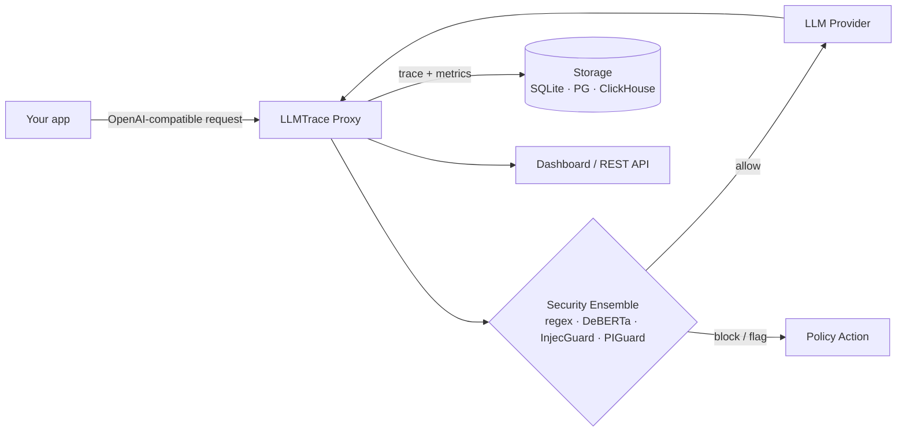

# LLMTrace

**Zero-code LLM observability and security for production.**

LLMTrace is a transparent proxy that sits between your application and any OpenAI-compatible API. Point your SDK at `http://localhost:8080/v1` and you instantly get prompt-injection detection, PII scanning, cost accounting, latency/TTFT metrics, and a dashboard — without changing a single line of application code.

[Install :material-download:](getting-started/installation.md){ .md-button .md-button--primary }
[Quickstart :material-rocket-launch:](getting-started/quickstart.md){ .md-button }
[View on GitHub :material-github:](https://github.com/epappas/llmtrace){ .md-button }


## Why LLMTrace

Production LLM applications have three blind spots that existing APM tools don't cover:

**Security**: — prompt injection, jailbreaks, PII leakage, data exfiltration via tool calls.


**Cost**: — per-agent budgets, rate limits, anomaly detection on token spend.


**Performance**: — latency, streaming TTFT, error rates, provider flakiness.


LLMTrace solves these transparently. Nothing about your application code changes.


## Use cases

=== "Drop-in security for an existing OpenAI app"

    Your codebase already calls OpenAI. Change the `base_url`, restart, and every request is now scanned for prompt injection, PII, and policy violations.

    ```python
    import openai
    client = openai.OpenAI(base_url="http://localhost:8080/v1")
    ```

    See: [OpenAI SDK integration](guides/integration-openai.md), [Pre-request enforcement](guides/enforcement.md).

=== "Multi-tenant SaaS guardrails"

    Isolate traces, budgets, and policies per API key or tenant header. Enforce per-tenant rate limits and block leaks from one customer reaching another.

    See: [Auth & multi-tenancy](guides/auth-tenancy.md), [Custom policies](guides/custom-policies.md).

=== "Cost control + anomaly alerts"

    Per-agent budgets, rate limiters, and Prometheus metrics feed Grafana dashboards and Slack/PagerDuty alerts when spend or latency crosses a threshold.

    See: [Monitoring & observability](guides/monitoring.md), [Dashboard](guides/dashboard.md).

=== "LangChain / LangGraph pipelines"

    Agent frameworks fan out to many provider calls. LLMTrace stitches them into a single trace with per-step security verdicts.

    See: [LangChain integration](guides/integration-langchain.md).

=== "Offline evaluation and red-teaming"

    Run benchmarks against the security ensemble locally. Reproduce OWASP LLM Top 10 coverage numbers, tune thresholds, measure false-positive rate.

    See: [Benchmark methodology](ml/benchmarks.md), [Threshold tuning](ml/tuning.md).


## How it works



Deep-dive: [System architecture](architecture/SYSTEM_ARCHITECTURE.md) · [Transparent proxy mechanics](architecture/TRANSPARENT_PROXY.md) · [LLM-as-judge](architecture/LLM_JUDGE.md).


## Security performance

Tested on a 153-sample adversarial corpus across 12 attack categories (CyberSecEval2, BIPIA, TensorTrust, InjecAgent).

| Metric    | Value |
|-----------|-------|
| Accuracy  | 87.6% |
| Precision | 95.5% |
| F1 Score  | 86.9% |
| Recall    | 79.7% |

Methodology and reproduction: [Benchmark methodology](ml/benchmarks.md).


## Install

=== "Cargo"

    ```bash
    cargo install llmtrace
    llmtrace-proxy --config config.yaml
    ```

=== "Docker"

    ```bash
    docker pull ghcr.io/epappas/llmtrace-proxy:latest
    docker run -p 8080:8080 ghcr.io/epappas/llmtrace-proxy:latest
    ```

=== "Docker Compose"

    ```bash
    curl -o compose.yaml https://raw.githubusercontent.com/epappas/llmtrace/main/compose.yaml
    docker compose up -d
    ```

=== "Kubernetes"

    ```bash
    helm install llmtrace ./deployments/helm/llmtrace
    ```

=== "Python SDK"

    ```bash
    pip install llmtracing
    ```

Full details: [Installation guide](getting-started/installation.md).


## Where to next

**Operators**: — [Installation](getting-started/installation.md) → [Configuration](getting-started/configuration.md) → [Kubernetes](deployment/kubernetes.md) → [Monitoring](guides/monitoring.md).


**Integrators**: — [Quickstart](getting-started/quickstart.md) → [OpenAI SDK](guides/integration-openai.md) → [REST API](guides/API.md).


**Security engineers**: — [Ensemble detection](ml/ensemble.md) → [OWASP LLM Top 10 coverage](security/OWASP_LLM_TOP10.md) → [Custom policies](guides/custom-policies.md).


**Researchers / contributors**: — [Architecture](architecture/SYSTEM_ARCHITECTURE.md) → [Research library](research/index.md) → [Contributing](contributing.md).

