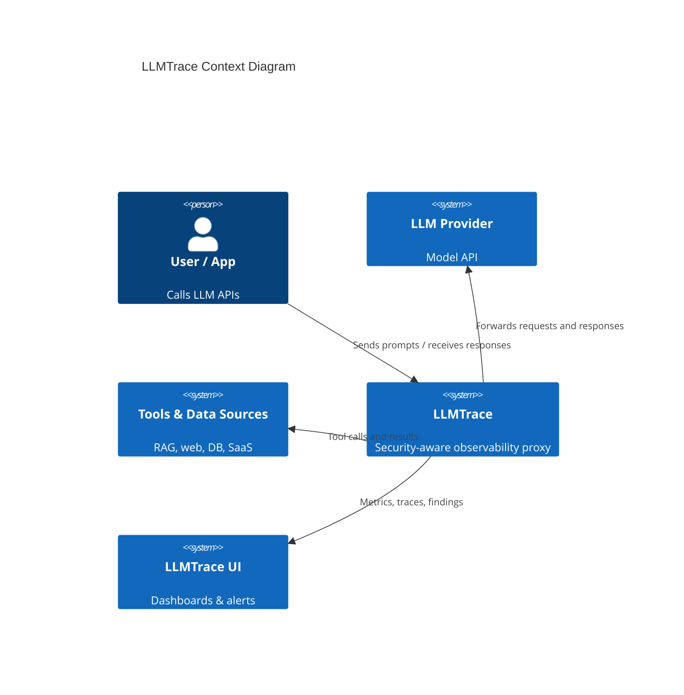
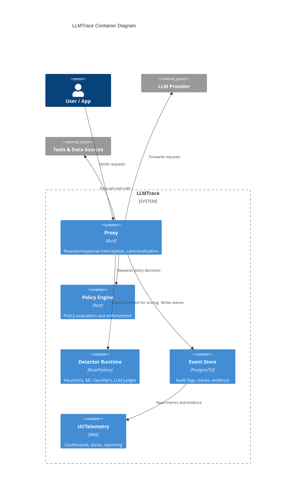
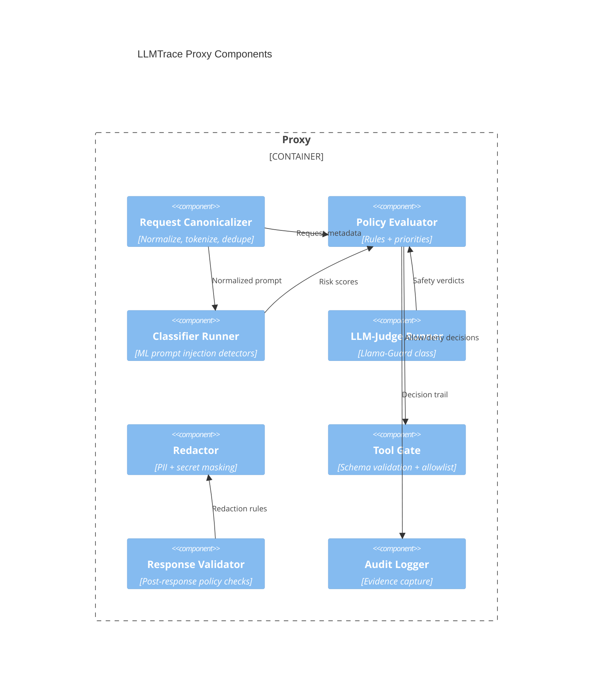
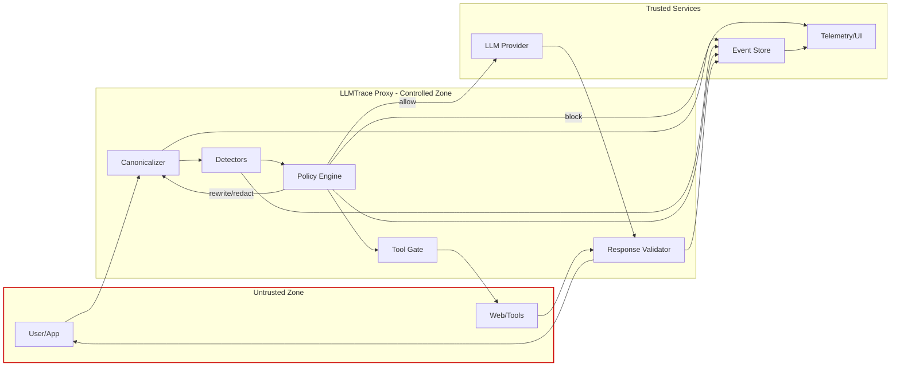

# LLMTrace Defense Pipeline Design

Last updated: 2026-02-03

## Executive Summary

LLMTrace is evolving from a passive observability proxy into a security-aware enforcement layer for LLM systems. The goal is to deliver a staged defense pipeline that can evaluate and act on risk signals at multiple points in the request lifecycle: before a request is sent, at tool-call boundaries, after responses are generated, and asynchronously after the fact. This document specifies what we are adding, why it matters, and how it will be implemented in a way that is compatible with LLMTrace's proxy architecture.

We are adding five core capabilities.

1. A structured defense pipeline with explicit hook points and deterministic decision paths, so policy can be enforced before an LLM or tool is called and after a response is generated.
2. A detector/guard plugin interface that normalizes risk scores, evidence spans, and recommended actions across heuristics, ML classifiers, and LLM-judge models.
3. A policy engine with a clear precedence model and actions that include allow, block, redact, rewrite, require confirmation, downgrade model, and tool disabling.
4. A data model that captures request/response/tool events with PII-safe storage, auditable evidence, and retention controls.
5. A metrics and tracing layer that quantifies latency, risk, and action outcomes so security posture can be monitored and improved over time.

These additions are driven by the literature on prompt injection, indirect tool injection, and multi-agent defenses. The papers emphasize that prompt-only defenses are insufficient, evasion is practical, and tool boundaries are the real security perimeter. LLMTrace is well positioned to enforce guardrails at that perimeter because it already mediates traffic between clients, LLMs, and tools. Our strategy is to combine low-latency heuristics and ML classifiers for inline decisions with heavier LLM-judge models and clustering for asynchronous review.

The design also emphasizes what LLMTrace will not do. It will not attempt to fully replace application-level logic, nor will it execute arbitrary actions on behalf of the app. Instead, it provides a policy-driven enforcement and observability layer that can inform, restrict, or redact traffic based on risk, while maintaining clear trust boundaries and respecting privacy constraints.

## Threat Model and Assumptions

Threat taxonomy covered:

- Direct prompt injection: malicious instructions in user prompts designed to override system policies.
- Indirect prompt injection: malicious instructions embedded in tool outputs or retrieved content.
- Tool injection: abuse of tool schemas or arguments to exfiltrate data or execute unintended actions.
- Data exfiltration: attempts to leak secrets, PII, or system prompts through responses.
- Jailbreak patterns: attempts to bypass content policies or safety constraints.

Attacker goals:

- Override system or developer instructions.
- Cause unsafe or unauthorized tool actions.
- Exfiltrate sensitive data or policy details.
- Induce model failures (e.g., prompt leakage, policy bypass).

Trust boundaries and control:

- LLMTrace controls the proxy path for requests, tool calls, and responses.
- LLMTrace does not control model weights, provider-side safety mechanisms, or upstream client behavior.
- Tool outputs and external content are untrusted by default and must be treated as tainted.
- The policy engine can block or redact, but cannot guarantee behavioral correctness of the model.

## Design Goals and Non-Goals

Design goals:

- Inline analysis with strict latency budgets for pre-request, tool-call, and post-response stages.
- Deterministic decisions for policy evaluation and action enforcement.
- Streaming compatibility where possible, with graceful fallback to buffering when required.
- Privacy-first storage with hashing, redaction, and configurable retention.
- Extensible detector interface for heuristics, ML models, and LLM judges.

Non-goals:

- Replacing application-level authorization logic.
- Guaranteeing perfect detection (defense-in-depth only).
- Running high-latency LLM judges on every request.
- Storing raw sensitive data without explicit configuration.

## Proposed Architecture (C4 Style)

### Context Diagram

### Container Diagram

### Component Diagram

### Data-Flow and Trust-Boundary Diagram

## Defense Pipeline Design (Core)

### Stage 1: Pre-Request

Inputs: raw prompt, request metadata, conversation history, model configuration.  
Outputs: normalized prompt, risk scores, policy decision, optional rewritten prompt.  
Decisions: allow, block, redact, rewrite, require confirmation, downgrade model.  
Error/fallback: if detectors fail, fall back to policy defaults (fail-closed for high-risk policies, fail-open for low-risk).

### Stage 2: Tool-Call Gate

Inputs: tool schema, tool arguments, tool policy allowlist, taint markers.  
Outputs: validated tool call, redacted arguments, allow/deny decision.  
Decisions: allow, block, redact, require confirmation, disable tool.  
Error/fallback: on schema mismatch or validator failure, block or require confirmation based on policy.

### Stage 3: Post-Response

Inputs: model response, policy rules, PII/secret detectors.  
Outputs: redacted response, safety labels, audit evidence.  
Decisions: allow, redact, rewrite, require confirmation, block.  
Error/fallback: if response validation fails, return a safe fallback response with an audit log.

### Stage 4: Async Analysis

Inputs: full request/response/tool traces, detector outputs, metadata.  
Outputs: retroactive alerts, clustering results, model evaluation reports.  
Decisions: notify, create incident, update policy recommendations.  
Error/fallback: batch failures do not affect inline traffic; alerts are retried and logged.

## Detector and Guard Strategy

Baseline detector layers:

- Heuristics: regex patterns, Unicode normalization checks, keyword and URL analysis.
- ML classifiers: DeBERTa/PromptGuard class detectors for prompt injection and jailbreaks.
- LLM judges: Llama-Guard class models for high-precision review of high-risk requests.
- Rule engines: Guardrails-style policy rules for response shaping.
- Tool policies: allowlist and schema enforcement per tool.

Plugin interface for detectors:

- Name and version.
- Required inputs (prompt, response, tool schema, embeddings).
- Synchronous budget in milliseconds.
- Cache key strategy (normalized prompt hash + model version).
- Output schema: risk score (0-1), labels, evidence spans, recommended action, optional explanation.

## Policy Engine

Policy language:

- YAML-based configuration with expressions for thresholds and context (tenant, model, tool).
- Evaluation order: explicit rule priority with first-match semantics, then default policy.
- Precedence: block > redact > rewrite > require-confirmation > allow.

Actions supported:

- allow
- block
- redact
- rewrite
- require user confirmation
- downgrade model
- disable tools
- require citations

## Data Model and Storage

Event schema:

- Request event: request hash, model, tenant, risk scores, classifier outputs.
- Response event: response hash, labels, redactions applied, policy decision.
- Tool event: tool name, schema hash, arguments hash, sanitizer outputs.
- Correlation: trace ID, session ID, parent span ID.

Storage principles:

- Hash and redact sensitive payloads before storage.
- Store minimal evidence spans for audit, not full raw content unless explicitly configured.
- Retention controls by tenant and policy class.

Audit logging and evidence capture:

- Store policy decisions, detector outputs, and redaction masks.
- Never store system prompts or secrets unless explicitly opted in.

## Observability

Metrics:

- Latency per stage (p50/p95/p99).
- Detector cache hit rates.
- Risk score distributions and block rates.
- Token/cost accounting per model and per tenant.
- Streaming stalls or rewinds.

Tracing:

- Correlation IDs across request, tool, and response spans.
- Per-stage spans for canonicalization, detection, policy evaluation, and response validation.

