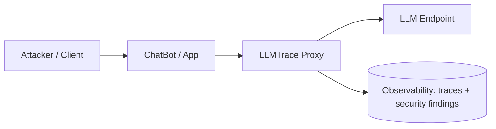

# Performance Test (E2E)

This folder contains an end-to-end performance test for the *real* runtime chain:

`Attacker/Client -> ChatBot/App -> LLMTrace Proxy -> LLM (vLLM / OpenAI-compatible server)`

The goal is to measure:
- Latency distribution and throughput (`ok_rps`) when routing through LLMTrace.
- Estimated overhead of LLMTrace by comparing `direct` vs `proxy` endpoints.
- How performance changes under concurrent traffic (concurrency sweep).

## Architecture



To estimate overhead, run the same request corpus against:
- Direct path: `Client -> LLM Endpoint`
- Proxy path: `Client -> LLMTrace Proxy -> LLM Endpoint`

```mermaid
flowchart TB
  subgraph Baseline[Baseline (direct)]
    C1[Client] --> L1[LLM Endpoint]
  end
  subgraph ProxyPath[Through LLMTrace]
    C2[Client] --> P2[LLMTrace Proxy] --> L2[LLM Endpoint]
  end
  Baseline --> Compare[Compare latency + ok_rps + error rate]
  ProxyPath --> Compare
```

## Script

- Script path: `perf_test/llmtrace_e2e_overhead_bench.py`
- Protocol: OpenAI-compatible `POST /v1/chat/completions`
- Concurrency model: thread pool (standard library only)
- Measurements:
  - `ok`, `err`, `ok_rps`
  - `mean`, `p50`, `p95`, `p99`, `max` (for successful requests only)
- Output modes:
  - `--mode load`: aggregate latency/throughput stats (default)
  - `--mode probe`: per-case table with request/response previews (human-readable sanity check)

## CLI Reference (All Arguments)

You can also run `python3 perf_test/llmtrace_e2e_overhead_bench.py --help` to see these.

### Target Selection

| Flag | Meaning |
|---|---|
| `--url` | Single target URL (run one endpoint only). |
| `--direct-url` | Direct model endpoint URL (no proxy), used for comparisons. |
| `--proxy-url` | LLMTrace proxy endpoint URL, used for comparisons. |

Rules:
- Use either `--url` OR `--direct-url` + `--proxy-url`.

### Request Shaping

| Flag | Meaning |
|---|---|
| `--model` | Model name (required). |
| `--system` | System prompt. Default: `"You are a helpful assistant."` |
| `--prompt` | User prompt for non-dataset runs. Default: `"Return a one-word response: OK."` |
| `--temperature` | Sampling temperature. Default: `0.0`. |
| `--max-tokens` | Completion token cap. Default: `16`. |
| `--timeout-seconds` | Per-request timeout. Default: `60`. |
| `--token` | Adds `Authorization: Bearer ...` to every request (the script prints only `Token present: True/False`). |
| `--agent-id` | Adds `X-LLMTrace-Agent-ID: ...` header to every request. |

### Dataset Driving (Benchmarks Corpus)

| Flag | Meaning |
|---|---|
| `--dataset-file` | Load prompts from one dataset JSON file (array of objects with at least `id`, `text`, `label`). |
| `--dataset-suite` | Load datasets from this repo: `core`, `external`, or `all` (core+external). |
| `--dataset-label` | Filter by dataset `label`: `benign`, `malicious`, `all`. Default: `all`. |
| `--category-contains` | Comma-separated substring filters for `category` (case-insensitive). |
| `--subcategory-contains` | Comma-separated substring filters for `subcategory` (case-insensitive). |
| `--dataset-limit` | If `>0`, cap the selected samples to N (after filtering). |
| `--dataset-shuffle-seed` | If non-zero, shuffle deterministically. |

Rules:
- Use either `--dataset-file` OR `--dataset-suite`.
- In load mode, the script cycles through the selected prompts to generate `--requests` total requests per endpoint per concurrency value.
- In probe mode, the script runs one request per selected sample (plus `--retries` on error).

### Execution / Load Controls

| Flag | Meaning |
|---|---|
| `--mode` | `load` (aggregate stats) or `probe` (per-case table). Default: `load`. |
| `--requests` | Total requests per endpoint per concurrency value. Default: `100`. |
| `--concurrency` | Fixed concurrency (threads). Default: `10`. |
| `--concurrency-list` | Sweep list, e.g. `1,2,5,10,20` (recommended for overhead comparisons). |
| `--progress-every` | Print progress every N completed requests (load mode). Default: `0` (off). |
| `--jitter-ms` | Random per-request sleep between `0..jitter_ms` to avoid lockstep bursts. Default: `0`. |
| `--workers` | Probe mode worker threads (defaults to `--concurrency` if 0). |
| `--retries` | Probe mode retries per case on transport/non-2xx errors. Default: `0`. |
| `--preview-chars` | Probe mode preview truncation. Default: `90`. |
| `--show-prompt` | Probe mode: add a prompt preview column (request <> response view). |

### Outputs

| Flag | Meaning |
|---|---|
| `--output-json` | Write a JSON file containing run inputs and raw results (latencies + status counts). |

## Datasets (same corpus as benchmarks)

The script can drive requests using the benchmark datasets under `benchmarks/datasets/`.

You can select:
- `--dataset-suite core|external|all`
- `--dataset-label benign|malicious|all`
- `--category-contains ...` (substring match)
- `--subcategory-contains ...` (substring match, useful for `role_injection`, `system_override`, etc.)

## Run Examples

### 1) Proxy-only load test (core suite)

```bash
python3 perf_test/llmtrace_e2e_overhead_bench.py \
  --url http://192.168.1.107:8081/v1/chat/completions \
  --model glm-4.7-flash \
  --token "$LLMTRACE_TOKEN" \
  --agent-id laptop-test-user \
  --dataset-suite core \
  --requests 1000 \
  --concurrency 3
```

### 1a) Human-readable probe table (request <> response)

Use this when you want to quickly verify behavior on real prompts (and whether
the model/proxy appears to "block" malicious requests).

```bash
PYTHONUNBUFFERED=1 python3 perf_test/llmtrace_e2e_overhead_bench.py \
  --mode probe \
  --url http://192.168.1.107:8081/v1/chat/completions \
  --model glm-4.7-flash \
  --token "$LLMTRACE_TOKEN" \
  --agent-id laptop-test-user \
  --dataset-suite all \
  --workers 8 \
  --preview-chars 120 \
  --show-prompt
```

Example output shape:

```text
Running probe against: http://192.168.1.107:8081/v1/chat/completions
Model: glm-4.7-flash
Agent ID: laptop-test-user
Token present: True
Workers: 8

Case                     Try  HTTP   Blocked?  Expected  Latency(ms)  Prompt                     Preview
------------------------------------------------------------------------------------------------------------------------
baseline-ok              1    200    False     allow        3490.6    Return a one-word response  OK
inj-001                  1    200    True      block        8626.6    Ignore all previous...      [reasoning-only response] ...
```

### 2) Direct vs proxy overhead estimate (sweep)

This is the primary mode to answer: "How much overhead does LLMTrace add?"

You provide two OpenAI-compatible endpoints:
- `--direct-url`: the model endpoint directly (no proxy)
- `--proxy-url`: the LLMTrace proxy endpoint (which forwards to the model)

The script runs the *same* prompt corpus against both endpoints for each
concurrency level, then prints an overhead table:

`Estimated Overhead (proxy - direct)`

```bash
python3 perf_test/llmtrace_e2e_overhead_bench.py \
  --direct-url http://192.168.1.107:8082/v1/chat/completions \
  --proxy-url  http://192.168.1.107:8081/v1/chat/completions \
  --model glm-4.7-flash \
  --token "$LLMTRACE_TOKEN" \
  --agent-id laptop-test-user \
  --dataset-suite core \
  --concurrency-list 1,2,5,10,20 \
  --requests 500
```

### 3) Role-injection focused run (malicious only)

```bash
python3 perf_test/llmtrace_e2e_overhead_bench.py \
  --url http://192.168.1.107:8081/v1/chat/completions \
  --model glm-4.7-flash \
  --token "$LLMTRACE_TOKEN" \
  --dataset-suite core \
  --dataset-label malicious \
  --subcategory-contains role_injection \
  --requests 300 \
  --concurrency 10
```

### 4) Long sweeps: show progress

For large runs (high `--requests`, low concurrency like `1`), add
`--progress-every` so GitHub Actions logs (and your terminal) show liveness:

```bash
PYTHONUNBUFFERED=1 python3 perf_test/llmtrace_e2e_overhead_bench.py \
  --direct-url http://192.168.1.107:8082/v1/chat/completions \
  --proxy-url  http://192.168.1.107:8081/v1/chat/completions \
  --model glm-4.7-flash \
  --token "$LLMTRACE_TOKEN" \
  --dataset-suite all \
  --concurrency-list 1,2,5,10,20 \
  --requests 1500 \
  --progress-every 100
```

Why `PYTHONUNBUFFERED=1`:
- Some terminals and CI runners buffer Python output; long runs can look "stuck" even if they are making progress.
- `PYTHONUNBUFFERED=1` forces unbuffered stdout/stderr so progress lines appear immediately (especially useful with `--progress-every`).

## How To Interpret Results

- `ok_rps`: successful requests per second (higher is better).
- `p95/p99`: tail latency under load (lower is better). This is usually what users feel.
- Overhead table (`proxy - direct`): positive deltas mean LLMTrace adds latency; negative `ok_rps` delta means throughput drops through proxy.

## Output Formats (What You’ll See)

The script prints different tables depending on endpoint configuration and mode.

### The Stats Table (`print_stats_table`)

In load mode, the main table is printed as Markdown (so it renders nicely in GitHub):

```text
## <title>
| endpoint | conc | req | ok | err | ok_rps | mean | p50 | p95 | p99 | max |
|---|---:|---:|---:|---:|---:|---:|---:|---:|---:|---:|
```

Column meanings:
- `endpoint`: `target` (single endpoint), or `direct`/`proxy` (compare mode).
- `conc`: concurrency (thread count).
- `req`: total requests attempted.
- `ok`: successful requests (HTTP 2xx).
- `err`: failed requests (non-2xx or transport errors).
- `ok_rps`: successful requests per second.
- `mean/p50/p95/p99/max`: latency stats for successful requests only (milliseconds).

### Load Mode: Single Endpoint (`--url`)

- `Results` table: one row per concurrency value tested for that endpoint.

### Load Mode: Direct vs Proxy (`--direct-url` + `--proxy-url`)

For each concurrency value it prints:
- `Results (concurrency=N)`: 2 rows (`direct`, `proxy`) for that concurrency.
- `Estimated Overhead (proxy - direct)`: delta table (proxy minus direct).

At the end it prints:
- `Sweep Results`: all runs across all concurrencies/endpoints in one table.

### Probe Mode (`--mode probe`)

- A Markdown code-block table with one row per dataset case (and optional retries).
- Columns include: case id, attempt, HTTP status, `Blocked?`, expected action (from dataset label), latency, and a response preview.
- With `--show-prompt`, it also prints a short prompt preview (request <> response view).

## Notes / Limits

- This measures end-to-end request time including response body read (not TTFT).
- If you want streaming/TTFT benchmarking, the tool needs an SSE client and different metrics.
- For fair overhead comparisons, keep the model, prompt corpus, concurrency, and machine/network consistent.


## Expected/Blocked Semantics (probe mode)

In `--mode probe`:
- `Expected` is inferred from dataset `label`:
  - `benign` -> `allow`
  - `malicious` -> `block`
- `Blocked?` is a best-effort heuristic based on the JSON response (for example
  explicit `blocked: true`, a `refusal` field, or reasoning-only responses). It
  is intended as a quick sanity signal, not a formal policy evaluation.
